# Module Purpose Map (auto-generated)

## Dependency Graph

```mermaid
graph LR
    adk_bridge --> cli
    adk_bridge --> config
    adk_bridge --> context
    adk_bridge --> harness
    adk_bridge --> hooks
    adk_bridge --> ops
    adk_bridge --> packs
    adk_bridge --> prompt
    adk_bridge --> recipes
    adk_bridge --> runtime
    adk_bridge --> shared
    adk_bridge --> storage
    adk_bridge --> tools
    adk_bridge --> transport
    artifacts --> channels
    artifacts --> ops
    artifacts --> plugins
    artifacts --> runtime
    artifacts --> storage
    artifacts --> tools
    benchmarks --> recipes
    billing --> ops
    billing --> tenancy
    browser --> cli
    browser --> config
    browser --> evidence
    browser --> runtime
    browser --> tools
    browser --> web_acquisition
    channels --> credentials_admin
    channels --> egress_proxy
    channels --> harness
    channels --> runtime
    cli --> adk_bridge
    cli --> benchmarks
    cli --> browser
    cli --> coding
    cli --> composio
    cli --> computer
    cli --> config
    cli --> customize
    cli --> evidence
    cli --> gateway
    cli --> harness
    cli --> hooks
    cli --> introspection
    cli --> learning
    cli --> main
    cli --> memory
    cli --> observability
    cli --> ops
    cli --> packs
    cli --> plugins
    cli --> recipes
    cli --> research
    cli --> runtime
    cli --> shadow
    cli --> shared
    cli --> tools
    cli --> transport
    cli --> web_acquisition
    coding --> meta_orchestration
    computer --> cli
    computer --> config
    computer --> tools
    config --> gates
    config --> runtime
    config --> shadow
    config --> transport
    connectors --> ops
    connectors --> plugins
    connectors --> storage
    context --> harness
    context --> hooks
    context --> runtime
    context --> shared
    context --> tools
    credentials_admin --> storage
    customize --> adk_bridge
    customize --> cli
    customize --> config
    customize --> evidence
    customize --> harness
    customize --> introspection
    customize --> transport
    discovery --> cli
    evidence --> coding
    evidence --> config
    evidence --> harness
    evidence --> packs
    evidence --> research
    evidence --> runtime
    evidence --> telemetry
    evidence --> tools
    evidence --> transport
    firstparty --> adk_bridge
    firstparty --> coding
    firstparty --> config
    firstparty --> gates
    firstparty --> harness
    firstparty --> hooks
    firstparty --> packs
    firstparty --> recipes
    firstparty --> tools
    gates --> coding
    gates --> config
    gates --> egress_proxy
    gates --> evidence
    gates --> learning
    gates --> memory
    gates --> ops
    gates --> packs
    gates --> runtime
    gates --> shadow
    gates --> tools
    gateway --> channels
    gateway --> config
    gateway --> harness
    gateway --> missions
    gateway --> ops
    harness --> adk_bridge
    harness --> channels
    harness --> config
    harness --> evidence
    harness --> gates
    harness --> hooks
    harness --> learning
    harness --> memory
    harness --> missions
    harness --> packs
    harness --> permissions
    harness --> recipes
    harness --> runtime
    harness --> storage
    harness --> telemetry
    harness --> tools
    harness --> transport
    harness --> web_acquisition
    harness --> workflows
    hooks --> harness
    hooks --> telemetry
    hooks --> tools
    introspection --> config
    introspection --> evidence
    introspection --> tools
    knowledge --> evidence
    knowledge --> tools
    knowledge --> web_acquisition
    learning --> gates
    learning --> harness
    learning --> memory
    learning --> storage
    learning --> telemetry
    memory --> runtime
    memory --> transport
    meta_orchestration --> evidence
    meta_orchestration --> harness
    meta_orchestration --> runtime
    missions --> config
    missions --> harness
    missions --> runtime
    missions --> storage
    observability --> config
    observability --> transport
    ops --> gateway
    ops --> harness
    packs --> adk_bridge
    packs --> config
    packs --> gates
    packs --> harness
    packs --> hooks
    packs --> recipes
    packs --> tools
    permissions --> ops
    plugins --> artifacts
    plugins --> browser
    plugins --> channels
    plugins --> config
    plugins --> knowledge
    plugins --> runtime
    plugins --> tools
    plugins --> web_acquisition
    prompt --> adk_bridge
    recipes --> benchmarks
    recipes --> coding
    recipes --> config
    recipes --> context
    recipes --> evidence
    recipes --> harness
    recipes --> memory
    recipes --> meta_orchestration
    recipes --> packs
    recipes --> research
    recipes --> runtime
    recipes --> tools
    recipes --> web_acquisition
    recipes --> workflows
    research --> evidence
    research --> meta_orchestration
    research --> runtime
    runtime --> adk_bridge
    runtime --> cli
    runtime --> config
    runtime --> customize
    runtime --> evidence
    runtime --> gates
    runtime --> harness
    runtime --> hooks
    runtime --> introspection
    runtime --> memory
    runtime --> meta_orchestration
    runtime --> ops
    runtime --> plugins
    runtime --> prompt
    runtime --> research
    runtime --> shadow
    runtime --> shared
    runtime --> tools
    runtime --> transport
    runtime --> web_acquisition
    security --> ops
    shadow --> adk_bridge
    shadow --> config
    shadow --> evidence
    shadow --> observability
    shadow --> ops
    shadow --> recipes
    shadow --> runtime
    shadow --> tools
    shadow --> transport
    shadow --> workspace
    tenancy --> ops
    testing --> evidence
    tools --> artifacts
    tools --> cli
    tools --> coding
    tools --> config
    tools --> customize
    tools --> evidence
    tools --> firstparty
    tools --> gates
    tools --> harness
    tools --> ops
    tools --> packs
    tools --> plugins
    tools --> runtime
    tools --> sandbox
    tools --> telemetry
    tools --> transport
    tools --> web_acquisition
    transport --> adk_bridge
    transport --> channels
    transport --> cli
    transport --> composio
    transport --> config
    transport --> credentials_admin
    transport --> customize
    transport --> evidence
    transport --> gates
    transport --> introspection
    transport --> learning
    transport --> missions
    transport --> ops
    transport --> plugins
    transport --> recipes
    transport --> research
    transport --> runtime
    transport --> shadow
    transport --> storage
    transport --> telemetry
    transport --> tools
    web_acquisition --> egress_proxy
    web_acquisition --> evidence
    web_acquisition --> research
    web_acquisition --> runtime
    web_acquisition --> tools
    workspace --> tools
```

## Packages

### (root)

| Module | Purpose | Depends On | Depended By |
|---|---|---|---|
| __init__.py | — | — | (root)/main.py, cli/tui/app.py |
| __main__.py | — | main | — |
| app.py | — | app_api, board_api, bootstrap, chat, config, control_requests, credentials, customize, debug_trace, health, integrations, learning_dashboard, observability, openmagi_runtime, plugins, shadow_invocations, streaming_chat_route, tools, web_dashboard | (root)/main.py |
| facades.py | High-level entry-point facades that compose existing modules. | bus, context, dispatcher, manifest, resolved, result | — |
| main.py | — | app, chat, env, flags, hosted_defaults, install_profile_bootstrap, local_defaults, local_proxy, local_vault, memory_bootstrap, models, observed_egress, openmagi_runtime, otel_noise, providers, vault_local, vault_server | (root)/__main__.py, cli/tests/test_app.py |

### adk_bridge/

| Module | Purpose | Depends On | Depended By |
|---|---|---|---|
| __init__.py | — | — | — |
| anthropic_cache_model.py | Cache-aware Anthropic (Claude) model for the ADK runner boundary — PR11. | env | cli/real_runner.py, prompt/injection.py, shadow/gate5b4c3_live_runner_boundary.py |
| artifact_service.py | — | — | — |
| callback_adapter.py | — | bus, context, manifest, resolved | — |
| context_compaction.py | Live context-compaction wiring for the ADK Runner (PR13). | auto_compact, context, context_lifecycle, manual_compaction_context, protected_tools, providers, query_state, readonly_classifier, session_service, token_estimation, token_tracker, usage_metadata | adk_bridge/control_plane.py |
| control_plane.py | ADK loop control-plane abstraction (PR2, goose-parity). | constraint_reinjection, context, context_compaction, edit_retry_reflection, env, facts_replan_control, fork_runner, gemini_content_ordering, manifest, registries, resilience_plugin, schema_feedback, self_review, tool_exception_reflection, tool_synthesis, tool_synthesis_nudge, turn_policy | adk_bridge/facts_replan_control.py, adk_bridge/local_runner.py, adk_bridge/schema_feedback.py, cli/real_runner.py, cli/tests/test_real_runner.py, customize/after_tool_gate.py, firstparty/packs/control_plane_default/impl.py, packs/context.py, packs/registries.py, transport/gate5b_governance.py |
| edit_retry_reflection.py | Edit-failure reflection / retry wiring for the live ADK Runner. | context, retry_repair_policies, turn_utilities | adk_bridge/control_plane.py, adk_bridge/schema_feedback.py, adk_bridge/tool_exception_reflection.py |
| event_adapter.py | — | events, health, public_events, transcript, transport, wire_profile | cli/engine.py, runtime/stream_withholding.py, shadow/fixture_runner.py, shadow/gate4c1_runner_shadow_invoker.py, transport/sse_buffer.py |
| facts_replan_control.py | FactsReplanControl — interval-based facts-survey injection (default-OFF). | context, control_plane, facts_replan | adk_bridge/control_plane.py |
| gemini_content_ordering.py | Gemini content-ordering repair for the ADK before_model hook. | — | adk_bridge/control_plane.py |
| local_runner.py | — | control_plane, live_gate, local_toolhost, session_service, task_completion | shadow/fixture_runner.py |
| local_toolhost.py | — | — | adk_bridge/local_runner.py |
| memory_service.py | — | — | — |
| policy_boundary.py | — | control | — |
| primitives.py | — | — | runtime/openmagi_runtime.py |
| resilience_plugin.py | Live ADK resilience plugin — loop guard + multi-strategy error recovery. | context, engine, error_recovery, loop_detectors, strategies | adk_bridge/control_plane.py |
| runner_adapter.py | — | — | cli/engine.py, harness/cron_turn_runner_adapter.py, runtime/adk_turn_runner.py, shadow/fixture_runner.py |
| schema_feedback.py | Schema-invalid argument feedback for the live ADK Runner (R3). | context, control_plane, edit_retry_reflection | adk_bridge/control_plane.py |
| session_service.py | — | session_store | adk_bridge/context_compaction.py, adk_bridge/local_runner.py, cli/real_runner.py, cli/session_log.py |
| tool_adapter.py | — | concurrency, concurrent_dispatcher, context, deferred, dispatcher, env, manifest, provider_adapter, registry | cli/tests/test_tool_runtime.py, cli/tool_runtime.py, cli/wiring.py |
| tool_exception_reflection.py | Generic tool-exception reflection for the live ADK Runner. | context, edit_retry_reflection | adk_bridge/control_plane.py |
| tool_synthesis_nudge.py | Per-step tool-synthesis reflection nudge for the live ADK Runner. | tool_synthesis | adk_bridge/control_plane.py |
| wire_profile.py | Wire profiles for ``OpenMagiEventBridge``. | public_events | adk_bridge/event_adapter.py |

### artifacts/

| Module | Purpose | Depends On | Depended By |
|---|---|---|---|
| __init__.py | — | delivery_boundary, file_delivery, output_registry_boundary | — |
| _file_delivery_fakes.py | Shared local-fake provider implementations for the FileDelivery boundary. | contract | artifacts/file_delivery_live.py, plugins/native/documents.py |
| delivery_boundary.py | — | contract, file_delivery | artifacts/__init__.py |
| delivery_receipts.py | — | contract, durable_store, file_delivery, safety | — |
| file_delivery.py | — | contract, provider_receipts | artifacts/__init__.py, artifacts/delivery_boundary.py, artifacts/delivery_receipts.py, artifacts/file_delivery_live.py, plugins/native/documents.py |
| file_delivery_live.py | Real filesystem-backed providers for the FileDelivery boundary. | _common, _file_delivery_fakes, contract, file_delivery | plugins/native/documents.py |
| local_result_store.py | — | output_budget, safety | tools/kernel.py |
| output_registry_boundary.py | — | — | artifacts/__init__.py |
| render_verification.py | — | durable_store, safety | — |

### benchmarks/

| Module | Purpose | Depends On | Depended By |
|---|---|---|---|
| __init__.py | Benchmark pieces consumed by the runtime (legal eval + legalbench). | — | — |
| legal_eval.py | LegalBench post-hoc evaluator. No provider/model calls are made here; it | models | benchmarks/legalbench/cli.py, benchmarks/legalbench/runner.py, cli/app.py |

### benchmarks/legalbench/

| Module | Purpose | Depends On | Depended By |
|---|---|---|---|
| __init__.py | — | — | — |
| cli.py | — | legal_eval, manifest, recipe, runner | cli/app.py |
| loader.py | Loader functions that read LegalBench task directories into typed models. | models | benchmarks/legalbench/manifest.py |
| manifest.py | Loads a curated subset of LegalBench tasks from a JSON manifest file. | loader, models | benchmarks/legalbench/cli.py |
| models.py | Pydantic models for the LegalBench lean harness data layer. | — | benchmarks/legal_eval.py, benchmarks/legalbench/loader.py, benchmarks/legalbench/manifest.py, benchmarks/legalbench/runner.py, recipes/first_party/legal/fewshot.py, recipes/first_party/legal/recipe.py |
| runner.py | — | legal_eval, models, recipe | benchmarks/legalbench/cli.py |

### billing/

| Module | Purpose | Depends On | Depended By |
|---|---|---|---|
| __init__.py | — | quota, spend_guard | — |
| quota.py | — | context, safety | billing/__init__.py, billing/spend_guard.py |
| spend_guard.py | — | context, quota, safety | billing/__init__.py |

### browser/

| Module | Purpose | Depends On | Depended By |
|---|---|---|---|
| __init__.py | Default-off browser provider boundaries for the ADK migration. | provider_boundary | — |
| live_provider_pack.py | — | policy, provider_boundary, provider_execution, provider_receipts | — |
| provider_boundary.py | — | policy, provider_execution, provider_receipts | browser/__init__.py, browser/live_provider_pack.py, browser/source_tools.py, plugins/native/browser.py |
| source_tools.py | — | policy, provider_boundary, result, source_ledger | plugins/native/browser.py |

### browser/autonomous/

| Module | Purpose | Depends On | Depended By |
|---|---|---|---|
| __init__.py | Default-off autonomous vision browser tool wrapping the browser-use library. | — | — |
| _api_notes.py | browser-use API surface notes (Task 0 spike). | — | — |
| config.py | — | env | browser/autonomous/tool.py |
| engine.py | Async wrapper that runs a browser-use Agent loop with an SSRF step guard. | safety_hooks | browser/autonomous/tool.py |
| provider_bridge.py | — | — | browser/autonomous/tool.py |
| safety_hooks.py | — | policy | browser/autonomous/engine.py |
| tool.py | BrowserTask tool: manifest, gated toolhost binding, and async handler. | catalog, cli, config, context, engine, manifest, policy, provider_bridge, registry, result | cli/tool_runtime.py, cli/wiring.py |

### channels/

| Module | Purpose | Depends On | Depended By |
|---|---|---|---|
| __init__.py | Traffic-free OpenMagi channel contract metadata. | contract | transport/integrations.py |
| channel_credentials.py | Resolve a channel credential from the local vault, then the environment. | credentials_admin, local_vault | gateway/channel_watchers.py |
| channel_validate.py | Bot-token validation for the dashboard Discord + Slack integrations. | — | transport/integrations.py |
| contract.py | — | — | artifacts/_file_delivery_fakes.py, artifacts/delivery_boundary.py, artifacts/delivery_receipts.py, artifacts/file_delivery.py, artifacts/file_delivery_live.py, channels/__init__.py, channels/discord_adapter.py, channels/discord_live.py, channels/dispatcher.py, channels/push_delivery.py, channels/runtime_boundary.py, channels/telegram_adapter.py, channels/telegram_live.py, harness/cron_runtime.py, harness/scheduler_runtime.py, plugins/native/documents.py |
| discord_adapter.py | — | contract, dispatcher, provider_execution, provider_receipts | channels/discord_live.py, gateway/channel_watchers.py |
| discord_live.py | E3 — Gated live Discord adapter. | contract, discord_adapter, scheduler_delivery, turn_bridge | gateway/channel_watchers.py |
| dispatcher.py | — | contract, provider_execution, provider_receipts, runtime_boundary, workflow_routing | channels/discord_adapter.py, channels/runtime_boundary.py, channels/telegram_adapter.py, harness/scheduler_runtime.py |
| email_live.py | E4 — Gated live email adapter. | platform_registry, scheduler_delivery | — |
| platform_registry.py | E1 — Platform Registry: self-registration seam for channel platforms. | — | channels/email_live.py, channels/slack_live.py |
| push_delivery.py | — | contract, provider_execution, provider_receipts, runtime_boundary | — |
| runtime_boundary.py | — | contract, dispatcher | channels/dispatcher.py, channels/push_delivery.py, channels/telegram_adapter.py, harness/scheduler_runtime.py |
| slack_live.py | E4 — Gated live Slack adapter. | platform_registry, scheduler_delivery, slack_urllib, turn_bridge | channels/providers/slack_urllib.py, gateway/channel_watchers.py |
| taskkind_classifier.py | — | inference_scaling | — |
| telegram_adapter.py | — | contract, dispatcher, provider_execution, provider_receipts, runtime_boundary | channels/providers/telegram_httpx.py, channels/telegram_live.py, gateway/channel_watchers.py |
| telegram_boundary.py | — | — | — |
| telegram_credentials.py | Resolve the Telegram bot token from the local vault, then the environment. | credentials_admin, local_vault | gateway/channel_watchers.py |
| telegram_easy.py | Telegram "easy setup": phone number → MTProto user session → automated | — | channels/telegram_easy_telethon.py, transport/integrations.py |
| telegram_easy_telethon.py | Telethon adapter for the Telegram "easy setup" path. | telegram_easy | transport/integrations.py |
| telegram_live.py | E2 — Gated live Telegram polling adapter. | contract, scheduler_delivery, telegram_adapter, turn_bridge | gateway/channel_watchers.py |
| telegram_validate.py | Bot-token validation for the dashboard Telegram integration. | — | transport/integrations.py |
| turn_bridge.py | Shared channel turn bridge — inbound message -> agent turn -> reply (PR1). | — | channels/discord_live.py, channels/slack_live.py, channels/telegram_live.py, channels/turn_engine.py, gateway/channel_watchers.py |
| turn_engine.py | Engine-backed ``run_turn`` for the channel turn bridge (PR1.5). | child_governed_collector, governed_turn, turn_bridge, turn_context | gateway/watchers.py |
| workflow_routing.py | — | — | channels/dispatcher.py |

### channels/providers/

| Module | Purpose | Depends On | Depended By |
|---|---|---|---|
| __init__.py | Concrete channel provider implementations (the ONLY place a real network | — | — |
| discord_gateway.py | Concrete live Discord provider over ``discord.py`` (PR2). | — | gateway/channel_watchers.py |
| slack_socketmode.py | Concrete live Slack inbound provider over ``slack_sdk`` Socket Mode (PR3). | — | gateway/channel_watchers.py |
| slack_urllib.py | Concrete out-of-box Slack provider over stdlib ``urllib`` (B1). | config, slack_live | channels/slack_live.py, gateway/channel_watchers.py |
| telegram_httpx.py | Concrete live Telegram provider over ``httpx`` (B17). | telegram_adapter | gateway/channel_watchers.py |

### cli/

| Module | Purpose | Depends On | Depended By |
|---|---|---|---|
| __init__.py | Magi headless CLI foundation (PR-A1). | — | browser/autonomous/tool.py, cli/app.py, cli/tests/test_anthropic_cache_selection.py, cli/tests/test_app.py, cli/tests/test_model_picker_wire.py, computer/autonomous/tool.py, transport/app_api.py |
| __main__.py | Thin stdlib-only shim for ``python -m magi_agent.cli`` (PR-F1). | app | cli/tests/test_app.py |
| app.py | Typer CLI entrypoint for Magi (PR-F1, Stream F). | cli, config, daemon, env, headless, health, install_profile_bootstrap, installer, legal_eval, local_defaults, memory_bootstrap, otel_noise, providers, scaffold, service_install, session_log, watchers, wiring | cli/__main__.py, cli/tests/test_app.py, cli/tests/test_composio_cli.py, cli/tests/test_doctor.py, cli/tests/test_gateway_start_daemon.py, cli/tests/test_plan_mode.py |
| clipboard_image.py | Read an image from the OS clipboard for CLI/TUI image attach. | message_builder | cli/tests/test_clipboard_image.py, cli/tui/app.py |
| contracts.py | Stable interface surface for the Magi headless CLI. | control, events | cli/commands/builtins.py, cli/commands/bundled.py, cli/commands/control.py, cli/commands/discovery.py, cli/commands/executor.py, cli/commands/mcp_commands.py, cli/commands/registry.py, cli/commands/session_history.py, cli/commands/skill_commands.py, cli/engine.py, cli/headless.py, cli/permissions.py, cli/readonly_classifier.py, cli/session_log.py, cli/tests/test_app.py, cli/tests/test_coldstart.py, cli/tests/test_command_executor.py, cli/tests/test_commands.py, cli/tests/test_contracts_a3.py, cli/tests/test_e2e_parity.py, cli/tests/test_engine.py, cli/tests/test_engine_gate.py, cli/tests/test_engine_image_blocks.py, cli/tests/test_engine_output_continuation.py, cli/tests/test_engine_recovery.py, cli/tests/test_engine_usage.py, cli/tests/test_fact_grounding_gate_wiring.py, cli/tests/test_headless.py, cli/tests/test_headless_projection.py, cli/tests/test_model_picker_wire.py, cli/tests/test_permissions.py, cli/tests/test_phase_route_consumption.py, cli/tests/test_redaction_hard_gate_wiring.py, cli/tests/test_runtime_policy_wiring.py, cli/tests/test_session_log.py, cli/tests/test_slash_p1_sources.py, cli/tests/test_slash_p2_control.py, cli/tests/test_slash_p2_mcp.py, cli/tests/test_slash_p3_seams.py, cli/tests/test_source_ledger_gate_wiring.py, cli/tests/test_streaming_chat.py, cli/tests/test_streaming_driver.py, cli/tests/test_tui_app.py, cli/tests/test_tui_autocomplete.py, cli/tests/test_tui_followups.py, cli/tests/test_tui_input.py, cli/tests/test_tui_palette.py, cli/tests/test_tui_subagent.py, cli/tests/test_tui_theme.py, cli/tests/test_tui_thinking.py, cli/tests/test_tui_tool_render.py, cli/tests/test_tui_transcript.py, cli/tests/test_tui_visual.py, cli/tests/test_tui_whichkey.py, cli/tests/test_tui_widgets.py, cli/tui/app.py, cli/tui/autocomplete.py, cli/tui/input.py, cli/tui/palette.py, cli/tui/tool_render.py, cli/tui/widgets/tool_card.py, cli/wiring.py, runtime/child_governed_collector.py, transport/chat_routes.py, transport/streaming_chat.py, transport/streaming_chat_route.py, transport/streaming_driver.py |
| engine.py | Real ADK-backed engine driver for the Magi headless CLI (PR-A2). | active_turn_registry, citation_audit, claim_grounding, context, contracts, criterion_engine, discipline_boundary, empty_response_recovery, env, error_recovery, event_adapter, events, final_output_gate, flags, gate5b4c3_image_parts, goal_nudge, hook_wiring, kernel_recipe_packs, ledger, output_continuation, permissions, readonly_classifier, recipe_routing, recipes, repair_loop, runner_adapter, runtime_gate, shacl_verifier, sse, store, task_completion, usage_metadata, validator_taxonomy, verification_policy, verifier_bus | cli/headless.py, cli/real_runner.py, cli/tests/test_app.py, cli/tests/test_coldstart.py, cli/tests/test_contracts_a3.py, cli/tests/test_document_coverage_seam_wiring.py, cli/tests/test_engine.py, cli/tests/test_engine_gate.py, cli/tests/test_engine_image_blocks.py, cli/tests/test_engine_output_continuation.py, cli/tests/test_engine_recovery.py, cli/tests/test_engine_usage.py, cli/tests/test_evidence_turn_id_reconciliation.py, cli/tests/test_fact_grounding_gate_wiring.py, cli/tests/test_headless_approval.py, cli/tests/test_phase_route_consumption.py, cli/tests/test_redaction_hard_gate_wiring.py, cli/tests/test_runtime_policy_wiring.py, cli/tests/test_source_grounded_recipe_gate_integration.py, cli/tests/test_source_ledger_gate_wiring.py, cli/wiring.py |
| goal_nudge_wiring.py | PR4 (cluster 03 C4) — production wiring for the goal-nudge continuation. | env, goal_nudge | cli/wiring.py |
| headless.py | Headless entrypoint for the Magi CLI (PR-A1). | commands, contracts, engine, env, governed_turn, live_audit, manual_compaction_context, ndjson, permissions, protocol, redaction, session_log, turn_context | cli/app.py, cli/tests/test_app.py, cli/tests/test_contracts_a3.py, cli/tests/test_e2e_parity.py, cli/tests/test_engine.py, cli/tests/test_engine_gate.py, cli/tests/test_engine_output_continuation.py, cli/tests/test_engine_recovery.py, cli/tests/test_engine_usage.py, cli/tests/test_headless.py, cli/tests/test_headless_approval.py, cli/tests/test_headless_projection.py, cli/tests/test_permissions.py |
| hook_wiring.py | Bridge CC-style user ``settings.json`` hooks into the CLI engine's ADK | bus, command_executor, context, env, external_config, manifest, resolved, settings_loader | cli/engine.py, cli/wiring.py |
| identity.py | Identity + project-context loading for the local ``magi`` CLI agent. | — | cli/tests/test_identity.py, cli/tool_runtime.py |
| install_profile_bootstrap.py | CLI install profile bootstrap: ``~/.magi/profile.env`` → process env. | — | (root)/main.py, cli/app.py, cli/tests/test_install_profile_bootstrap.py |
| learning_recall.py | CLI learning-recall block builder. | config, contracts, injection, memory_mode_guard, memory_recall, memory_write, models, namespaces, store | cli/tool_runtime.py |
| local_runner.py | — | — | cli/tests/test_real_runner.py, cli/wiring.py |
| memory_bootstrap.py | CLI memory bootstrap: ``config.toml[memory]`` → process env (PR-C). | config, providers | (root)/main.py, cli/app.py |
| memory_recall_block.py | Per-turn query-based memory recall block builder (PR-E item 3). | config, memory_mode_guard, prompt_projection, search | cli/tool_runtime.py |
| ndjson.py | Single-writer NDJSON output for the headless CLI. | protocol | cli/headless.py, cli/tests/test_ndjson.py |
| permissions.py | Permission rules engine + gate skeleton for the Magi headless CLI. | contracts, control, durable_control_store, env, protocol, readonly_classifier | cli/engine.py, cli/headless.py, cli/tests/test_app.py, cli/tests/test_coldstart.py, cli/tests/test_engine_gate.py, cli/tests/test_headless_approval.py, cli/tests/test_headless_projection.py, cli/tests/test_permissions.py, cli/tests/test_streaming_driver.py, cli/wiring.py, transport/active_turn.py, transport/streaming_driver.py, transport/streaming_sink.py |
| protocol.py | Pydantic models for the Magi headless CLI wire protocol. | — | cli/headless.py, cli/ndjson.py, cli/permissions.py, cli/tests/test_ndjson.py, cli/tests/test_permissions.py, cli/tests/test_protocol.py, cli/tests/test_streaming_driver.py, cli/tests/test_streaming_sink.py, transport/streaming_chat_route.py |
| providers.py | Provider/key resolution for the local ``magi`` CLI. | env, model | (root)/main.py, adk_bridge/context_compaction.py, cli/app.py, cli/commands/control.py, cli/memory_bootstrap.py, cli/real_runner.py, cli/tests/test_anthropic_cache_selection.py, cli/tests/test_model_picker_wire.py, cli/tests/test_providers.py, cli/tests/test_real_runner.py, cli/tests/test_runtime_policy_wiring.py, cli/tests/test_tui_dialog_model.py, cli/tui/app.py, cli/tui/dialogs/model.py, cli/wiring.py, customize/shacl_compiler.py, discovery/orchestrator.py, runtime/child_runner_live.py, runtime/model_tiers.py, tools/document_qa_tools.py, tools/image_tools.py, transport/app_api.py, transport/egress_critic.py, transport/streaming_chat_route.py |
| readonly_classifier.py | SmartApprove read-only classifier for the Magi permission gate (PR3). | contracts, real_runner, registry | adk_bridge/context_compaction.py, cli/engine.py, cli/permissions.py, cli/wiring.py, customize/shacl_compiler.py, transport/egress_critic.py |
| real_runner.py | A real, model-backed runner for the local ``magi`` CLI. | after_tool_gate, anthropic_cache_model, compiler, control_plane, discovery, engine, env, flags, kernel_recipe_packs, live_gate, local_tool_collector, materializer, preset_map, providers, recipe_routing, session_identity, session_service, store, task_completion, tool_runtime, verification_policy, what_menu, wiring | cli/readonly_classifier.py, cli/tests/test_app.py, cli/tests/test_force_recipe_env_wiring.py, cli/tests/test_force_recipe_source_grounded_selection.py, cli/tests/test_real_runner.py, cli/tests/test_runtime_policy_wiring.py, cli/wiring.py, discovery/orchestrator.py, runtime/child_runner_live.py |
| session_log.py | Append-only JSONL session log for the Magi CLI (Stream B, PR-B1). | contracts, session_continuity, session_service, transcript | cli/app.py, cli/headless.py, cli/tests/test_app.py, cli/tests/test_coldstart.py, cli/tests/test_session_log.py, cli/tui/app.py, cli/tui/history.py, cli/tui/theme.py, cli/wiring.py |
| tool_runtime.py | Real tool runtime for the local ``magi`` CLI agent. | ask_user_question_toolhost, context, continuity_policy, core_toolhost, dispatcher, env, file_tool_manifests, file_toolhost, first_party_gate, identity, kernel_recipe_packs, learning_recall, live_gate, local_tool_collector, manifest, memory_recall_block, memory_snapshot_cache, memory_write_wiring, message_builder, permission_scope, persistent_python_toolhost, plan_mode_toolhost, prompt_guidance, python_exec, recipe_routing, registry, session_identity, tool, tool_adapter, tool_synthesis, tools, web, web_search_tools | cli/real_runner.py, cli/tests/test_evidence_turn_id_reconciliation.py, cli/tests/test_identity.py, cli/tests/test_local_tool_evidence_wiring.py, cli/tests/test_plan_mode.py, cli/tests/test_plan_mode_tools_exposed.py, cli/tests/test_tool_runtime.py, cli/wiring.py, runtime/child_runner_live.py |
| wiring.py | Composition root for the Magi CLI (PR-F1, Stream F). | app, commands, config, context, contracts, dispatcher, egress_critic, engine, env, file_provider, file_tool_manifests, file_toolhost, first_party_gate, flags, goal_nudge_wiring, hook_wiring, live_gate, local_runner, local_tool_collector, main_agent_profile, manifest, mcp, memory_mode_guard, openmagi_runtime, permission_scope, permissions, providers, readonly_classifier, real_runner, registry, runtime_sink, safety, session_identity, session_log, tool, tool_adapter, tool_render, tool_runtime, transcript, web | cli/app.py, cli/real_runner.py, cli/tests/test_app.py, cli/tests/test_coldstart.py, cli/tests/test_plan_mode.py, cli/tests/test_real_runner.py, cli/tests/test_runtime_policy_wiring.py, cli/tests/test_streaming_sink.py, runtime/child_runner_live.py, runtime/governed_turn.py, transport/chat_routes.py, transport/streaming_chat_route.py |

### cli/commands/

| Module | Purpose | Depends On | Depended By |
|---|---|---|---|
| __init__.py | Command registry package for the Magi CLI (Stream D). | builtins, discovery, registry | cli/headless.py, cli/tests/test_commands.py, cli/tests/test_slash_p1_sources.py, cli/wiring.py |
| builtins.py | Seed *local* builtin slash-commands for the Magi CLI (Stream D, PR-D2). | contracts, skills, slash_control_boundary | cli/commands/__init__.py, cli/commands/discovery.py, cli/tests/test_commands.py, cli/tests/test_tui_app.py |
| bundled.py | Bundled slash-commands for the Magi CLI (Stream D, PR-D3 / P1.1). | contracts | cli/commands/discovery.py, cli/tests/test_slash_p1_sources.py |
| control.py | Runtime-control slash-command seams for the Magi CLI (Stream D, PR4). | contracts, providers | cli/commands/discovery.py, cli/tests/test_model_picker_wire.py, cli/tests/test_slash_p2_control.py |
| discovery.py | Command discovery + precedence merge for the Magi CLI (Stream D, PR-D2/D3). | builtins, bundled, contracts, control, registry, session_history, skill_commands | cli/commands/__init__.py, cli/commands/skill_commands.py, cli/tests/test_commands.py, cli/tests/test_headless_projection.py, cli/tests/test_slash_p1_sources.py, cli/tests/test_slash_p2_control.py, cli/tests/test_slash_p2_mcp.py, cli/tests/test_slash_p3_seams.py |
| executor.py | Default ``CommandExecutor`` for the Magi TUI (Stream D/F, PR2.2). | contracts | cli/tests/test_command_executor.py, cli/tui/app.py |
| mcp_commands.py | MCP prompts → CLI slash-commands bridge (Stream D, P2). | contracts, mcp_adapter | cli/tests/test_slash_p2_mcp.py |
| registry.py | Command registry + dispatcher for the Magi CLI (Stream D, PR-D1). | contracts | cli/commands/__init__.py, cli/commands/discovery.py, cli/tests/test_model_picker_wire.py, cli/tests/test_slash_p2_control.py, cli/tests/test_slash_p3_seams.py |
| session_history.py | Session-history slash-command seams for the Magi CLI (Stream D, PR5). | contracts | cli/commands/discovery.py, cli/tests/test_slash_p3_seams.py |
| skill_commands.py | Skill → command bridge for the Magi CLI (Stream D, PR-D3 / P1.3). | contracts, discovery | cli/commands/discovery.py, cli/tests/test_slash_p1_sources.py |

### cli/commands/templates/

| Module | Purpose | Depends On | Depended By |
|---|---|---|---|
| __init__.py | — | — | — |

### cli/keybindings/

| Module | Purpose | Depends On | Depended By |
|---|---|---|---|
| __init__.py | PR-E4 — Magi CLI keybinding subsystem (pure, textual-free). | loader, resolver, schema | cli/tests/test_tui_keybindings.py |
| defaults.py | PR-E4 — the built-in default keymap (a list of :class:`ParsedBinding`). | schema | cli/keybindings/loader.py, cli/tests/test_tui_app.py, cli/tests/test_tui_keybindings.py, cli/tests/test_tui_whichkey.py |
| loader.py | PR-E4 — load -> merge -> validate the keybindings config (never throws). | defaults, schema | cli/keybindings/__init__.py, cli/tui/app.py |
| resolver.py | PR-E4 — the pure chord-resolution algorithm + a duck-typed event adapter. | schema | cli/keybindings/__init__.py, cli/tui/app.py, cli/tui/widgets/whichkey.py |
| schema.py | PR-E4 — keybinding config contract: contexts, actions, keystroke grammar. | — | cli/keybindings/__init__.py, cli/keybindings/defaults.py, cli/keybindings/loader.py, cli/keybindings/resolver.py, cli/tests/test_tui_app.py, cli/tests/test_tui_whichkey.py, cli/tui/app.py, cli/tui/widgets/whichkey.py |

### cli/render/

| Module | Purpose | Depends On | Depended By |
|---|---|---|---|
| __init__.py | Surface-specific render helpers for the Magi CLI TUI stream. | width | cli/tests/test_render_diff.py, cli/tests/test_tui_tool_render.py, cli/tui/tool_render.py |
| diff.py | Pure-Python diff engine for the Magi CLI TUI. | — | cli/tui/app.py |
| width.py | Display-width-aware truncation for the Magi CLI TUI. | — | cli/render/__init__.py, cli/tests/test_tui_sidebar.py, cli/tests/test_tui_subagent.py, cli/tests/test_tui_thinking.py, cli/tests/test_tui_tool_render.py, cli/tests/test_tui_visual.py, cli/tests/test_tui_width.py, cli/tui/app.py, cli/tui/sidebar.py, cli/tui/tool_render.py |

### cli/tests/

| Module | Purpose | Depends On | Depended By |
|---|---|---|---|
| __init__.py | — | — | — |
| conftest.py | conftest.py for magi_agent/cli/tests. | — | — |
| test_anthropic_cache_selection.py | Tests for _maybe_build_cache_aware_anthropic in real_runner — Task 1. | cli, providers | — |
| test_app.py | Tests for cli/app.py (Typer entrypoint) and cli/wiring.py (PR-F1). | __main__, app, cli, contracts, engine, env, headless, main, permissions, real_runner, session_log, wiring | — |
| test_clipboard_image.py | — | clipboard_image | — |
| test_coldstart.py | Cold-start import discipline tests for CLI Stream F (PR-F1). | contracts, engine, permissions, session_log, wiring | — |
| test_command_executor.py | Tests for the PR2.2 ``CommandExecutor`` contract + default executor. | contracts, executor | — |
| test_commands.py | Tests for the Stream D command registry (PR-D1). | builtins, commands, contracts, discovery | — |
| test_composio_cli.py | — | app | — |
| test_contracts_a3.py | PR-A3 contract-hardening tests. | contracts, engine, headless | — |
| test_doctor.py | — | app | — |
| test_document_coverage_seam_wiring.py | Customize opt-in seam for the document-authoring-coverage gate. | engine, store | — |
| test_e2e_parity.py | End-to-end parity: one engine, two surfaces (PR-F2b). | app, contracts, headless | — |
| test_engine.py | Tests for the real ADK-backed MagiEngineDriver (PR-A2). | contracts, engine, headless | — |
| test_engine_gate.py | Tests for the permission-gate wiring into ``MagiEngineDriver`` (PR-F-gate). | contracts, engine, headless, permissions | cli/tests/test_headless_approval.py |
| test_engine_image_blocks.py | Tests for image-block threading through the CLI engine (Task 2). | contracts, engine | — |
| test_engine_output_continuation.py | LIVE tests for output-continuation: resume a response truncated at the | contracts, engine, headless, output_continuation | — |
| test_engine_recovery.py | LIVE error-recovery tests for the genuine run-invocation retry seam (PR12). | contracts, engine, error_recovery, headless, rate_limit | — |
| test_engine_usage.py | Usage/cost honesty: EngineResult.usage populated from ADK usage_metadata. | contracts, engine, headless, output_continuation | — |
| test_evidence_turn_id_reconciliation.py | Regression tests for the live turn_id mismatch between the collector and gate. | engine, local_tool_collector, tool_runtime, verifier_bus | — |
| test_fact_grounding_gate_wiring.py | Engine wiring for semantic grounding verification (live evidence gate). | contracts, engine, events | — |
| test_force_recipe_env_wiring.py | ``MAGI_FORCE_RECIPE`` pins the compiler recipe selection for a live CLI turn. | real_runner | — |
| test_force_recipe_source_grounded_selection.py | ``MAGI_FORCE_RECIPE=openmagi.source-grounded`` resolves to a real pack. | compiler, real_runner | — |
| test_gateway_start_daemon.py | `magi gateway start` must supervise (GatewayDaemon.run) by default and | app | — |
| test_headless.py | — | contracts, headless | — |
| test_headless_approval.py | End-to-end headless tool-permission approval tests. | engine, headless, permissions, test_engine_gate | — |
| test_headless_projection.py | Tests for the PR-F2b headless stream-json projection, command dispatch, and | contracts, discovery, headless, permissions | — |
| test_identity.py | Tests for cli/identity.py — self identity + project context loading. | identity, tool_runtime | — |
| test_install_profile_bootstrap.py | Tests for the install profile bootstrap (``~/.magi/profile.env`` → env). | install_profile_bootstrap | — |
| test_local_tool_evidence_wiring.py | — | local_tool_collector, tool_runtime, verifier_bus | — |
| test_model_picker_wire.py | Tests for the /model command wiring (persist_model, TUI picker, visibility). | app, cli, contracts, control, model, models, openmagi_runtime, providers, registry, streaming_chat_route, tool_render | — |
| test_ndjson.py | — | ndjson, protocol | — |
| test_permissions.py | PR-C1 permission rules-engine + gate-skeleton tests. | contracts, headless, permissions, protocol | — |
| test_phase_route_consumption.py | D1: the CLI engine/runner must CONSUME the materialized phase route. | contracts, engine, events | — |
| test_plan_mode.py | Tests for plan-mode tool gating in the CLI wiring. | app, tool_runtime, wiring | — |
| test_plan_mode_tools_exposed.py | CLI exposure of the manifest-routed plan-mode tools (doc 12 PR2). | tool_runtime | — |
| test_protocol.py | — | protocol | — |
| test_providers.py | — | providers | — |
| test_real_runner.py | — | control_plane, fork_runner, live_gate, local_runner, local_tool_collector, providers, real_runner, research_tools, self_review, task_completion, tools, wiring | — |
| test_redaction_hard_gate_wiring.py | Engine wiring for the force-merged HARD validators / evidence. | contracts, engine, events | — |
| test_render_diff.py | Tests for the PR-E3 diff engine (``cli/render/diff.py``). | render | — |
| test_runtime_policy_wiring.py | — | compiler, contracts, engine, events, providers, real_runner, wiring | — |
| test_session_log.py | — | contracts, session_log | — |
| test_slash_p1_sources.py | Tests for P1.1 (bundled /init /review), P1.2 (markdown frontmatter + arg-sub), | bundled, commands, contracts, discovery, skill_commands | — |
| test_slash_p2_control.py | Tests for PR4 — runtime-control command seams (/model /agent /mcp /new). | contracts, control, discovery, registry | — |
| test_slash_p2_mcp.py | Tests for P2 — MCP prompts projected as CLI slash-commands. | contracts, discovery, mcp_adapter, mcp_commands | — |
| test_slash_p3_seams.py | Tests for PR5 — session-history command seams (/fork /undo /redo /share /unshare). | contracts, discovery, registry, session_history | — |
| test_source_grounded_recipe_gate_integration.py | Integration: real recipe -> materializer -> assembly -> pre-final gate. | compiler, engine, materializer, source_ledger | — |
| test_source_ledger_gate_wiring.py | Engine wiring for the live source-ledger evidence ref (pre-final gate). | contracts, engine, events | — |
| test_sse_sanitize_control_request.py | Tests for control_request sanitization in magi_agent.transport.sse. | transport | — |
| test_streaming_chat.py | Tests for magi_agent.transport.streaming_chat — SSE frame serializer. | contracts, events, streaming_chat | — |
| test_streaming_driver.py | Tests for magi_agent.transport.streaming_driver.drive_streaming_chat. | active_turn, contracts, control, events, permissions, protocol, streaming_driver, streaming_sink | — |
| test_streaming_sink.py | Tests for magi_agent.transport.streaming_sink. | control, events, protocol, streaming_sink, wiring | — |
| test_tool_render.py | Render-layer tests for the ``full_output`` cap-override chokepoint. | tool_render | — |
| test_tool_runtime.py | — | local_tool_collector, task_completion, tool_adapter, tool_runtime | — |
| test_tui_app.py | Tests for the PR-E2 Textual App + REPL loop + TextualSink. | app, builtins, contracts, defaults, footer, help, input, model, palette, schema, session, tool_card, tool_render, transcript_view, tui | — |
| test_tui_autocomplete.py | Tests for the PR-E2 prefix autocomplete router. | autocomplete, contracts, file_provider | — |
| test_tui_dialog_help.py | Tests for the PR2.5 help dialog. | help | — |
| test_tui_dialog_model.py | Tests for the PR2.3 model picker dialog. | model, providers | — |
| test_tui_dialog_session.py | Tests for the PR2.4 session list dialog. | session | — |
| test_tui_followups.py | Tests for PR-F2c TUI follow-ups: ToolRenderer wiring + keybinding on_key. | app, contracts, tool_render | — |
| test_tui_footer.py | Tests for the PR3.1 StatusFooter dynamic status widget. | footer | — |
| test_tui_history.py | Tests for InputHistory (PR1.2) — pure logic + JSONL persistence. | app, history | — |
| test_tui_input.py | Tests for the PR-E2 prompt input + submission routing. | app, autocomplete, contracts, history, input | — |
| test_tui_keybindings.py | PR-E4 — keybinding subsystem tests (pure pytest, no Textual App needed). | defaults, keybindings | — |
| test_tui_markdown.py | Tests for the PR0.1 markdown/syntax renderer (cli/tui/render/markdown.py). | render | — |
| test_tui_notify.py | Tests for the PR3.3 toast helpers in ``magi_agent.cli.tui.notify``. | tui | — |
| test_tui_palette.py | — | app, contracts, palette | — |
| test_tui_sidebar.py | Tests for the PR3.2 toggleable sidebar widget. | sidebar, tui, width | — |
| test_tui_subagent.py | PR4.3 — subagent / child-run inline display (REDESIGNED). | app, contracts, tool_render, width | — |
| test_tui_theme.py | PR4.1 — curated theme registration + ctrl+t cycle + persistence + picker. | app, contracts, palette, theme | — |
| test_tui_thinking.py | PR4.2 — reasoning/thinking inline display (REDESIGNED). | app, contracts, tool_render, width | — |
| test_tui_tool_render.py | Tests for the PR-E3 per-tool renderers (``cli/tui/tool_render.py``). | contracts, render, tui, width | — |
| test_tui_transcript.py | Tests for the PR-E1 streaming-transcript spike. | _bench, contracts, message, tool_card, transcript, transcript_view | — |
| test_tui_visual.py | Visual-layer tests: Magi-named tool renderers + the app shell (topbar/echo). | app, contracts, tool_render, width | — |
| test_tui_whichkey.py | PR4.4 — which-key chord-hint overlay. | app, contracts, defaults, schema, whichkey | — |
| test_tui_widgets.py | Tests for the PR0.3 transcript widget primitives. | contracts, message, tool_card, transcript_view | — |
| test_tui_width.py | Unit tests for the display-width truncation helper (``cli/render/width.py``). | width | — |

### cli/tui/

| Module | Purpose | Depends On | Depended By |
|---|---|---|---|
| __init__.py | Interactive Textual TUI for the Magi headless CLI (Stream E). | — | cli/tests/test_tui_app.py, cli/tests/test_tui_notify.py, cli/tests/test_tui_sidebar.py, cli/tests/test_tui_tool_render.py, cli/tui/app.py |
| _bench.py | Headless throughput benchmark for the streaming-transcript spike (PR-E1). | transcript | cli/tests/test_tui_transcript.py |
| app.py | Interactive Textual App + REPL loop for the Magi CLI (PR-E2). | autocomplete, clipboard_image, contracts, diff, executor, footer, help, history, input, loader, manual_compaction_context, markdown, model, notify, palette, providers, resolver, schema, session, session_log, sidebar, theme, tool_card, tool_render, transcript, transcript_view, tui, whichkey, width | cli/tests/test_app.py, cli/tests/test_e2e_parity.py, cli/tests/test_model_picker_wire.py, cli/tests/test_tui_app.py, cli/tests/test_tui_followups.py, cli/tests/test_tui_history.py, cli/tests/test_tui_input.py, cli/tests/test_tui_palette.py, cli/tests/test_tui_subagent.py, cli/tests/test_tui_theme.py, cli/tests/test_tui_thinking.py, cli/tests/test_tui_visual.py, cli/tests/test_tui_whichkey.py, cli/wiring.py |
| autocomplete.py | Prefix autocomplete router for the Magi TUI input (PR-E2). | contracts | cli/tests/test_tui_autocomplete.py, cli/tests/test_tui_input.py, cli/tui/app.py, cli/tui/input.py |
| file_provider.py | Workspace file provider for ``@``-mention autocomplete (gap: identity-and-polish). | — | cli/tests/test_tui_autocomplete.py, cli/wiring.py |
| footer.py | Bottom status footer for the Magi TUI (PR3.1). | — | cli/tests/test_tui_app.py, cli/tests/test_tui_footer.py, cli/tui/app.py |
| history.py | Per-session input history + draft stash for the Magi TUI (PR1.2 / PR1.3). | session_log | cli/tests/test_tui_history.py, cli/tests/test_tui_input.py, cli/tui/app.py, cli/tui/input.py |
| input.py | Prompt input widget + submission routing for the Magi TUI (PR-E2 / PR1.1). | autocomplete, contracts, history | cli/tests/test_tui_app.py, cli/tests/test_tui_input.py, cli/tui/app.py |
| notify.py | Toast + bell helpers for the Magi TUI (PR3.3 + PR3.4). | — | cli/tui/app.py |
| palette.py | Textual command-palette providers for the Magi TUI (PR2.1+). | contracts, theme | cli/tests/test_tui_app.py, cli/tests/test_tui_palette.py, cli/tests/test_tui_theme.py, cli/tui/app.py, cli/tui/dialogs/help.py |
| sidebar.py | Toggleable left sidebar for the Magi TUI (PR3.2). | width | cli/tests/test_tui_sidebar.py, cli/tui/app.py |
| theme.py | PR4.1 — curated theme set + registration + persistence for the Magi TUI. | session_log | cli/tests/test_tui_theme.py, cli/tui/app.py, cli/tui/palette.py |
| tool_render.py | Per-tool renderers conforming to the frozen ``ToolRenderer`` Protocol. | contracts, render, width | cli/tests/test_model_picker_wire.py, cli/tests/test_tool_render.py, cli/tests/test_tui_app.py, cli/tests/test_tui_followups.py, cli/tests/test_tui_subagent.py, cli/tests/test_tui_thinking.py, cli/tests/test_tui_visual.py, cli/tui/app.py, cli/wiring.py |
| transcript.py | Streaming-transcript widget — the one architectural risk of the TUI stream. | markdown, message | cli/tests/test_tui_transcript.py, cli/tui/_bench.py, cli/tui/app.py |

### cli/tui/dialogs/

| Module | Purpose | Depends On | Depended By |
|---|---|---|---|
| __init__.py | Modal dialogs for the Magi TUI (PR2.3+). | — | — |
| _option_modal.py | Shared ``OptionList`` modal base for the Magi TUI dialogs (PR2.5 refactor). | — | cli/tui/dialogs/model.py, cli/tui/dialogs/session.py |
| help.py | Help dialog for the Magi TUI (PR2.5). | palette | cli/tests/test_tui_app.py, cli/tests/test_tui_dialog_help.py, cli/tui/app.py |
| model.py | Model picker dialog for the Magi TUI (PR2.3). | _option_modal, providers | cli/providers.py, cli/tests/test_model_picker_wire.py, cli/tests/test_tui_app.py, cli/tests/test_tui_dialog_model.py, cli/tui/app.py |
| session.py | Session list dialog for the Magi TUI (PR2.4). | _option_modal | cli/tests/test_tui_app.py, cli/tests/test_tui_dialog_session.py, cli/tui/app.py |

### cli/tui/render/

| Module | Purpose | Depends On | Depended By |
|---|---|---|---|
| __init__.py | TUI render helpers (markdown + syntax). Rich-backed renderables only. | — | cli/tests/test_tui_markdown.py |
| markdown.py | Markdown + fenced-code syntax rendering for the TUI (PR0.1). | — | cli/tui/app.py, cli/tui/transcript.py |

### cli/tui/widgets/

| Module | Purpose | Depends On | Depended By |
|---|---|---|---|
| __init__.py | Mounted transcript widgets (PR0.3+). The finalized region is a list of these. | — | — |
| message.py | Message widgets for the mounted-widget transcript (01-architecture §2.3). | — | cli/tests/test_tui_transcript.py, cli/tests/test_tui_widgets.py, cli/tui/transcript.py |
| tool_card.py | Collapsible tool-output card (01-architecture §2.3, PR0.4). | contracts | cli/tests/test_tui_app.py, cli/tests/test_tui_transcript.py, cli/tests/test_tui_widgets.py, cli/tui/app.py |
| transcript_view.py | The mounted-widget finalized region (01-architecture §2.3, PR0.3). | — | cli/tests/test_tui_app.py, cli/tests/test_tui_transcript.py, cli/tests/test_tui_widgets.py, cli/tui/app.py |
| whichkey.py | PR4.4 — which-key chord-hint overlay. | resolver, schema | cli/tests/test_tui_whichkey.py, cli/tui/app.py |

### coding/

| Module | Purpose | Depends On | Depended By |
|---|---|---|---|
| __init__.py | Coding-layer contracts for first-party local harnesses. | — | — |
| edit_matching.py | edit_matching.py — 9-stage fuzzy-match cascade for FileEdit. | — | evidence/coding_verification.py, evidence/edit_match_receipts.py, firstparty/packs/workspace_tools_default/impl.py, gates/gate5b_full_toolhost.py, recipes/coding_mutation.py |
| final_projection.py | PR7: Governed Coding Final Projection. | — | — |
| formatter_runner.py | Format-after-edit selection and a thin, fail-open formatter runner. | — | gates/gate5b_full_toolhost.py |
| lsp_client.py | PR5 — Minimal LSP diagnostics client for after-edit self-correction. | — | gates/gate5b_full_toolhost.py |
| meta_adapter.py | — | child_acceptance, child_roles, task_plan | — |
| patch_apply.py | Codex-style multi-file envelope patch parser + 4-pass fuzzy matcher. | — | gates/gate5b_full_toolhost.py, tools/memory_mode_guard.py |
| read_format.py | PR6: Read tool quality formatting (pure, IO-free). | — | gates/gate5b_full_toolhost.py, tools/local_readonly.py |
| repair_loop.py | PR6: Bounded Coding Repair Loop. | — | cli/engine.py |
| ripgrep.py | Ripgrep backend for coding-mode Glob/Grep. | — | gates/gate5b_full_toolhost.py, tools/local_readonly.py |

### composio/

| Module | Purpose | Depends On | Depended By |
|---|---|---|---|
| __init__.py | — | config, mcp | transport/integrations.py |
| config.py | — | — | cli/app.py, cli/wiring.py, composio/__init__.py, composio/health.py, composio/mcp.py, transport/health.py, transport/integrations.py |
| connections.py | Composio connection management used by the dashboard Integrations tab. | — | — |
| health.py | — | config, mcp, redaction | cli/app.py, transport/health.py |
| mcp.py | — | config, redaction | cli/wiring.py, composio/__init__.py, composio/health.py |
| redaction.py | — | — | cli/headless.py, composio/health.py, composio/mcp.py, transport/sse.py |

### computer/

| Module | Purpose | Depends On | Depended By |
|---|---|---|---|
| __init__.py | — | — | — |

### computer/autonomous/

| Module | Purpose | Depends On | Depended By |
|---|---|---|---|
| __init__.py | — | — | — |
| config.py | — | env | computer/autonomous/tool.py |
| cua_backend.py | — | cua_pure | computer/autonomous/tool.py |
| cua_pure.py | — | — | computer/autonomous/cua_backend.py, computer/autonomous/engine.py |
| engine.py | — | cua_pure, provider_bridge, safety_hooks | computer/autonomous/tool.py |
| installer.py | — | — | cli/app.py |
| provider_bridge.py | — | — | computer/autonomous/engine.py, computer/autonomous/tool.py |
| safety_hooks.py | — | — | computer/autonomous/engine.py |
| tool.py | ComputerTask tool: manifest, gated binding, and async handler. | catalog, cli, config, context, cua_backend, engine, manifest, provider_bridge, registry, result | cli/tool_runtime.py |

### config/

| Module | Purpose | Depends On | Depended By |
|---|---|---|---|
| __init__.py | — | env, models | config/tests/test_flags.py, config/tests/test_truthy.py |
| _truthy.py | Dependency-free leaf for the canonical truthy convention + profile defaults. | — | config/env.py, config/flags.py, config/tests/test_truthy.py |
| env.py | — | _truthy, facts_replan, flags, gate3a_replay, gate5b4c3_shadow_counter_store, gate5b4c3_shadow_generation_contract, hosted_defaults, models, pregate8_continuity_canary, shadow_generations | (root)/main.py, adk_bridge/anthropic_cache_model.py, adk_bridge/control_plane.py, adk_bridge/tool_adapter.py, browser/autonomous/config.py, cli/app.py, cli/engine.py, cli/goal_nudge_wiring.py, cli/headless.py, cli/hook_wiring.py, cli/permissions.py, cli/providers.py, cli/real_runner.py, cli/tests/test_app.py, cli/tool_runtime.py, cli/wiring.py, computer/autonomous/config.py, config/__init__.py, evidence/local_tool_collector.py, firstparty/packs/workspace_tools_default/impl.py, gates/gate5b_full_toolhost.py, gates/tool_usage_guidance.py, harness/general_automation/constraint_reinjection.py, harness/general_automation/delegation.py, harness/general_automation/live_gate.py, harness/general_automation/plan_act_switch.py, harness/general_automation/question_tool.py, harness/general_automation/recipe_disclosure.py, harness/general_automation/task_completion.py, introspection/tool.py, plugins/native/missions.py, plugins/native/scheduled_work.py, plugins/native/skills.py, plugins/native/taskboard.py, recipes/coding_mutation.py, recipes/compiler.py, recipes/ledger_workforce.py, recipes/recipe_routing.py, runtime/facts_replan.py, runtime/message_builder.py, runtime/model_tiers.py, runtime/openmagi_runtime.py, runtime/prompt_guidance.py, runtime/tool_synthesis.py, shadow/gate5b4c3_live_runner_boundary.py, shadow/gate5b4c3_runner_input_adapter.py, shadow/session_service_registry.py, tools/ask_user_question_toolhost.py, tools/core_toolhost.py, tools/dispatcher.py, tools/document_tools.py, tools/file_tool_manifests.py, tools/file_toolhost.py, tools/image_tools.py, tools/local_readonly.py, tools/plan_mode_toolhost.py, tools/safety.py, tools/web_search_tools.py, transport/chat.py, transport/chat_routes.py, transport/chat_shared.py, transport/gate5b_governance.py, transport/streaming_chat_route.py |
| flags.py | Canonical feature-flag registry + typed reader (single source of truth). | _truthy | (root)/main.py, cli/engine.py, cli/real_runner.py, cli/wiring.py, config/env.py, config/tests/test_flags.py, customize/after_tool_gate.py, customize/apply.py, customize/runtime_gate.py, customize/tool_perm.py, customize/what_menu.py, gateway/watchers.py, harness/kernel_roles.py, harness/verifier_bus.py, missions/work_queue/board_api.py, observability/transcript.py, packs/discovery.py, recipes/kernel_recipe_packs.py, runtime/child_runner_live.py, runtime/message_builder.py, shadow/gate5b4c3_live_runner_boundary.py, tools/document_qa_tools.py, tools/image_tools.py, tools/python_exec.py, transport/customize.py, transport/streaming_chat_route.py |
| models.py | — | pregate8_continuity_canary | (root)/main.py, cli/tests/test_model_picker_wire.py, config/__init__.py, config/env.py, gates/gate2_readiness.py, gates/gate3_readiness.py, gates/gate4_readiness.py, gates/gate5_readiness.py, gates/gate7_readiness.py, gates/gate8_readiness.py, runtime/openmagi_runtime.py |

### config/tests/

| Module | Purpose | Depends On | Depended By |
|---|---|---|---|
| __init__.py | — | — | — |
| test_flags.py | Unit tests for the canonical flag registry + reader (``config/flags.py``). | config, flags | — |
| test_truthy.py | Unit tests for ``magi_agent.config._truthy`` — the dependency-free leaf | _truthy, config | — |

### connectors/

| Module | Purpose | Depends On | Depended By |
|---|---|---|---|
| __init__.py | — | credential_lease, registry | — |
| credential_lease.py | — | durable_store, registry, safety | connectors/__init__.py |
| marketplace.py | — | manifest, registry, safety, sandbox_policy | — |
| registry.py | — | safety | connectors/__init__.py, connectors/credential_lease.py, connectors/marketplace.py |

### context/

| Module | Purpose | Depends On | Depended By |
|---|---|---|---|
| __init__.py | — | — | — |
| auto_compact.py | — | protected_tools, types | adk_bridge/context_compaction.py, context/hook.py |
| content_replacement.py | — | types | context/hook.py |
| hook.py | — | auto_compact, collapse_drain, content_replacement, context, manifest, microcompact, reactive_compact, result, scope, token_tracker, types | — |
| microcompact.py | — | protected_tools, types | context/hook.py |
| protected_tools.py | Track 19 PR8 — compaction-protected tool-result detection. | constants, recipe_routing_constants | adk_bridge/context_compaction.py, context/auto_compact.py, context/microcompact.py |
| recipe_routing_constants.py | Import-boundary-safe constant for cross-family recipe routing. | — | context/protected_tools.py, recipes/recipe_routing.py |
| token_tracker.py | — | token_estimation, types | adk_bridge/context_compaction.py, context/hook.py |
| types.py | — | types | context/auto_compact.py, context/content_replacement.py, context/hook.py, context/microcompact.py, context/token_tracker.py |

### credentials_admin/

| Module | Purpose | Depends On | Depended By |
|---|---|---|---|
| __init__.py | Local "Credentials" registration admin surface for the OSS dashboard. | credentials_admin | channels/channel_credentials.py, channels/telegram_credentials.py, credentials_admin/local_proxy.py, credentials_admin/vault_server.py, transport/credentials.py, transport/integrations.py |
| approvals_store.py | Local approval-request store for guarded credentials. | — | — |
| local_proxy.py | mitmproxy addon + lifecycle for the local credential-injecting forward proxy. | credentials_admin, local_proxy_decision, local_vault | (root)/main.py, credentials_admin/vault_server.py |
| local_proxy_decision.py | Pure decision core for the local credential-injecting forward proxy. | — | credentials_admin/local_proxy.py |
| local_vault.py | Native encrypted local vault backend for the dashboard "Credentials" feature. | — | (root)/main.py, channels/channel_credentials.py, channels/telegram_credentials.py, credentials_admin/local_proxy.py, credentials_admin/vault_local.py, credentials_admin/vault_server.py, transport/integrations.py |
| store.py | Local redacted-metadata store for registered credentials. | — | — |
| vault_local.py | Local vault seam for the dashboard "Credentials" registration feature. | durable_store, local_vault | (root)/main.py |
| vault_server.py | Standalone Agent Vault server — the per-bot hosted sidecar process. | credentials_admin, local_proxy, local_vault | (root)/main.py |

### customize/

| Module | Purpose | Depends On | Depended By |
|---|---|---|---|
| __init__.py | — | apply, store | — |
| after_tool_gate.py | Customize after-tool-use ingestion gate (P4). | control_plane, criterion_engine, flags, store, verification_policy | cli/real_runner.py |
| apply.py | — | flags, verification_policy | customize/__init__.py, runtime/openmagi_runtime.py, transport/customize.py |
| catalog.py | — | app_api, preset_map, presets, what_menu | transport/customize.py |
| criterion_engine.py | Generic LLM criterion-judgment engine (P3). | egress_gate | cli/engine.py, customize/after_tool_gate.py |
| custom_rules.py | Custom verification-rule schema + validation (spec §9.1). | shacl_verifier, what_menu | transport/customize.py |
| preset_map.py | Canonical preset id → runtime-seam map for the Customize verification tab. | — | cli/real_runner.py, customize/catalog.py |
| runtime_gate.py | Runtime-side query for Customize verification preset state. | flags, store, verification_policy | cli/engine.py, customize/what_menu.py |
| shacl_compiler.py | SHACL compiler module -- Tasks 3.1 + 3.2: pure helpers + NL-to-SHACL compiler. | builtin, providers, readonly_classifier, shacl_verifier, types | transport/customize.py |
| store.py | — | — | cli/engine.py, cli/real_runner.py, cli/tests/test_document_coverage_seam_wiring.py, customize/__init__.py, customize/after_tool_gate.py, customize/runtime_gate.py, customize/tool_perm.py, runtime/message_builder.py, runtime/openmagi_runtime.py, transport/customize.py |
| tool_perm.py | Custom tool-permission rule matching (P2). | flags, store, verification_policy | tools/permission.py |
| verification_policy.py | — | — | cli/engine.py, cli/real_runner.py, customize/after_tool_gate.py, customize/apply.py, customize/runtime_gate.py, customize/tool_perm.py |
| what_menu.py | WHAT-menu for deterministic custom rules. | flags, runtime_gate | cli/real_runner.py, customize/catalog.py, customize/custom_rules.py |

### discovery/

| Module | Purpose | Depends On | Depended By |
|---|---|---|---|
| __init__.py | Stateful iterative-discovery orchestrator + static template library. | — | — |
| gate.py | Default-OFF gate for the discovery orchestrator. | — | discovery/orchestrator.py |
| grounding.py | Triple grounding verifier for the discovery orchestrator (TIDE ``D̂ ⊆ D``). | models | — |
| models.py | Pydantic models for the TIDE-style iterative-discovery orchestrator. | — | discovery/grounding.py, discovery/orchestrator.py, discovery/prompt.py, discovery/templates/__init__.py |
| orchestrator.py | Stateful iterative-discovery orchestrator (TIDE mechanism). | gate, models, prompt, providers, real_runner | — |
| prompt.py | Prompt construction + tolerant parsing for the discovery orchestrator. | models | discovery/orchestrator.py |

### discovery/templates/

| Module | Purpose | Depends On | Depended By |
|---|---|---|---|
| __init__.py | Static discovery-template library (feature B1). | models | — |

### egress_proxy/

| Module | Purpose | Depends On | Depended By |
|---|---|---|---|
| __init__.py | — | config | — |
| config.py | — | — | (root)/app.py, channels/providers/slack_urllib.py, egress_proxy/__init__.py, egress_proxy/injection.py, gates/gate5b_full_toolhost.py, web_acquisition/live_fetch_provider.py |
| injection.py | — | config | gates/gate5b_full_toolhost.py, web_acquisition/live_fetch_provider.py |

### evidence/

| Module | Purpose | Depends On | Depended By |
|---|---|---|---|
| __init__.py | — | builtin, contracts, extractors, ledger, types | testing/runtime_issuance_support.py |
| builtin.py | — | types | customize/shacl_compiler.py, evidence/__init__.py, evidence/ledger.py |
| calculation_policy.py | — | — | evidence/final_output_gate.py |
| child_runtime_envelope.py | — | runtime_issuance, subagent, tool_preview, types | harness/general_automation/delegation.py, meta_orchestration/child_acceptance.py, recipes/opencode_child_lifecycle.py, research/child_roles.py, research/evidence_graph.py, runtime/child_event_projection.py, runtime/child_runner_boundary.py |
| citation_audit.py | — | reports, source_ledger, types | cli/engine.py, evidence/research_final_gate.py, research/event_projection.py |
| claim_grounding.py | — | grounded_answer_guard | cli/engine.py |
| code_diagnostics_receipts.py | PR5 — CodeDiagnostics evidence boundary for after-edit LSP diagnostics. | — | gates/gate5b_full_toolhost.py |
| coding_tool_receipts.py | PR3 — ToolHost Coding Mutation Receipt Boundary. | result | gates/gate5b_full_toolhost.py, tools/dispatcher.py |
| coding_verification.py | — | contracts, edit_matching, reports, types, verifier_bus | recipes/coding_evidence_gate.py |
| contracts.py | — | trace_context, types | evidence/__init__.py, evidence/coding_verification.py, evidence/subagent.py, harness/verifier_bus.py |
| document_coverage.py | Task B — DocumentCoverage evidence boundary for authored documents. | types | tools/document_write_tools.py |
| edit_match_receipts.py | PR1 — EditMatch evidence boundary for fuzzy file-edit matching. | edit_matching | gates/gate5b_full_toolhost.py |
| event_projection.py | — | public_events, reports, runtime_issuance, source_ledger, types, verifier_bus | research/research_first_canary.py |
| extraction.py | — | result, transcript, types | evidence/local_tool_collector.py |
| extractors.py | — | types | evidence/__init__.py |
| final_output_gate.py | — | calculation_policy, evidence_first_projection, model_tiers, uncertainty_policy | cli/engine.py, harness/long_context_eval.py, runtime/goal_nudge.py |
| first_party_activity.py | First-party activity evidence — versioned payloads + dispatch-seam builders. | context, ledger, result, types | evidence/local_tool_collector.py, tools/dispatcher.py |
| first_party_gate.py | Static gate for first-party activity capture. | discovery | cli/tool_runtime.py, cli/wiring.py, gates/gate5b_full_toolhost.py, tools/dispatcher.py |
| gate1a_egress_correlation.py | — | — | evidence/observed_egress.py, gates/gate8_readiness.py, shadow/gate5b4c3_live_runner_boundary.py, transport/chat.py, transport/chat_routes.py |
| gate2_durable_evidence.py | Durable evidence store for Gate 2 selected sandbox canary. | — | transport/chat.py, transport/gate2_sandbox_canary.py |
| ledger.py | — | builtin, types | cli/engine.py, evidence/__init__.py, evidence/first_party_activity.py, evidence/local_tool_collector.py, harness/general_automation/constraint_reinjection.py, harness/general_automation/live_gate.py, harness/general_automation/task_completion.py, harness/verifier_bus.py, introspection/projection.py, introspection/tool.py, shadow/audit_reporter.py |
| ledger_semantics.py | — | — | — |
| ledger_store.py | Reader + retention for the durable evidence-ledger files. | — | evidence/local_tool_collector.py, shadow/gate5b4c3_live_runner_boundary.py |
| local_tool_collector.py | — | env, extraction, first_party_activity, ledger, ledger_store, result, source_ledger, types | cli/real_runner.py, cli/tests/test_evidence_turn_id_reconciliation.py, cli/tests/test_local_tool_evidence_wiring.py, cli/tests/test_real_runner.py, cli/tests/test_tool_runtime.py, cli/tool_runtime.py, cli/wiring.py, runtime/child_runner_live.py, tools/dispatcher.py, tools/tests/test_core_toolhost_source_projection.py |
| observed_egress.py | — | gate1a_egress_correlation | (root)/main.py, transport/chat.py, transport/chat_routes.py, transport/health.py |
| reports.py | — | tool_preview, types | evidence/citation_audit.py, evidence/coding_verification.py, evidence/event_projection.py, evidence/source_ledger.py, evidence/subagent.py, shadow/audit_reporter.py |
| research_final_gate.py | — | citation_audit, source_ledger, types | research/research_first_canary.py |
| rollout.py | — | types | harness/resolved.py |
| runtime_issuance.py | — | — | evidence/child_runtime_envelope.py, evidence/event_projection.py, evidence/subagent.py, research/action_claims.py, research/boundary_enforcement.py, research/claim_graph.py, research/event_projection.py, research/source_proof.py, runtime/child_runner_boundary.py, testing/runtime_issuance_support.py, web_acquisition/cross_verifier.py, web_acquisition/deep_research.py, web_acquisition/tests/test_cross_verifier.py, web_acquisition/tests/test_deep_research_orchestrator.py |
| runtime_receipts.py | — | — | tools/local_readonly.py |
| shacl_ontology.py | evidence → RDF ontology flattener. | types | evidence/shacl_verifier.py |
| shacl_verifier.py | SHACL constraint verifier — pure function, zero model/LLM calls. | shacl_ontology, types | cli/engine.py, customize/custom_rules.py, customize/shacl_compiler.py |
| source_ledger.py | — | reports, types | browser/source_tools.py, cli/tests/test_source_grounded_recipe_gate_integration.py, evidence/citation_audit.py, evidence/event_projection.py, evidence/local_tool_collector.py, evidence/research_final_gate.py, knowledge/source_tools.py, research/research_first_canary.py, tools/document_tools.py, tools/local_readonly.py, web_acquisition/repo_research_tools.py, web_acquisition/research_tools.py |
| subagent.py | — | contracts, reports, runtime_issuance, types | evidence/child_runtime_envelope.py, recipes/opencode_child_lifecycle.py, runtime/child_runner_boundary.py |
| tool_boundary.py | — | tool_preview | tools/event_projection.py, tools/kernel.py |
| types.py | — | — | customize/shacl_compiler.py, evidence/__init__.py, evidence/builtin.py, evidence/child_runtime_envelope.py, evidence/citation_audit.py, evidence/coding_verification.py, evidence/contracts.py, evidence/document_coverage.py, evidence/event_projection.py, evidence/extraction.py, evidence/extractors.py, evidence/first_party_activity.py, evidence/ledger.py, evidence/local_tool_collector.py, evidence/reports.py, evidence/research_final_gate.py, evidence/rollout.py, evidence/shacl_ontology.py, evidence/shacl_verifier.py, evidence/source_ledger.py, evidence/subagent.py, harness/goal_judge.py, harness/goal_loop_control.py, harness/resolved.py, harness/scheduler_delivery.py, harness/scheduler_job_execution.py, harness/self_review.py, harness/self_review_pipeline.py, harness/skill_curator.py, harness/verifier_bus.py, recipes/coding_evidence_gate.py, shadow/audit_reporter.py, tools/manifest.py, transport/customize.py |
| validator_taxonomy.py | — | — | cli/engine.py |

### firstparty/

| Module | Purpose | Depends On | Depended By |
|---|---|---|---|
| __init__.py | — | — | — |

### firstparty/packs/

| Module | Purpose | Depends On | Depended By |
|---|---|---|---|
| __init__.py | — | — | — |

### firstparty/packs/callback_turn_audit/

| Module | Purpose | Depends On | Depended By |
|---|---|---|---|
| __init__.py | — | — | — |
| impl.py | First-party turn-start audit callback provider (no privilege, typed-ctx only). | context, manifest, result | — |

### firstparty/packs/connector_local_readonly/

| Module | Purpose | Depends On | Depended By |
|---|---|---|---|
| __init__.py | — | — | — |
| impl.py | First-party read-only local connector provider (no privilege, typed-ctx only). | catalog, context, manifest | — |

### firstparty/packs/control_plane_default/

| Module | Purpose | Depends On | Depended By |
|---|---|---|---|
| __init__.py | — | — | — |
| impl.py | First-party default control-plane providers (no privilege, typed-ctx only). | context, control_plane | — |

### firstparty/packs/evidence_firstparty_activity/

| Module | Purpose | Depends On | Depended By |
|---|---|---|---|
| __init__.py | — | — | — |
| impl.py | First-party activity evidence producers (no privilege, typed-ctx only). | context | — |

### firstparty/packs/evidence_gitdiff/

| Module | Purpose | Depends On | Depended By |
|---|---|---|---|
| __init__.py | — | — | — |
| impl.py | First-party GitDiff evidence producer (no privilege, typed-ctx only). | context | — |

### firstparty/packs/gates_policy_default/

| Module | Purpose | Depends On | Depended By |
|---|---|---|---|
| __init__.py | — | — | — |
| impl.py | Gate5b dispatch policies (no privilege; BeforeToolCtx/AfterToolCtx only). | context, gate5b_full_toolhost, memory_mode_guard, permission | — |

### firstparty/packs/goal_loop_default/

| Module | Purpose | Depends On | Depended By |
|---|---|---|---|
| __init__.py | — | — | — |
| impl.py | First-party loop policy provider (no privilege, typed-ctx only). | context, goal_loop_control | — |

### firstparty/packs/harness_coding_lean/

| Module | Purpose | Depends On | Depended By |
|---|---|---|---|
| __init__.py | — | — | — |
| impl.py | First-party lean coding harness provider (no privilege, typed-ctx only). | context, resolved | — |

### firstparty/packs/harness_gaia_codeact/

| Module | Purpose | Depends On | Depended By |
|---|---|---|---|
| __init__.py | — | — | — |
| impl.py | First-party CodeAct harness provider (no privilege, typed-ctx only). | context, resolved | — |

### firstparty/packs/memory_strategies_default/

| Module | Purpose | Depends On | Depended By |
|---|---|---|---|
| __init__.py | — | — | — |
| impl.py | First-party memory strategy providers (no privilege, typed-ctx only). | context, memory_compaction, memory_recall, memory_review | — |

### firstparty/packs/recipe_authoring_static/

| Module | Purpose | Depends On | Depended By |
|---|---|---|---|
| __init__.py | — | — | — |

### firstparty/packs/scheduler_default/

| Module | Purpose | Depends On | Depended By |
|---|---|---|---|
| __init__.py | — | — | — |
| impl.py | First-party schedule policy provider (no privilege, typed-ctx only). | context, scheduler_executor | — |

### firstparty/packs/source_opened_validator/

| Module | Purpose | Depends On | Depended By |
|---|---|---|---|
| __init__.py | — | — | — |
| impl.py | First-party deterministic validator impl (no privilege, typed-ctx only). | context | — |

### firstparty/packs/tools_clock/

| Module | Purpose | Depends On | Depended By |
|---|---|---|---|
| __init__.py | — | — | — |
| impl.py | First-party Clock tool provider (no privilege, typed-ctx only). | catalog, context, manifest | — |

### firstparty/packs/tools_persistent_python/

| Module | Purpose | Depends On | Depended By |
|---|---|---|---|
| __init__.py | — | — | — |
| impl.py | First-party PersistentPython tool provider (no privilege, typed-ctx only). | catalog, context, manifest | tools/persistent_python_toolhost.py |

### firstparty/packs/workspace_tools_default/

| Module | Purpose | Depends On | Depended By |
|---|---|---|---|
| __init__.py | — | — | — |
| impl.py | First-party gate5b workspace tool handlers (no privilege, typed-view only). | context, edit_matching, env, gate5b_full_toolhost | — |

### gates/

| Module | Purpose | Depends On | Depended By |
|---|---|---|---|
| __init__.py | — | — | — |
| _bounded_pipe.py | Bounded subprocess pipe capture shared by the sync and async shell paths. | — | gates/async_shell_runner.py, gates/gate5b_full_toolhost.py |
| api_canary_ladder.py | — | — | — |
| async_shell_runner.py | Async, off-loop shell execution for the Gate5B Bash/TestRun path (B-2). | _bounded_pipe | gates/gate5b_full_toolhost.py |
| gate1a_readonly_tools.py | — | catalog, context, manifest, registry | transport/chat.py, transport/chat_routes.py, transport/chat_shared.py, transport/egress_critic.py, transport/generation_request.py |
| gate2_readiness.py | — | gate2_activation_loop_a, gate2_recipe_profile_resolver, gate2_shadow_tool_policy, models, safety | transport/chat.py, transport/gate2_sandbox_canary.py, transport/health.py |
| gate3_readiness.py | — | models | transport/health.py |
| gate4_readiness.py | — | models | transport/health.py |
| gate5_readiness.py | — | models | transport/health.py |
| gate5b_full_toolhost.py | — | _bounded_pipe, async_shell_runner, code_diagnostics_receipts, coding_tool_receipts, config, context, deadline, dispatcher, edit_match_receipts, edit_matching, env, first_party_gate, formatter_runner, injection, lsp_client, main_agent_profile, manifest, memory_mode_guard, patch_apply, permission, public_events, read_format, read_ledger, registries, registry, result, ripgrep, session_identity, tool_usage_guidance | firstparty/packs/gates_policy_default/impl.py, firstparty/packs/workspace_tools_default/impl.py, packs/context.py, tools/core_toolhost.py, tools/tests/test_core_toolhost_source_projection.py, transport/chat.py, transport/chat_routes.py, transport/chat_shared.py, transport/egress_critic.py, transport/generation_request.py, transport/health.py, transport/streaming_chat_route.py |
| gate7_readiness.py | — | models | transport/health.py |
| gate8_readiness.py | — | gate1a_egress_correlation, models | transport/chat.py, transport/chat_routes.py, transport/health.py |
| learning_live_readiness.py | Learning-layer LIVE adapter readiness gate — PR7. | config | harness/memory_recall.py, harness/memory_write.py, learning/live.py, transport/chat_routes.py |
| learning_readiness.py | Learning reflection readiness gate — PR2. | config | learning/bootstrap.py |
| memory_write_readiness.py | Writable-memory rollout readiness gate — Track D, PR D5. | config | runtime/memory_write_wiring.py |
| pregate8_continuity_canary.py | — | context_packet | config/env.py, config/models.py |
| scheduler_executor_readiness.py | Scheduler-executor rollout readiness gate — Track A, PR A5. | — | harness/scheduler_job_execution.py |
| tool_usage_guidance.py | Per-tool usage guidance appended to gate5b ADK tool descriptions (D1). | env, model_tiers | gates/gate5b_full_toolhost.py |
| workflow_executor_readiness.py | Workflow-executor rollout readiness gate — Track 17 PR6. | — | harness/workflow_executor.py |

### gateway/

| Module | Purpose | Depends On | Depended By |
|---|---|---|---|
| __init__.py | Track F — the ``magi gateway`` always-on daemon package. | — | — |
| channel_watchers.py | Operator wiring: tie a concrete channel provider to a gateway poll watcher. | channel_credentials, daemon, discord_adapter, discord_gateway, discord_live, scheduler_delivery, slack_live, slack_socketmode, slack_urllib, telegram_adapter, telegram_credentials, telegram_httpx, telegram_live, turn_bridge, watchers | gateway/watchers.py |
| daemon.py | GatewayDaemon — the supervised asyncio watcher fleet (Track F). | health, watchers | cli/app.py, gateway/channel_watchers.py, gateway/watchers.py, ops/health.py |
| service_install.py | OS service install for the ``magi gateway`` daemon (Track F). | — | cli/app.py |
| watchers.py | Watcher-fleet builders — COMPOSE the existing always-on blocks (Track F). | channel_watchers, daemon, driver, flags, goal_judge, notifier, runner, scheduler_job_execution, scheduler_job_store, scheduler_loop_driver, store, turn_engine | cli/app.py, gateway/channel_watchers.py, gateway/daemon.py |

### harness/

| Module | Purpose | Depends On | Depended By |
|---|---|---|---|
| __init__.py | — | approval_receipts, discipline_boundary, profiles, repair_policy | — |
| approval_receipts.py | — | — | harness/__init__.py |
| audit.py | — | presets | — |
| autopilot.py | — | — | — |
| cron_runtime.py | — | config, contract, learning_executor, provider_receipts | learning/api.py, learning/bootstrap.py |
| cron_turn_runner_adapter.py | A-driver — CronTurnRunnerAdapter: OpenMagiRunnerAdapter -> CronTurnRunner bridge. | resolved, runner_adapter, scheduler_job_execution | — |
| cross_review.py | Track 17 PR4 — adversarial cross-review + best-of-N variant generation. | inference_scaling, public_events, verifier_bus | harness/workflow_executor.py, recipes/workflow_recipe.py |
| discipline_boundary.py | — | — | cli/engine.py, harness/__init__.py |
| e2e_readiness.py | — | — | — |
| engine.py | — | evidence_scope, manifest, resolved, trace_context | — |
| evidence_scope.py | — | — | harness/engine.py, harness/resolved.py |
| goal_judge.py | B2 — GoalJudge: goal-satisfaction judge (parse + fail-open + parse-failure budget, | types | gateway/watchers.py, harness/goal_loop_control.py, missions/work_queue/runner.py |
| goal_loop.py | — | — | harness/general_automation/delegation.py, harness/goal_state.py |
| goal_loop_control.py | B3/B4 — Continuation loop control + after-turn hook (the Ralph loop). | context, discovery, goal_judge, goal_state, manifest, registries, result, types | firstparty/packs/goal_loop_default/impl.py |
| goal_state.py | B1 — GoalState: persistent session-scoped goal state layer. | goal_loop, migrations | harness/goal_loop_control.py |
| guardrail_matrix.py | — | — | — |
| inference_scaling.py | — | — | channels/taskkind_classifier.py, harness/cross_review.py |
| kernel_roles.py | External agent roles as a kernel ``role`` provides type (PR2, contained seam). | discovery, flags | harness/resolved.py, packs/registries.py |
| learning_executor.py | Learning reflection executor — PR3 (real signal extraction + labeling). | candidates, config, eval_gate, labeler, store | harness/cron_runtime.py, learning/bootstrap.py |
| long_context_eval.py | — | context_budget, final_output_gate, model_tiers, request_shape | — |
| memory_compaction.py | — | discovery, memory_write, registries, write_boundary | firstparty/packs/memory_strategies_default/impl.py, harness/memory_review.py |
| memory_recall.py | — | contracts, injection, learning_live_readiness, memory_recall, namespaces | cli/learning_recall.py, learning/live.py |
| memory_review.py | Gated background memory-review harness (A1, PR5). | context, declarative_filter, memory_compaction | firstparty/packs/memory_strategies_default/impl.py |
| memory_write.py | — | contracts, declarative_filter, learning_live_readiness, local_file_writable, write_boundary | cli/learning_recall.py, harness/memory_compaction.py, harness/memory_write_tool.py, learning/live.py |
| memory_write_tool.py | MemoryWriteToolHost — agent-callable tool surface for declarative memory writes (D2). | context, memory_write, registry, result | runtime/memory_write_wiring.py |
| parallel_execution.py | — | — | harness/workflow_executor.py |
| plan_gate.py | — | tool_preview | harness/general_automation/plan_act_switch.py |
| policy_state.py | — | presets, profiles | — |
| presets.py | — | — | customize/catalog.py, harness/audit.py, harness/policy_state.py, harness/profiles.py |
| profiles.py | — | presets | harness/__init__.py, harness/policy_state.py, runtime/openmagi_runtime.py |
| repair_policy.py | — | — | harness/__init__.py |
| research_routing.py | — | research_agents | — |
| resolved.py | — | constraint_reinjection, evidence_scope, kernel_roles, manifest, question_tool, recipe_disclosure, rollout, scope, types | (root)/facades.py, adk_bridge/callback_adapter.py, cli/hook_wiring.py, firstparty/packs/harness_coding_lean/impl.py, firstparty/packs/harness_gaia_codeact/impl.py, harness/cron_turn_runner_adapter.py, harness/engine.py, hooks/bus.py, packs/harness_projection.py, runtime/message_builder.py |
| scheduler_delivery.py | A4 — Delivery boundary for cron turn output. | types | channels/discord_live.py, channels/email_live.py, channels/slack_live.py, channels/telegram_live.py, gateway/channel_watchers.py, harness/scheduler_job_execution.py |
| scheduler_executor.py | A2 — SchedulerExecutor: file-lock lease holder + at-most-once tick. | discovery, registries, schedule_grammar, scheduler_runtime | firstparty/packs/scheduler_default/impl.py, harness/scheduler_job_execution.py, harness/scheduler_job_store.py, harness/scheduler_loop_driver.py |
| scheduler_job_execution.py | A3 — Gated ADK turn execution for due scheduler jobs (shadow-first, default off). | auto_control, scheduler_delivery, scheduler_executor, scheduler_executor_readiness, scheduler_runtime, types | gateway/watchers.py, harness/cron_turn_runner_adapter.py, harness/scheduler_loop_driver.py, ops/health.py |
| scheduler_job_store.py | A-driver — persistent SQLite-backed ScheduledJobSource. | migrations, scheduler_executor | gateway/watchers.py |
| scheduler_loop_driver.py | A-driver — SchedulerLoopDriver: the periodic loop that fires due jobs. | scheduler_executor, scheduler_job_execution, scheduler_runtime | gateway/watchers.py |
| scheduler_runtime.py | — | contract, dispatcher, provider_receipts, runtime_boundary | harness/scheduler_executor.py, harness/scheduler_job_execution.py, harness/scheduler_loop_driver.py |
| self_review.py | C1 — Post-turn self-review fork (default OFF, shadow-first, no writes). | prompt_snapshot, types | adk_bridge/control_plane.py, cli/tests/test_real_runner.py, harness/self_review_pipeline.py |
| self_review_pipeline.py | C2 — LearningPipelineSink: routes self-review candidates through the learning eval-gate. | candidates, eval_gate, models, self_review, store, types | — |
| skill_curator.py | C3 — SkillCurator: inactivity-triggered janitor for agent-authored learned items. | store, types | — |
| verifier_bus.py | — | contracts, flags, ledger, types | cli/engine.py, cli/tests/test_evidence_turn_id_reconciliation.py, cli/tests/test_local_tool_evidence_wiring.py, evidence/coding_verification.py, evidence/event_projection.py, harness/cross_review.py, meta_orchestration/commit_adapter.py |
| workflow_executor.py | Bounded workflow-executor — PR1 (skeleton) + PR3 (resumability). | child_runner_boundary, child_runner_live, child_toolset, compiler, cross_review, dry_run, parallel_execution, public_events, research_child_runner, runtime, workflow_executor_readiness, workflow_result_cache | recipes/workflow_recipe.py |
| workflow_result_cache.py | Within-run result cache for the workflow executor — PR3. | — | harness/workflow_executor.py |

### harness/coding/

| Module | Purpose | Depends On | Depended By |
|---|---|---|---|
| __init__.py | — | ownership_projection | — |
| code_intelligence_contracts.py | — | — | — |
| ownership_projection.py | — | ownership | harness/coding/__init__.py |

### harness/general_automation/

| Module | Purpose | Depends On | Depended By |
|---|---|---|---|
| __init__.py | First-party general automation harness contracts. | — | — |
| background_task_projection.py | — | — | — |
| browser_evidence.py | — | — | — |
| constants.py | Track 19 PR8 — import-boundary-safe constants for general_automation harness. | — | context/protected_tools.py, harness/general_automation/recipe_disclosure.py |
| constraint_reinjection.py | Track 19 PR6 — per-turn General-Automation constraint re-injection. | control_projection, env, ledger, manifest, scope, task_completion | adk_bridge/control_plane.py, harness/resolved.py |
| control_projection.py | — | — | harness/general_automation/constraint_reinjection.py, harness/general_automation/live_gate.py, harness/general_automation/question_tool.py, tools/plan_mode_toolhost.py |
| delegation.py | Track 19 PR10 — General-Automation scoped delegation (receipt-backed). | child_runtime_envelope, context, env, goal_loop | — |
| event_projection.py | — | — | — |
| external_directory_receipts.py | — | path_policy | harness/general_automation/live_gate.py |
| followup_refs.py | — | — | harness/general_automation/output_budget_policy.py |
| live_gate.py | Track 19 PR2 — General-Automation live allow/ask/deny gate (flag-gated). | bus, context, control_projection, env, external_directory_receipts, ledger, path_policy, shell_policy, shell_receipts | adk_bridge/local_runner.py, cli/real_runner.py, cli/tests/test_real_runner.py, cli/tool_runtime.py, cli/wiring.py, tools/dispatcher.py |
| output_budget_policy.py | — | followup_refs, text_scrub | — |
| package_boundary.py | — | package_manifest | harness/general_automation/package_tool_projection.py |
| package_manifest.py | — | manifest | harness/general_automation/package_boundary.py, harness/general_automation/package_tool_projection.py |
| package_tool_projection.py | — | manifest, package_boundary, package_manifest | — |
| path_policy.py | — | — | harness/general_automation/external_directory_receipts.py, harness/general_automation/live_gate.py, harness/general_automation/shell_policy.py |
| plan_act_switch.py | Track 19 PR9 — plan→act posture switch on approved plan-exit. | context, control, env, plan_gate, preset_projection, tool_preview | — |
| question_tool.py | Track 19 PR7 — blocking General-Automation ``question`` tool. | context, control, control_projection, env, manifest, result, tool_preview | harness/resolved.py, tools/ask_user_question_toolhost.py |
| recipe_disclosure.py | Track 19 PR8 — progressive-disclosure GA recipes + compaction-protected bodies. | constants, context, env, manifest, presets, result | harness/resolved.py |
| shell_policy.py | — | path_policy, text_scrub | harness/general_automation/live_gate.py, harness/general_automation/shell_receipts.py |
| shell_receipts.py | — | shell_policy | harness/general_automation/live_gate.py |
| spreadsheet_evidence.py | — | — | — |
| task_completion.py | Track 19 PR3 — General-Automation task-completion verifier (flag-gated). | env, ledger, turn_policy | adk_bridge/local_runner.py, cli/engine.py, cli/real_runner.py, cli/tests/test_real_runner.py, cli/tests/test_tool_runtime.py, harness/general_automation/constraint_reinjection.py |
| text_scrub.py | Shared secret/path scrubber for the General Automation harness. | — | harness/general_automation/output_budget_policy.py, harness/general_automation/shell_policy.py |
| web_source_receipts.py | — | policy | — |

### hooks/

| Module | Purpose | Depends On | Depended By |
|---|---|---|---|
| __init__.py | — | manifest, registry, result, scope, settings_loader | — |
| bus.py | — | context, executors, manifest, resolved, result, trace_context | (root)/facades.py, adk_bridge/callback_adapter.py, cli/hook_wiring.py, harness/general_automation/live_gate.py, hooks/external_config.py, hooks/settings_loader.py, packs/hook_projection.py, runtime/message_builder.py |
| context.py | — | — | (root)/facades.py, adk_bridge/callback_adapter.py, cli/engine.py, cli/hook_wiring.py, context/hook.py, firstparty/packs/callback_turn_audit/impl.py, harness/goal_loop_control.py, hooks/builtin/prompt_transforms.py, hooks/bus.py, hooks/executors/__init__.py, hooks/executors/command_executor.py, hooks/executors/http_executor.py, hooks/executors/llm_executor.py, hooks/executors/sanitize.py, hooks/external_config.py, runtime/message_builder.py |
| external_config.py | External hook configuration loading. | bus, context, manifest, result | cli/hook_wiring.py, hooks/settings_loader.py |
| manifest.py | — | manifest, scope | (root)/facades.py, adk_bridge/callback_adapter.py, adk_bridge/control_plane.py, cli/hook_wiring.py, context/hook.py, firstparty/packs/callback_turn_audit/impl.py, harness/engine.py, harness/general_automation/constraint_reinjection.py, harness/goal_loop_control.py, harness/resolved.py, hooks/__init__.py, hooks/builtin/llm_safety_hooks.py, hooks/builtin/prompt_transforms.py, hooks/bus.py, hooks/executors/__init__.py, hooks/executors/command_executor.py, hooks/executors/http_executor.py, hooks/executors/llm_executor.py, hooks/executors/sanitize.py, hooks/external_config.py, hooks/registry.py, hooks/settings_loader.py, runtime/message_builder.py |
| registry.py | — | manifest | hooks/__init__.py, packs/registries.py |
| result.py | — | — | context/hook.py, firstparty/packs/callback_turn_audit/impl.py, harness/goal_loop_control.py, hooks/__init__.py, hooks/builtin/prompt_transforms.py, hooks/bus.py, hooks/executors/__init__.py, hooks/executors/command_executor.py, hooks/executors/http_executor.py, hooks/executors/llm_executor.py, hooks/external_config.py |
| scope.py | — | — | context/hook.py, harness/general_automation/constraint_reinjection.py, harness/resolved.py, hooks/__init__.py, hooks/manifest.py |
| settings_loader.py | CC-style ``settings.json`` hooks loader (cluster doc 11 PR1). | bus, external_config, manifest | cli/hook_wiring.py, hooks/__init__.py |

### hooks/builtin/

| Module | Purpose | Depends On | Depended By |
|---|---|---|---|
| __init__.py | Built-in hook presets for the OpenMagi core agent. | — | — |
| llm_safety_hooks.py | Pre-built LLM hook preset manifests for common safety checks. | manifest | — |
| prompt_transforms.py | Built-in ``beforeSystemPrompt`` prompt-transform presets (PR3, Track 16). | context, manifest, result | — |

### hooks/executors/

| Module | Purpose | Depends On | Depended By |
|---|---|---|---|
| __init__.py | — | command_executor, context, http_executor, llm_executor, manifest, result | hooks/bus.py, hooks/executors/command_executor.py, hooks/executors/http_executor.py, hooks/executors/llm_executor.py |
| command_executor.py | Command hook executor — spawns an external process via ``bash -c <command>``. | context, executors, manifest, result, sanitize | cli/hook_wiring.py, hooks/executors/__init__.py |
| http_executor.py | HTTP hook executor — POSTs (or configurable method) to an external webhook URL. | context, executors, manifest, result, sanitize | hooks/executors/__init__.py |
| llm_executor.py | LLM hook executor — classifies hook context via a lightweight LLM call. | context, executors, manifest, result, sanitize | hooks/executors/__init__.py |
| sanitize.py | Shared sanitization helpers for hook executors. | context, manifest | hooks/executors/command_executor.py, hooks/executors/http_executor.py, hooks/executors/llm_executor.py |

### introspection/

| Module | Purpose | Depends On | Depended By |
|---|---|---|---|
| __init__.py | — | projection, tool | — |
| egress_gate.py | Evidence-grounded egress critic gate (PR3). | fact_critical, projection, reason_safety | customize/criterion_engine.py, transport/chat.py, transport/chat_routes.py, transport/egress_critic.py |
| fact_critical.py | Fact-critical turn classifier for the egress critic gate (PR3). | projection, reason_safety | introspection/egress_gate.py |
| mapping.py | Shared, pure normalization of tool-call evidence into ``ToolCallView``. | projection | introspection/projection.py, transport/egress_critic.py |
| projection.py | Shared, pure projection of the session evidence ledger into a lean view. | ledger, mapping, read_ledger | introspection/__init__.py, introspection/egress_gate.py, introspection/fact_critical.py, introspection/mapping.py, introspection/tool.py, transport/egress_critic.py |
| reason_safety.py | Helpers for storing model-generated explanation text safely. | — | introspection/egress_gate.py, introspection/fact_critical.py, transport/egress_critic.py |
| tool.py | Self-introspection tool (pull) — ``InspectSelfEvidence``. | context, env, ledger, projection, read_ledger, registry, result | cli/tool_runtime.py, introspection/__init__.py, runtime/openmagi_runtime.py |

### knowledge/

| Module | Purpose | Depends On | Depended By |
|---|---|---|---|
| __init__.py | — | provider_boundary | — |
| provider_boundary.py | — | — | knowledge/__init__.py, knowledge/source_tools.py, plugins/native/knowledge.py |
| source_tools.py | — | policy, provider_boundary, result, source_ledger | plugins/native/knowledge.py |

### learning/

| Module | Purpose | Depends On | Depended By |
|---|---|---|---|
| __init__.py | Learning KB — foundational storage layer (PR1). | models, policy, store, vector | — |
| api.py | Learning governance — business-logic service over the learning store. | cron_runtime, models, policy, store | transport/learning_dashboard.py |
| bootstrap.py | Learning bootstrap — PR9b (turnkey safe reflect tier on startup). | config, cron_runtime, labeler, learning_executor, learning_readiness, live, session_store, store | (root)/app.py |
| candidates.py | Learning candidate models and transcript source protocol — PR2. | models | harness/learning_executor.py, harness/self_review_pipeline.py, learning/eval_gate.py, learning/labeler.py, learning/live.py, learning/signals.py |
| config.py | Learning Layer configuration + resolution — PR9a (layered opt-out). | — | cli/learning_recall.py, gates/learning_live_readiness.py, gates/learning_readiness.py, harness/cron_runtime.py, harness/learning_executor.py, learning/bootstrap.py, learning/telemetry.py, transport/learning_dashboard.py |
| eval_gate.py | Learning KB — eval gate (PR4). | candidates, models, policy, store | harness/learning_executor.py, harness/self_review_pipeline.py |
| injection.py | Learning injection — PR5 dynamic-injection source (scope → retrieve). | contracts, models, store | cli/learning_recall.py, harness/memory_recall.py |
| labeler.py | Signal labeling + candidate pipeline — PR3. | candidates, models, signals | harness/learning_executor.py, learning/bootstrap.py, learning/live.py |
| live.py | Learning-layer LIVE adapters — PR7 (local-fake → real promotion). | candidates, labeler, learning_live_readiness, memory_recall, memory_write, signals, telemetry | learning/bootstrap.py, learning/telemetry.py |
| models.py | Learning KB — data models. | — | cli/learning_recall.py, harness/self_review_pipeline.py, learning/__init__.py, learning/api.py, learning/candidates.py, learning/eval_gate.py, learning/injection.py, learning/labeler.py, learning/policy.py, learning/store.py, transport/learning_dashboard.py |
| policy.py | Learning KB — policy invariants. | models | learning/__init__.py, learning/api.py, learning/eval_gate.py, learning/store.py |
| signals.py | Deterministic correction-signal extraction — PR3. | candidates | learning/labeler.py, learning/live.py |
| store.py | Learning KB — store protocol and SQLite implementation. | models, policy | cli/learning_recall.py, harness/learning_executor.py, harness/self_review_pipeline.py, harness/skill_curator.py, learning/__init__.py, learning/api.py, learning/bootstrap.py, learning/eval_gate.py, learning/injection.py, transport/learning_dashboard.py |
| telemetry.py | Learning-layer rollout staging telemetry — PR8. | config, deterministic_events, live, logging | learning/live.py |
| vector.py | Learning KB — vector index abstraction. | — | learning/__init__.py |

### memory/

| Module | Purpose | Depends On | Depended By |
|---|---|---|---|
| __init__.py | — | contracts, namespaces, policy | — |
| adk_bridge.py | — | contracts, policy | — |
| compaction_tree.py | 5-level persistent compaction tree + ROOT.md synthesis (PR-A). | compactor, config, local_file_writable | runtime/memory_turn_hook.py |
| compactor.py | Deterministic, IO-free memory compactor (gap-closer B2). | — | memory/adapters/local_file_writable.py, memory/compaction_tree.py |
| config.py | Single source of truth for Hipocampus memory activation (PR1). | — | cli/memory_bootstrap.py, cli/memory_recall_block.py, gates/memory_write_readiness.py, memory/adapters/hipocampus_readonly.py, memory/adapters/local_file_writable.py, memory/adapters/operator_soul_writer.py, memory/compaction_tree.py, memory/policy.py, memory/search/__init__.py, runtime/memory_turn_hook.py |
| conformance.py | — | declarative_filter, hipocampus_readonly, local_file_writable, policy | — |
| continuity_policy.py | A1 — memory continuity policy block. | — | cli/tool_runtime.py, memory/prompt_projection.py |
| contracts.py | — | — | cli/learning_recall.py, harness/memory_recall.py, harness/memory_write.py, learning/injection.py, memory/__init__.py, memory/adapters/hipocampus_readonly.py, memory/adapters/local_file_writable.py, memory/adk_bridge.py, memory/namespaces.py, memory/policy.py, memory/projection.py, recipes/first_party/memory_recall.py |
| declarative_filter.py | Declarative-only filter for agent memory writes (D2). | — | harness/memory_review.py, harness/memory_write.py, memory/conformance.py |
| namespaces.py | — | contracts, policy | cli/learning_recall.py, harness/memory_recall.py, memory/__init__.py, memory/projection.py, recipes/first_party/memory_recall.py |
| policy.py | — | config, contracts | memory/__init__.py, memory/adapters/hipocampus_readonly.py, memory/adapters/local_file_writable.py, memory/adk_bridge.py, memory/conformance.py, memory/namespaces.py, memory/projection.py, memory/prompt_projection.py, recipes/first_party/memory_recall.py |
| projection.py | — | contracts, events, namespaces, policy, tool_preview | memory/prompt_projection.py, recipes/first_party/memory_recall.py |
| prompt_projection.py | D3 — gated memory prompt projection. | continuity_policy, hipocampus_readonly, policy, projection, tool_preview | cli/memory_recall_block.py, runtime/memory_snapshot_cache.py |
| qmd_client.py | Fail-open client for live qmd memory search. | — | memory/adapters/hipocampus_readonly.py |
| recall_ledger.py | — | — | — |
| write_boundary.py | — | — | harness/memory_compaction.py, harness/memory_write.py |

### memory/adapters/

| Module | Purpose | Depends On | Depended By |
|---|---|---|---|
| __init__.py | — | hipocampus_readonly | — |
| hipocampus_readonly.py | — | config, contracts, policy, qmd_client, search | memory/adapters/__init__.py, memory/adapters/local_file_writable.py, memory/adapters/operator_soul_writer.py, memory/conformance.py, memory/prompt_projection.py |
| local_file_writable.py | LocalFileMemoryProvider — gated writable local-file memory adapter (D1). | compactor, config, contracts, hipocampus_readonly, policy, tool_preview | harness/memory_write.py, memory/adapters/operator_soul_writer.py, memory/compaction_tree.py, memory/conformance.py, runtime/memory_turn_hook.py, runtime/memory_write_wiring.py |
| operator_soul_writer.py | OperatorSoulWriter — operator-gated SOUL.md write path (D4). | config, hipocampus_readonly, local_file_writable | — |

### memory/search/

| Module | Purpose | Depends On | Depended By |
|---|---|---|---|
| __init__.py | Hipocampus memory search backends (PR2, read-side, unwired). | base, bm25, config, qmd | cli/memory_recall_block.py, memory/adapters/hipocampus_readonly.py |
| base.py | SearchBackend abstraction for Hipocampus memory (PR2, read-side). | — | memory/search/__init__.py, memory/search/bm25.py, memory/search/qmd.py |
| bm25.py | Pure-Python Okapi BM25 backend (PR2) — the DEFAULT search backend. | base | memory/search/__init__.py |
| qmd.py | ``qmd`` CLI search backend (PR2). | base | memory/search/__init__.py |

### meta_orchestration/

| Module | Purpose | Depends On | Depended By |
|---|---|---|---|
| child_acceptance.py | — | child_runtime_envelope, task_plan | coding/meta_adapter.py, meta_orchestration/inspection_loop.py, recipes/workflow_recipe.py, research/meta_adapter.py, runtime/child_runner_boundary.py |
| child_roles.py | — | task_plan | coding/meta_adapter.py, research/meta_adapter.py |
| commit_adapter.py | — | final_assembly, task_plan, verifier_bus | meta_orchestration/event_projection.py, meta_orchestration/projection.py |
| event_projection.py | — | commit_adapter, final_assembly, inspection_loop, public_events, task_plan | — |
| final_assembly.py | — | inspection_loop, task_plan | meta_orchestration/commit_adapter.py, meta_orchestration/event_projection.py, meta_orchestration/projection.py, recipes/workflow_recipe.py |
| inspection_loop.py | — | child_acceptance, task_plan | meta_orchestration/event_projection.py, meta_orchestration/final_assembly.py, meta_orchestration/projection.py, recipes/workflow_recipe.py |
| projection.py | — | commit_adapter, final_assembly, inspection_loop, task_plan | — |
| task_plan.py | — | — | coding/meta_adapter.py, meta_orchestration/child_acceptance.py, meta_orchestration/child_roles.py, meta_orchestration/commit_adapter.py, meta_orchestration/event_projection.py, meta_orchestration/final_assembly.py, meta_orchestration/inspection_loop.py, meta_orchestration/projection.py, research/meta_adapter.py |

### missions/

| Module | Purpose | Depends On | Depended By |
|---|---|---|---|
| __init__.py | Default-off mission lifecycle contract boundaries. | lifecycle, receipts | — |
| background_tasks.py | — | long_running_activity, receipt_utils | — |
| cron_policy.py | — | receipts | missions/schedule_grammar.py, missions/scheduler_adapter.py |
| events.py | — | receipts | transport/sse.py |
| lifecycle.py | — | receipts | missions/__init__.py |
| receipts.py | — | — | missions/__init__.py, missions/cron_policy.py, missions/events.py, missions/lifecycle.py |
| schedule_grammar.py | A1 — ScheduleSpec: once / interval / cron grammar (preview-only). | cron_policy | harness/scheduler_executor.py |
| scheduler_adapter.py | — | cron_policy | — |

### missions/work_queue/

| Module | Purpose | Depends On | Depended By |
|---|---|---|---|
| __init__.py | — | models | — |
| board_api.py | Read-only FastAPI board router for the durable work-queue. | flags, store | (root)/app.py |
| driver.py | WorkQueueDriver — the periodic dispatcher tick for the durable work-queue. | runner, store | gateway/watchers.py |
| models.py | — | — | missions/work_queue/__init__.py, missions/work_queue/runner.py, missions/work_queue/store.py |
| notifier.py | Work-queue terminal-event notifier — tail-from-now delivery via injected sink. | — | gateway/watchers.py |
| runner.py | — | goal_judge, models | gateway/watchers.py, missions/work_queue/driver.py |
| store.py | — | migrations, models | gateway/watchers.py, missions/work_queue/board_api.py, missions/work_queue/driver.py |

### observability/

| Module | Purpose | Depends On | Depended By |
|---|---|---|---|
| __init__.py | — | config, core, integration, models, transcript | (root)/app.py |
| api.py | — | bus, health, store | observability/core.py |
| bus.py | — | — | observability/api.py, observability/core.py |
| config.py | — | — | observability/__init__.py, observability/core.py, observability/integration.py |
| core.py | — | api, bus, config, projector, store | observability/__init__.py, observability/integration.py |
| integration.py | — | config, core, page, runtime_sink | observability/__init__.py, observability/transcript.py, shadow/gate5b4c3_live_runner_boundary.py |
| models.py | — | — | observability/__init__.py, observability/projector.py, observability/store.py |
| page.py | — | — | observability/integration.py |
| projector.py | — | models | observability/core.py |
| runtime_sink.py | Process-global event-sink registry. | — | cli/wiring.py, observability/integration.py |
| store.py | — | models | observability/api.py, observability/core.py |
| transcript.py | Per-session JSONL transcript writer + process-global sink registry. | flags, integration | cli/wiring.py, observability/__init__.py, shadow/gate5b4c3_live_runner_boundary.py |

### ops/

| Module | Purpose | Depends On | Depended By |
|---|---|---|---|
| __init__.py | — | — | transport/health.py, transport/product_admin.py |
| authority.py | Frozen-contract / authority model bases (C-4 / C-5 shared home). | — | ops/safety.py |
| health.py | — | daemon, scheduler_job_execution | adk_bridge/event_adapter.py, gateway/daemon.py, shadow/gate5b4c3_live_runner_boundary.py, transport/sse.py, transport/streaming_chat_route.py |
| job_queue.py | — | safety | — |
| metrics.py | — | safety | — |
| otel_noise.py | Suppress a benign OpenTelemetry teardown log line. | — | (root)/main.py, cli/app.py |
| safety.py | — | authority | artifacts/delivery_receipts.py, artifacts/local_result_store.py, artifacts/render_verification.py, billing/quota.py, billing/spend_guard.py, connectors/credential_lease.py, connectors/marketplace.py, connectors/registry.py, gates/gate2_readiness.py, ops/job_queue.py, ops/metrics.py, permissions/auto_control.py, runtime/governed_projection.py, runtime/heartbeat_contract.py, runtime/no_agent_watchdog.py, runtime/resume_decision.py, security/compliance.py, shadow/gate2_recipe_profile_resolver.py, tenancy/context.py, tools/kernel.py, tools/output_budget.py, tools/schema_validation.py, transport/product_admin.py |

### packs/

| Module | Purpose | Depends On | Depended By |
|---|---|---|---|
| __init__.py | Neutral OSS pack kernel: manifest, discovery, loader, catalog build. | — | packs/registries.py |
| catalog_build.py | Build the live ``CompileRecipePackCatalog`` from loaded pack primitives (D4). | discovery, loader, types | packs/loader.py |
| connector_projection.py | Project loaded connector specs' ToolManifests into the live tool registry. | registries | — |
| context.py | D5 typed-context ABI + dispatcher for the neutral microkernel. | control_plane, gate5b_full_toolhost | adk_bridge/context_compaction.py, adk_bridge/control_plane.py, adk_bridge/edit_retry_reflection.py, adk_bridge/facts_replan_control.py, adk_bridge/resilience_plugin.py, adk_bridge/schema_feedback.py, adk_bridge/tool_exception_reflection.py, firstparty/packs/callback_turn_audit/impl.py, firstparty/packs/connector_local_readonly/impl.py, firstparty/packs/control_plane_default/impl.py, firstparty/packs/evidence_firstparty_activity/impl.py, firstparty/packs/evidence_gitdiff/impl.py, firstparty/packs/goal_loop_default/impl.py, firstparty/packs/harness_coding_lean/impl.py, firstparty/packs/harness_gaia_codeact/impl.py, firstparty/packs/memory_strategies_default/impl.py, firstparty/packs/scheduler_default/impl.py, firstparty/packs/source_opened_validator/impl.py, firstparty/packs/tools_clock/impl.py, firstparty/packs/tools_persistent_python/impl.py, firstparty/packs/workspace_tools_default/impl.py, gates/gate5b_full_toolhost.py, packs/registries.py, tools/persistent_python_toolhost.py |
| discovery.py | Pack discovery (D1): resolve search-path bases and rglob ``pack.toml``. | flags, manifest | cli/real_runner.py, evidence/first_party_gate.py, harness/goal_loop_control.py, harness/kernel_roles.py, harness/memory_compaction.py, harness/scheduler_executor.py, packs/catalog_build.py, packs/loader.py, packs/registries.py, recipes/kernel_recipe_packs.py, tools/persistent_python_toolhost.py |
| harness_projection.py | Inject a pack-provided harness into the live resolved preset state. | resolved | — |
| hook_projection.py | Expose the previously-unexposed ``HookRegistry`` discovery into the live | bus, registries | — |
| loader.py | Pack loader (D3/D6): discovery -> lazy impl import -> registry registration. | catalog_build, discovery, manifest, types | packs/catalog_build.py, packs/registries.py |
| manifest.py | Static pack manifest schema (D2/D3). | — | packs/discovery.py, packs/loader.py, packs/scaffold.py |
| registries.py | Typed primitive registries (D3/D4). One keyed registry for all 8 provides types. | compiler, context, control_plane, discovery, kernel_roles, loader, packs, registry | adk_bridge/control_plane.py, gates/gate5b_full_toolhost.py, harness/goal_loop_control.py, harness/memory_compaction.py, harness/scheduler_executor.py, packs/connector_projection.py, packs/hook_projection.py |
| scaffold.py | `magi pack new` scaffolding engine (Pack B1). | manifest | cli/app.py |
| types.py | Kernel-owned catalog contract (D4) — re-homed from the deleted authoring plane. | — | packs/catalog_build.py, packs/loader.py |

### permissions/

| Module | Purpose | Depends On | Depended By |
|---|---|---|---|
| __init__.py | — | auto_control | — |
| auto_control.py | — | safety | harness/scheduler_job_execution.py, permissions/__init__.py |

### plugins/

| Module | Purpose | Depends On | Depended By |
|---|---|---|---|
| __init__.py | — | manifest, sandbox_policy | — |
| audit.py | — | manager, manifest | transport/plugins.py |
| extension_boundary.py | — | — | — |
| manager.py | — | manifest | plugins/audit.py, plugins/tool_projection.py, runtime/openmagi_runtime.py, transport/plugins.py |
| manifest.py | — | sandbox_policy | connectors/marketplace.py, plugins/__init__.py, plugins/audit.py, plugins/manager.py, plugins/native_catalog.py, plugins/sandbox_policy.py, plugins/tool_projection.py |
| mcp_adapter.py | — | manifest, output_budget, provider_receipts, result, schema_projection | cli/commands/mcp_commands.py, cli/tests/test_slash_p2_mcp.py |
| native_catalog.py | — | manifest | runtime/openmagi_runtime.py |
| sandbox_policy.py | — | manifest | connectors/marketplace.py, plugins/__init__.py, plugins/manifest.py |
| shell_testrun_safe_subset.py | — | — | — |
| tool_projection.py | — | manager, manifest, model | runtime/openmagi_runtime.py |

### plugins/agentmemory/

| Module | Purpose | Depends On | Depended By |
|---|---|---|---|
| __init__.py | Local first-party AgentMemory compatibility plugin. | — | — |
| hooks.py | — | — | — |
| tools.py | — | _common, context, policy, result | — |

### plugins/general_automation/

| Module | Purpose | Depends On | Depended By |
|---|---|---|---|
| hook_projection.py | — | — | — |
| mcp_projection.py | — | — | — |

### plugins/native/

| Module | Purpose | Depends On | Depended By |
|---|---|---|---|
| __init__.py | First-party native plugin tool handlers for the local Magi Agent runtime. | — | — |
| _common.py | — | context, policy, result | artifacts/file_delivery_live.py, plugins/agentmemory/tools.py, plugins/native/apify.py, plugins/native/artifacts.py, plugins/native/coding.py, plugins/native/documents.py, plugins/native/knowledge.py, plugins/native/missions.py, plugins/native/scheduled_work.py, plugins/native/skills.py, plugins/native/source_ledger.py, plugins/native/subagents.py, plugins/native/taskboard.py, tools/document_write/canonical.py, tools/document_write/model.py, tools/document_write/orchestrator.py, tools/document_write_tools.py |
| apify.py | Apify Actor marketplace tools — REST over api.apify.com. | _common, context, result | — |
| artifacts.py | — | _common, context, result | — |
| browser.py | — | context, provider_boundary, result, source_tools | — |
| coding.py | — | _common, context, result | — |
| documents.py | — | _common, _file_delivery_fakes, context, contract, file_delivery, file_delivery_live, orchestrator, result, spreadsheet_tools | — |
| knowledge.py | — | _common, context, policy, provider_boundary, result, source_tools | — |
| missions.py | — | _common, context, env, policy, result | — |
| scheduled_work.py | — | _common, context, env, policy, result | — |
| skills.py | — | _common, context, env, result | cli/commands/builtins.py, transport/app_api.py |
| source_ledger.py | — | _common, context, result | — |
| subagents.py | — | _common, child_runner_boundary, child_runner_live, child_toolset, context, public_events, result | — |
| taskboard.py | — | _common, context, env, result | — |
| web.py | — | context, manifest, research_tools, result, truncation, web_search_tools | cli/tool_runtime.py, cli/wiring.py |

### prompt/

| Module | Purpose | Depends On | Depended By |
|---|---|---|---|
| __init__.py | Public API for the prompt caching split package. | injection, memoizer, metrics, provider_adapter, providers, splitter, types | — |
| injection.py | Cache control injection: convert PromptBlocks to provider-formatted dicts. | anthropic_cache_model, providers, types | prompt/__init__.py, prompt/provider_adapter.py, runtime/message_builder.py |
| memoizer.py | Section memoization for the prompt caching pipeline. | — | prompt/__init__.py |
| metrics.py | Prompt cache metrics and environment config loader. | — | prompt/__init__.py |
| provider_adapter.py | Model-aware prompt adaptation per LLM provider. | injection | adk_bridge/tool_adapter.py, prompt/__init__.py, runtime/message_builder.py |
| providers.py | Provider-specific cache control strategies. | — | prompt/__init__.py, prompt/injection.py |
| splitter.py | Prompt split logic: partition a flat list of prompt parts into static and | types | prompt/__init__.py, runtime/message_builder.py |
| types.py | Frozen data models for the prompt caching split. | — | prompt/__init__.py, prompt/injection.py, prompt/splitter.py |

### recipes/

| Module | Purpose | Depends On | Depended By |
|---|---|---|---|
| __init__.py | — | compiler, recipes, selector_validation | cli/engine.py |
| best_of_n.py | General Best-of-N budgeted test-time scaling wrapper. | manifest | recipes/cross_verify.py |
| coding_evidence_gate.py | — | coding_verification, types | — |
| coding_mutation.py | — | edit_matching, env, read_ledger | recipes/coding_subagents.py |
| coding_subagents.py | — | coding_mutation, read_ledger, runtime | — |
| compiler.py | — | discovery, env, learning_usage | cli/real_runner.py, cli/tests/test_force_recipe_source_grounded_selection.py, cli/tests/test_runtime_policy_wiring.py, cli/tests/test_source_grounded_recipe_gate_integration.py, packs/registries.py, recipes/__init__.py, recipes/first_party/discovery.py, recipes/first_party/learning_usage.py, recipes/kernel_recipe_packs.py, recipes/materializer.py, recipes/recipe_routing.py, recipes/workflow_recipe.py, shadow/gate2_recipe_profile_resolver.py, transport/chat.py, transport/chat_routes.py |
| composition.py | — | — | recipes/effective_contract.py, recipes/merge_algebra.py |
| cross_verify.py | Unified cross-verification recipe — fan out one prompt across N models, vote. | best_of_n, manifest, runtime | — |
| effective_contract.py | — | composition, hook_composition, merge_algebra | recipes/projection.py |
| hook_composition.py | — | — | recipes/effective_contract.py |
| kernel_recipe_packs.py | Fold kernel-loaded ``recipe`` provides into the recipe-compile PackRegistry. | compiler, discovery, flags | cli/engine.py, cli/real_runner.py, cli/tool_runtime.py, recipes/recipe_routing.py, recipes/workflow_recipe.py, shadow/gate2_recipe_profile_resolver.py, transport/chat_routes.py |
| ledger_budget.py | Ledger budget policy — deterministic per-task budget contract. | — | recipes/ledger_orchestrator.py |
| ledger_orchestrator.py | Ledger-based orchestration loop — single-agent mode. | ledger_budget, ledger_progress, ledger_task | — |
| ledger_progress.py | Progress ledger contracts — stall detection & per-step self-assessment. | — | recipes/ledger_orchestrator.py |
| ledger_task.py | Task ledger contract — facts, guesses, and plan for ledger-based orchestration. | child_roles | recipes/ledger_orchestrator.py, recipes/ledger_workforce.py |
| ledger_workforce.py | Multi-agent workforce mode for ledger-based orchestration (Phase 4). | child_roles, env, ledger_task | — |
| materializer.py | — | compiler, context_budget, model_tiers, phase_routing, phase_routing_defaults, reliability_budget, reliability_policy | cli/real_runner.py, cli/tests/test_source_grounded_recipe_gate_integration.py, recipes/workflow_recipe.py, transport/chat.py, transport/chat_routes.py |
| merge_algebra.py | — | composition | recipes/effective_contract.py |
| opencode_child_lifecycle.py | — | child_roles, child_runtime_envelope, subagent | — |
| opencode_permission_patterns.py | — | control | — |
| phase_routing_defaults.py | — | model_tiers, phase_routing, reliability_policy | recipes/materializer.py |
| projection.py | — | effective_contract | — |
| recipe_routing.py | Cross-family description-based recipe routing — generalizes the GA-only | compiler, context, env, kernel_recipe_packs, manifest, recipe_routing_constants, registry, result | cli/engine.py, cli/real_runner.py, cli/tool_runtime.py |
| reliability_policy.py | — | model_tiers | recipes/materializer.py, recipes/phase_routing_defaults.py |
| research_agents.py | — | — | harness/research_routing.py |
| research_child_runner.py | — | runtime | harness/workflow_executor.py |
| retry_repair_policies.py | — | turn_utilities | adk_bridge/edit_retry_reflection.py |
| selector_validation.py | — | — | recipes/__init__.py |
| workflow_recipe.py | Track 17 PR5 — Workflow-as-recipe + reuse ("save as command"). | child_acceptance, compiler, cross_review, final_assembly, inspection_loop, kernel_recipe_packs, materializer, registry, workflow_executor | — |

### recipes/first_party/

| Module | Purpose | Depends On | Depended By |
|---|---|---|---|
| __init__.py | — | — | — |
| discovery.py | Discovery first-party recipe pack — metadata-only, default-OFF. | compiler | recipes/compiler.py |
| learning_usage.py | Learning-usage first-party recipe pack — PR5 static injection. | compiler | recipes/compiler.py |
| memory_recall.py | — | contracts, namespaces, policy, projection | cli/learning_recall.py, firstparty/packs/memory_strategies_default/impl.py, harness/memory_recall.py |
| self_improvement.py | — | — | — |

### recipes/first_party/coding/

| Module | Purpose | Depends On | Depended By |
|---|---|---|---|
| __init__.py | — | ownership | — |
| ownership.py | — | — | harness/coding/ownership_projection.py, recipes/first_party/coding/__init__.py |

### recipes/first_party/general_automation/

| Module | Purpose | Depends On | Depended By |
|---|---|---|---|
| __init__.py | First-party general automation recipe metadata. | — | — |
| background_task_contracts.py | — | — | — |
| browser_contracts.py | — | — | — |
| preset_projection.py | — | presets | harness/general_automation/plan_act_switch.py |
| presets.py | — | — | harness/general_automation/recipe_disclosure.py, recipes/first_party/general_automation/preset_projection.py |
| spreadsheet_contracts.py | — | — | — |
| web_acquisition_contracts.py | — | policy | — |

### recipes/first_party/legal/

| Module | Purpose | Depends On | Depended By |
|---|---|---|---|
| __init__.py | — | — | — |
| fewshot.py | — | models | recipes/first_party/legal/recipe.py |
| output_parser.py | — | — | recipes/first_party/legal/recipe.py |
| prompt_variants.py | — | — | recipes/first_party/legal/recipe.py |
| recipe.py | — | fewshot, models, output_parser, prompt_variants, rule_inject | benchmarks/legalbench/cli.py, benchmarks/legalbench/runner.py |
| rule_inject.py | — | — | recipes/first_party/legal/recipe.py |

### research/

| Module | Purpose | Depends On | Depended By |
|---|---|---|---|
| __init__.py | Research-layer contracts for first-party local harnesses. | — | — |
| acceptance_criteria.py | — | — | research/child_roles.py, research/evidence_graph.py, research/policy_pack.py, research/repair.py |
| action_claims.py | — | runtime_issuance | research/boundary_enforcement.py, research/child_roles.py, research/evidence_graph.py, research/final_projection_gate.py, research/policy_pack.py |
| answer_policy.py | Answer Policy — configurable commit-vs-abstain seam (first-party, P6). | — | runtime/best_effort_answer.py |
| answer_verifier.py | Answer Verifier — value-level verification against already-gathered evidence. | answer_verifier_checks | research/answer_verifier_checks.py |
| answer_verifier_checks.py | Answer Verifier Checks — detect type, build prompt, parse response, safety guards. | answer_verifier | research/answer_verifier.py |
| boundary_enforcement.py | — | action_claims, evidence_graph, runtime_issuance | research/final_projection_gate.py |
| child_roles.py | — | acceptance_criteria, action_claims, child_runtime_envelope, claim_graph, source_proof | recipes/ledger_task.py, recipes/ledger_workforce.py, recipes/opencode_child_lifecycle.py |
| claim_graph.py | — | runtime_issuance | research/child_roles.py, research/evidence_graph.py, research/repair.py, web_acquisition/cross_verifier.py, web_acquisition/deep_research.py |
| event_projection.py | — | citation_audit, public_events, runtime_issuance, source_proof | research/research_first_canary.py |
| evidence_graph.py | — | acceptance_criteria, action_claims, child_runtime_envelope, claim_graph, source_proof | research/boundary_enforcement.py, research/final_projection_gate.py, research/repair.py |
| final_projection_gate.py | — | action_claims, boundary_enforcement, evidence_graph | — |
| grounded_answer_guard.py | General grounded-answer guard (anti-fabrication lever). | — | evidence/claim_grounding.py, transport/gate5b_governance.py |
| live_audit.py | Live, observe-only research-governance audit (audit-first). | — | cli/headless.py |
| meta_adapter.py | — | child_acceptance, child_roles, task_plan | — |
| output_contract_gate.py | Output-Contract Adherence Gate — general format-discipline gate for final answers. | — | — |
| policy_pack.py | — | acceptance_criteria, action_claims, repair | — |
| repair.py | — | acceptance_criteria, claim_graph, evidence_graph, source_proof | research/policy_pack.py |
| research_first_canary.py | — | event_projection, public_events, research_final_gate, source_ledger | transport/chat.py, transport/chat_routes.py |
| source_proof.py | — | runtime_issuance | research/child_roles.py, research/event_projection.py, research/evidence_graph.py, research/repair.py, web_acquisition/cross_verifier.py, web_acquisition/deep_research.py, web_acquisition/repo_research_tools.py |

### runtime/

| Module | Purpose | Depends On | Depended By |
|---|---|---|---|
| __init__.py | — | — | harness/workflow_executor.py, recipes/coding_subagents.py, recipes/cross_verify.py, recipes/research_child_runner.py |
| active_turn_registry.py | Single-flight registry for active turns, keyed by session. | — | cli/engine.py |
| activity_boundary.py | — | — | — |
| adk_turn_runner.py | — | model_tiers, request_shape, runner_adapter | runtime/child_runner_boundary.py |
| admission.py | — | — | — |
| approval_resume.py | — | kernel, request_ledger, result | — |
| best_effort_answer.py | Best-effort finalization — first-party never-empty answer mechanism. | answer_policy | — |
| cache_safe_params.py | — | query_state | — |
| checkpointing.py | — | — | — |
| child_derive.py | Derive a child TurnContext from a ChildTaskRequest (spawn = recursion). | child_runner_live, turn_context | runtime/child_runner_live.py |
| child_event_projection.py | — | child_runner_boundary, child_runtime_envelope, tool_preview | — |
| child_governed_collector.py | Governed-stream → child-envelope adapter. | child_runner_live, contracts, events | channels/turn_engine.py, runtime/child_runner_live.py |
| child_runner_boundary.py | — | adk_turn_runner, child_acceptance, child_runtime_envelope, model_tiers, runtime_issuance, subagent | harness/workflow_executor.py, plugins/native/subagents.py, runtime/child_event_projection.py |
| child_runner_live.py | A REAL, model-backed local child runner for the Child Runner boundary. | child_derive, child_governed_collector, child_toolset, flags, governed_turn, local_tool_collector, model_tiers, providers, real_runner, tool_runtime, wiring | harness/workflow_executor.py, plugins/native/subagents.py, runtime/child_derive.py, runtime/child_governed_collector.py, runtime/child_runner_status.py, runtime/message_builder.py, transport/chat_shared.py |
| child_runner_status.py | — | child_runner_live, child_toolset | transport/chat_routes.py, transport/health.py |
| child_toolset.py | Child-runner toolset profile resolution (PR1, doc 07). | local_readonly | harness/workflow_executor.py, plugins/native/subagents.py, runtime/child_runner_live.py, runtime/child_runner_status.py, runtime/main_agent_profile.py |
| commit_boundary.py | — | turn_utilities | — |
| content_replacement.py | — | query_state | — |
| context_attachments.py | — | context_packet, message_builder | — |
| context_budget.py | — | model_tiers | harness/long_context_eval.py, recipes/materializer.py |
| context_lifecycle.py | — | query_state | adk_bridge/context_compaction.py |
| context_packet.py | — | session_continuity_projection, session_continuity_proof | gates/pregate8_continuity_canary.py, runtime/context_attachments.py |
| context_projection.py | — | — | — |
| control.py | — | tool_preview | adk_bridge/policy_boundary.py, cli/contracts.py, cli/permissions.py, cli/tests/test_streaming_driver.py, cli/tests/test_streaming_sink.py, harness/general_automation/plan_act_switch.py, harness/general_automation/question_tool.py, recipes/opencode_permission_patterns.py, runtime/control_oob.py, runtime/durable_control_store.py, shadow/ts_parity_replay.py, tools/permission.py |
| control_oob.py | Out-of-band (OOB) approval resolve for the durable control queue (doc 09 PR-5 / A7). | control, durable_control_store | — |
| deadline.py | Deadline-awareness nudge for one-shot eval/headless runs. | — | gates/gate5b_full_toolhost.py |
| deterministic_policy.py | — | — | — |
| durable_control_store.py | Durable JSONL-backed :class:`ControlRequestStore` (doc 09 PR-4 / A7). | control | cli/permissions.py, runtime/control_oob.py |
| empty_response_recovery.py | Empty-response recovery — never end a turn with nothing (hermes mechanism 3). | — | cli/engine.py |
| error_taxonomy.py | — | — | runtime/stream_fallback.py, runtime/stream_withholding.py |
| events.py | — | heartbeat_contract, no_agent_watchdog, public_events, tool_preview, transcript | adk_bridge/event_adapter.py, cli/contracts.py, cli/engine.py, cli/tests/test_fact_grounding_gate_wiring.py, cli/tests/test_phase_route_consumption.py, cli/tests/test_redaction_hard_gate_wiring.py, cli/tests/test_runtime_policy_wiring.py, cli/tests/test_source_ledger_gate_wiring.py, cli/tests/test_streaming_chat.py, cli/tests/test_streaming_driver.py, cli/tests/test_streaming_sink.py, memory/projection.py, runtime/child_governed_collector.py, transport/streaming_chat.py, transport/streaming_chat_route.py, transport/streaming_driver.py, transport/streaming_sink.py |
| evidence_first_projection.py | — | — | evidence/final_output_gate.py |
| facts_replan.py | In-context facts-survey replanning — pure logic (HAL/smolagents-inspired). | env | adk_bridge/facts_replan_control.py, config/env.py |
| fork_messages.py | — | — | runtime/fork_runner.py |
| fork_runner.py | — | fork_messages, prompt_snapshot | adk_bridge/control_plane.py, cli/tests/test_real_runner.py |
| goal_nudge.py | PR4 — Lightweight goal-nudge continuation primitive. | final_output_gate | cli/engine.py, cli/goal_nudge_wiring.py |
| governed_projection.py | — | safety | — |
| governed_turn.py | The single primitive every governed turn flows through. | turn_context, wiring | channels/turn_engine.py, cli/headless.py, runtime/child_runner_live.py, transport/chat_routes.py |
| heartbeat_boundary.py | — | heartbeat_contract, heartbeat_store | — |
| heartbeat_contract.py | — | safety | runtime/events.py, runtime/heartbeat_boundary.py, runtime/heartbeat_store.py, runtime/resume_decision.py, runtime/stale_run_detector.py |
| heartbeat_store.py | — | heartbeat_contract | runtime/heartbeat_boundary.py, runtime/stale_run_detector.py |
| hosted_defaults.py | Hosted-deployment control-stage overlay. | — | (root)/main.py, config/env.py |
| llm_stream_reader.py | — | — | — |
| local_defaults.py | — | research_tools | (root)/main.py, cli/app.py |
| long_running_activity.py | — | receipt_utils | missions/background_tasks.py |
| loop_detectors.py | — | — | adk_bridge/resilience_plugin.py |
| main_agent_profile.py | Orchestrator main-agent profile — toolset definitions (Seam 1a). | child_toolset | cli/wiring.py, gates/gate5b_full_toolhost.py |
| manual_compaction_context.py | Process-level cross-turn one-shot signal for manual ``/compact`` (G7). | — | adk_bridge/context_compaction.py, cli/headless.py, cli/tui/app.py |
| memory_mode_context.py | Async-safe per-request memory-mode context for the live serve path. | session_identity | transport/chat_routes.py, transport/streaming_chat_route.py |
| memory_snapshot_cache.py | Session-scoped frozen snapshot cache for memory prompt projection. | prompt_projection | cli/tool_runtime.py |
| memory_turn_hook.py | Turn-end memory hook: transcript→daily flush + compaction trigger (PR-B). | compaction_tree, config, local_file_writable | transport/chat_routes.py |
| memory_write_wiring.py | Gate-aware factory for the MemoryWrite tool host (Task D, PR2). | local_file_writable, memory_write_readiness, memory_write_tool | cli/tool_runtime.py, runtime/openmagi_runtime.py |
| message_builder.py | — | bus, child_runner_live, context, env, flags, injection, manifest, model_tiers, provider_adapter, resolved, splitter, store | cli/clipboard_image.py, cli/tool_runtime.py, runtime/context_attachments.py, shadow/gate5b4c3_runner_input_adapter.py, transport/chat.py, transport/generation_request.py |
| model_tiers.py | — | env, providers | evidence/final_output_gate.py, gates/tool_usage_guidance.py, harness/long_context_eval.py, recipes/materializer.py, recipes/phase_routing_defaults.py, recipes/reliability_policy.py, runtime/adk_turn_runner.py, runtime/child_runner_boundary.py, runtime/child_runner_live.py, runtime/context_budget.py, runtime/message_builder.py, runtime/phase_routing.py, runtime/reliability_budget.py, runtime/request_shape.py, runtime/tool_synthesis.py, tools/image_tools.py |
| no_agent_watchdog.py | — | safety | runtime/events.py |
| openmagi_runtime.py | — | apply, base, catalog, core_toolhost, env, manager, memory_write_wiring, models, native_catalog, persistent_python_toolhost, primitives, profiles, registry, store, todo_toolhost, tool, tool_projection | (root)/app.py, (root)/main.py, cli/tests/test_model_picker_wire.py, cli/wiring.py, transport/app_api.py, transport/chat.py, transport/chat_routes.py, transport/chat_shared.py, transport/control_requests.py, transport/credentials.py, transport/customize.py, transport/gate2_sandbox_canary.py, transport/generation_request.py, transport/health.py, transport/integrations.py, transport/learning_dashboard.py, transport/plugins.py, transport/product_admin.py, transport/shadow_invocations.py, transport/tools.py, transport/web_dashboard.py |
| output_continuation.py | Output continuation — resume a deliverable that hit the model's per-response | — | cli/engine.py, cli/tests/test_engine_output_continuation.py, cli/tests/test_engine_usage.py, shadow/gate5b4c3_live_runner_boundary.py |
| phase_routing.py | — | model_tiers, reliability_budget | recipes/materializer.py, recipes/phase_routing_defaults.py |
| policy_snapshot.py | — | — | — |
| prompt_guidance.py | Default-OFF system-prompt guidance blocks (Fable port D2-D4). | env | cli/tool_runtime.py |
| prompt_snapshot.py | — | — | harness/self_review.py, runtime/fork_runner.py |
| provider_execution.py | — | provider_receipts | browser/live_provider_pack.py, browser/provider_boundary.py, channels/discord_adapter.py, channels/dispatcher.py, channels/push_delivery.py, channels/telegram_adapter.py, web_acquisition/live_provider_pack.py |
| provider_receipts.py | — | — | artifacts/file_delivery.py, browser/live_provider_pack.py, browser/provider_boundary.py, channels/discord_adapter.py, channels/dispatcher.py, channels/push_delivery.py, channels/telegram_adapter.py, harness/cron_runtime.py, harness/scheduler_runtime.py, plugins/mcp_adapter.py, runtime/provider_execution.py, web_acquisition/live_provider_pack.py, web_acquisition/provider_router.py |
| public_events.py | — | — | adk_bridge/event_adapter.py, adk_bridge/wire_profile.py, evidence/event_projection.py, gates/gate5b_full_toolhost.py, harness/cross_review.py, harness/workflow_executor.py, meta_orchestration/event_projection.py, plugins/native/subagents.py, research/event_projection.py, research/research_first_canary.py, runtime/events.py, runtime/work_console_snapshot.py, shadow/gate5b4c3_live_runner_boundary.py, tools/event_projection.py, transport/chat.py, transport/chat_routes.py, transport/sse.py, transport/streaming_chat_route.py, transport/streaming_driver.py |
| query_state.py | — | — | adk_bridge/context_compaction.py, runtime/cache_safe_params.py, runtime/content_replacement.py, runtime/context_lifecycle.py |
| readiness.py | — | — | transport/health.py |
| receipt_utils.py | — | — | missions/background_tasks.py, runtime/long_running_activity.py |
| reliability_budget.py | — | model_tiers | recipes/materializer.py, runtime/phase_routing.py |
| request_ledger.py | — | — | runtime/approval_resume.py, tools/kernel.py, tools/scheduler.py |
| request_shape.py | — | model_tiers | harness/long_context_eval.py, runtime/adk_turn_runner.py |
| resume_decision.py | — | heartbeat_contract, safety | — |
| session_continuity.py | — | session_continuity_projection, session_continuity_proof | cli/session_log.py |
| session_continuity_projection.py | — | transcript | runtime/context_packet.py, runtime/session_continuity.py |
| session_continuity_proof.py | — | — | runtime/context_packet.py, runtime/session_continuity.py |
| session_identity.py | — | — | cli/real_runner.py, cli/tool_runtime.py, cli/wiring.py, gates/gate5b_full_toolhost.py, runtime/memory_mode_context.py, tools/context.py, tools/memory_mode_guard.py, transport/chat.py, transport/chat_routes.py, transport/generation_request.py |
| slash_control_boundary.py | — | — | cli/commands/builtins.py |
| stale_run_detector.py | — | heartbeat_contract, heartbeat_store | — |
| stream_fallback.py | — | error_taxonomy, sse, sse_buffer, stream_withholding | — |
| stream_withholding.py | — | error_taxonomy, event_adapter, sse_buffer | runtime/stream_fallback.py |
| streaming.py | — | — | — |
| structured_output_boundary.py | — | — | — |
| tool_synthesis.py | Live-SWE-style tool-synthesis activation + recipe block (default OFF). | env, model_tiers | adk_bridge/control_plane.py, adk_bridge/tool_synthesis_nudge.py, cli/tool_runtime.py |
| transcript.py | — | — | adk_bridge/event_adapter.py, cli/session_log.py, evidence/extraction.py, runtime/events.py, runtime/session_continuity_projection.py, shadow/fixture_runner.py, shadow/ts_parity_replay.py |
| turn_context.py | Single value object describing one governed turn (top-level or child). | — | channels/turn_engine.py, cli/headless.py, runtime/child_derive.py, runtime/governed_turn.py, transport/chat_routes.py |
| turn_maintenance.py | — | — | — |
| turn_policy.py | — | — | adk_bridge/control_plane.py, harness/general_automation/task_completion.py |
| turn_utilities.py | — | — | adk_bridge/edit_retry_reflection.py, recipes/retry_repair_policies.py, runtime/commit_boundary.py |
| uncertainty_policy.py | — | — | evidence/final_output_gate.py |
| usage_cost.py | Best-effort USD cost for a turn's token usage. | — | transport/streaming_chat_route.py |
| user_visible_model_routing.py | User-visible model-route selection policy for the Gate5B serving path. | gate5b4c3_shadow_generation_contract | transport/chat.py, transport/chat_routes.py, transport/chat_shared.py, transport/egress_critic.py, transport/gate2_sandbox_canary.py, transport/generation_request.py |
| work_console_snapshot.py | — | public_events, tool_preview | — |

### runtime/error_recovery/

| Module | Purpose | Depends On | Depended By |
|---|---|---|---|
| __init__.py | — | classifier, engine, reactive_compact, types | adk_bridge/resilience_plugin.py, cli/engine.py, cli/tests/test_engine_recovery.py |
| classifier.py | — | types | runtime/error_recovery/__init__.py |
| engine.py | — | strategies, types | adk_bridge/resilience_plugin.py, runtime/error_recovery/__init__.py |
| types.py | — | types | context/hook.py, runtime/error_recovery/__init__.py, runtime/error_recovery/classifier.py, runtime/error_recovery/engine.py, runtime/error_recovery/strategies/collapse_drain.py, runtime/error_recovery/strategies/media_removal.py, runtime/error_recovery/strategies/output_escalation.py, runtime/error_recovery/strategies/rate_limit.py, runtime/error_recovery/strategies/reactive_compact.py, runtime/error_recovery/strategies/recovery_message.py |

### runtime/error_recovery/strategies/

| Module | Purpose | Depends On | Depended By |
|---|---|---|---|
| __init__.py | — | collapse_drain, media_removal, output_escalation, rate_limit, reactive_compact, recovery_message | adk_bridge/resilience_plugin.py, runtime/error_recovery/engine.py |
| _token_utils.py | — | token_estimation | runtime/error_recovery/strategies/collapse_drain.py, runtime/error_recovery/strategies/reactive_compact.py |
| collapse_drain.py | — | _token_utils, types | context/hook.py, runtime/error_recovery/strategies/__init__.py |
| media_removal.py | — | types | runtime/error_recovery/strategies/__init__.py |
| output_escalation.py | — | types | runtime/error_recovery/strategies/__init__.py |
| rate_limit.py | — | types | cli/tests/test_engine_recovery.py, runtime/error_recovery/strategies/__init__.py |
| reactive_compact.py | — | _token_utils, types | context/hook.py, runtime/error_recovery/__init__.py, runtime/error_recovery/strategies/__init__.py |
| recovery_message.py | — | types | runtime/error_recovery/strategies/__init__.py |

### sandbox/

| Module | Purpose | Depends On | Depended By |
|---|---|---|---|
| __init__.py | — | — | — |
| browser.py | — | network, policy | — |
| child_workspace.py | — | filesystem, policy | — |
| filesystem.py | — | policy | sandbox/child_workspace.py, sandbox/process.py |
| network.py | — | policy | sandbox/browser.py, sandbox/process.py, tools/media_egress.py |
| policy.py | — | — | sandbox/browser.py, sandbox/child_workspace.py, sandbox/filesystem.py, sandbox/network.py, sandbox/process.py |
| process.py | — | filesystem, network, policy | — |

### security/

| Module | Purpose | Depends On | Depended By |
|---|---|---|---|
| __init__.py | — | advisory, compliance, context_guard, credentials, external_surface, posture, sandbox_preflight | — |
| advisory.py | — | — | security/__init__.py |
| compliance.py | — | safety | security/__init__.py |
| context_guard.py | — | — | security/__init__.py |
| credentials.py | — | — | security/__init__.py |
| external_surface.py | — | — | security/__init__.py |
| posture.py | — | — | security/__init__.py |
| sandbox_preflight.py | — | — | security/__init__.py |

### shadow/

| Module | Purpose | Depends On | Depended By |
|---|---|---|---|
| __init__.py | Local-only diagnostic shadow helpers. | shadow | — |
| audit_reporter.py | — | ledger, reports, types | — |
| fact_grounding_verifier_contract.py | — | — | — |
| fixture_runner.py | — | event_adapter, local_runner, runner_adapter, sse, transcript | shadow/gate3a_bundle.py, shadow/gate3a_report.py, shadow/redacted_ts_bundle.py |
| gate2_activation_loop_a.py | — | gate2_shadow_tool_policy | gates/gate2_readiness.py, transport/chat.py, transport/gate2_sandbox_canary.py, transport/health.py |
| gate2_recipe_profile_resolver.py | — | compiler, kernel_recipe_packs, safety | gates/gate2_readiness.py |
| gate2_shadow_tool_policy.py | — | — | gates/gate2_readiness.py, shadow/gate2_activation_loop_a.py |
| gate3a_bundle.py | — | fixture_runner | shadow/gate3a_replay.py |
| gate3a_replay.py | — | gate3a_bundle, gate3a_report | config/env.py |
| gate3a_report.py | — | fixture_runner | shadow/gate3a_replay.py |
| gate3b_bundle.py | — | — | shadow/gate3b_ingest.py, shadow/gate3b_local_consumer.py |
| gate3b_ingest.py | — | gate3b_bundle | shadow/gate3b_local_consumer.py |
| gate3b_local_consumer.py | — | gate3b_bundle, gate3b_ingest | shadow/gate3b_local_report.py, shadow/gate3b_metrics.py, shadow/gate4_bridge.py, shadow/gate4_consumer.py, shadow/gate4c1_runner_shadow_invoker.py, shadow/gate4c2_shadow_comparison_report.py, shadow/gate4d_local_shadow_diagnostics.py, shadow/gate5a_no_memory_shadow_canary.py |
| gate3b_local_report.py | — | gate3b_local_consumer | shadow/gate3b_metrics.py, shadow/gate4_bridge.py, shadow/gate4_consumer.py |
| gate3b_metrics.py | — | gate3b_local_consumer, gate3b_local_report | shadow/gate4_bridge.py, shadow/gate4_consumer.py |
| gate4_bridge.py | — | gate3b_local_consumer, gate3b_local_report, gate3b_metrics | — |
| gate4_consumer.py | — | gate3b_local_consumer, gate3b_local_report, gate3b_metrics | shadow/gate4c2_shadow_comparison_report.py, shadow/gate5a_no_memory_shadow_canary.py |
| gate4c0_shadow_config.py | — | — | shadow/gate4c1_dry_run_boundary.py, shadow/gate4c1_runner_shadow_invoker.py, shadow/gate5a_no_memory_shadow_canary.py, shadow/gate5b_user_visible_routing_canary.py |
| gate4c1_dry_run_boundary.py | — | gate4c0_shadow_config | — |
| gate4c1_runner_shadow_invoker.py | — | event_adapter, gate3b_local_consumer, gate4c0_shadow_config, tool_preview | shadow/gate4c2_shadow_comparison_report.py, shadow/gate4d_local_shadow_diagnostics.py, shadow/gate5a_no_memory_shadow_canary.py |
| gate4c2_shadow_comparison_report.py | — | gate3b_local_consumer, gate4_consumer, gate4c1_runner_shadow_invoker | shadow/gate4d_local_shadow_diagnostics.py, shadow/gate5a_no_memory_shadow_canary.py |
| gate4d_local_shadow_diagnostics.py | — | gate3b_local_consumer, gate4c1_runner_shadow_invoker, gate4c2_shadow_comparison_report | shadow/gate5a_no_memory_shadow_canary.py |
| gate5a_no_memory_shadow_canary.py | — | gate3b_local_consumer, gate4_consumer, gate4c0_shadow_config, gate4c1_runner_shadow_invoker, gate4c2_shadow_comparison_report, gate4d_local_shadow_diagnostics | — |
| gate5b4_internal_endpoint_contract.py | — | — | — |
| gate5b4c2_shadow_invocation_contract.py | — | — | transport/shadow_invocations.py |
| gate5b4c3_image_parts.py | Convert sanitized Anthropic-style image blocks into ADK content parts. | — | cli/engine.py, shadow/gate5b4c3_live_runner_boundary.py |
| gate5b4c3_live_runner_boundary.py | — | anthropic_cache_model, env, flags, gate1a_egress_correlation, gate5b4c3_image_parts, gate5b4c3_runner_input_adapter, gate5b4c3_shadow_generation_contract, health, integration, ledger_store, output_continuation, public_events, session_service_registry, transcript | shadow/gate5b4c3_shadow_parity.py, transport/chat.py, transport/chat_routes.py, transport/chat_shared.py |
| gate5b4c3_runner_input_adapter.py | — | env, gate5b4c3_shadow_generation_contract, message_builder | shadow/gate5b4c3_live_runner_boundary.py |
| gate5b4c3_shadow_comparison.py | — | gate5b4c3_shadow_generation_contract, gate5b4c3_shadow_generation_report | — |
| gate5b4c3_shadow_counter_store.py | — | — | config/env.py, shadow/gate5b4c3_shadow_generation_report.py, transport/chat.py, transport/chat_routes.py, transport/shadow_generations.py |
| gate5b4c3_shadow_generation_contract.py | — | — | config/env.py, runtime/user_visible_model_routing.py, shadow/gate5b4c3_live_runner_boundary.py, shadow/gate5b4c3_runner_input_adapter.py, shadow/gate5b4c3_shadow_comparison.py, shadow/gate5b4c3_shadow_generation_report.py, shadow/gate5b4c3_shadow_parity.py, transport/chat.py, transport/chat_routes.py, transport/generation_request.py, transport/shadow_generations.py |
| gate5b4c3_shadow_generation_report.py | — | gate5b4c3_shadow_counter_store, gate5b4c3_shadow_generation_contract | shadow/gate5b4c3_shadow_comparison.py |
| gate5b4c3_shadow_parity.py | Gate 5B-4c-3 Shadow Parity — observe-only measurement primitive. | gate5b4c3_live_runner_boundary, gate5b4c3_shadow_generation_contract | — |
| gate5b4d_stream_fixture_audit.py | — | sse | — |
| gate5b_user_visible_routing_canary.py | — | gate4c0_shadow_config | — |
| redacted_ts_bundle.py | — | fixture_runner | — |
| research_runner_capture.py | — | — | — |
| session_service_registry.py | Process-scope session-service registry for hosted turn reuse (08-PR5). | env | shadow/gate5b4c3_live_runner_boundary.py |
| tool_policy.py | — | context, dispatcher, manifest, result | — |
| ts_parity_replay.py | — | control, sse, transcript | — |
| workspace_adoption_preflight_contract.py | — | isolation, tool_preview | — |

### shared/

| Module | Purpose | Depends On | Depended By |
|---|---|---|---|
| __init__.py | — | — | — |
| token_estimation.py | — | — | adk_bridge/context_compaction.py, context/token_tracker.py, runtime/error_recovery/strategies/_token_utils.py |
| types.py | — | — | context/types.py, runtime/error_recovery/types.py |
| usage_metadata.py | Shared, duck-typed ADK usage-metadata extraction (single source). | — | adk_bridge/context_compaction.py, cli/engine.py, shared/tests/test_usage_metadata.py |

### shared/tests/

| Module | Purpose | Depends On | Depended By |
|---|---|---|---|
| __init__.py | — | — | — |
| test_usage_metadata.py | G2: shared duck-typed ADK usage-metadata extraction. | usage_metadata | — |

### storage/

| Module | Purpose | Depends On | Depended By |
|---|---|---|---|
| __init__.py | Default-off durable runtime storage contracts. | content_addressed, durable_store, memory_store, sqlite_store | — |
| content_addressed.py | — | durable_store | storage/__init__.py, storage/memory_store.py |
| durable_store.py | — | — | artifacts/delivery_receipts.py, artifacts/render_verification.py, connectors/credential_lease.py, credentials_admin/vault_local.py, storage/__init__.py, storage/content_addressed.py, storage/memory_store.py, storage/sqlite_store.py, transport/credentials.py |
| memory_store.py | — | content_addressed, durable_store | storage/__init__.py |
| migrations.py | — | — | harness/goal_state.py, harness/scheduler_job_store.py, missions/work_queue/store.py, storage/session_store.py |
| session_store.py | — | migrations | adk_bridge/session_service.py, learning/bootstrap.py, transport/app_api.py, transport/streaming_chat_route.py |
| sqlite_store.py | — | durable_store | storage/__init__.py |

### telemetry/

| Module | Purpose | Depends On | Depended By |
|---|---|---|---|
| __init__.py | — | execution_trace, logging, trace_context | — |
| deterministic_events.py | — | — | learning/telemetry.py |
| execution_trace.py | Execution trace recorder for per-turn observability. | — | telemetry/__init__.py, telemetry/trace_context.py |
| logging.py | — | — | learning/telemetry.py, telemetry/__init__.py |
| trace_context.py | Async-safe per-turn trace context using contextvars. | execution_trace | evidence/contracts.py, harness/engine.py, hooks/bus.py, telemetry/__init__.py, tools/dispatcher.py, transport/debug_trace.py |

### tenancy/

| Module | Purpose | Depends On | Depended By |
|---|---|---|---|
| __init__.py | — | context | — |
| context.py | — | safety | billing/quota.py, billing/spend_guard.py, tenancy/__init__.py |

### testing/

| Module | Purpose | Depends On | Depended By |
|---|---|---|---|
| __init__.py | — | runtime_issuance_support | — |
| runtime_issuance_support.py | — | evidence, runtime_issuance | testing/__init__.py |

### tools/

| Module | Purpose | Depends On | Depended By |
|---|---|---|---|
| __init__.py | — | base, catalog, core_toolhost, dispatcher, manifest, permission, registry, result | cli/tests/test_real_runner.py, cli/tool_runtime.py, tools/tests/test_ask_user_question_toolhost.py, tools/tests/test_plan_mode_toolhost.py |
| archive_tools.py | ArchiveExtract tool — extract and inspect .zip archives in the workspace. | context, result, spreadsheet_tools, truncation | tools/file_markdown.py, tools/file_toolhost.py |
| ask_user_question_toolhost.py | Route the catalog ``AskUserQuestion`` tool to the GA blocking-question flow. | context, env, question_tool, registry, result | cli/tool_runtime.py, tools/tests/test_ask_user_question_toolhost.py |
| audio_tools.py | AudioTranscribe tool — transcribe audio files in the workspace via ASR. | context, media_egress, result, spreadsheet_tools, video_tools | tools/file_toolhost.py |
| base.py | — | context, manifest, result | runtime/openmagi_runtime.py, tools/__init__.py, tools/health.py, tools/registry.py |
| catalog.py | — | manifest, registry | browser/autonomous/tool.py, computer/autonomous/tool.py, firstparty/packs/connector_local_readonly/impl.py, firstparty/packs/tools_clock/impl.py, firstparty/packs/tools_persistent_python/impl.py, gates/gate1a_readonly_tools.py, runtime/openmagi_runtime.py, tools/__init__.py, tools/file_tool_manifests.py, tools/python_exec.py, tools/tests/test_catalog_honest_manifests.py, web_acquisition/reference_research_tools.py |
| concurrency.py | Tool-level concurrency configuration. | — | adk_bridge/tool_adapter.py, tools/concurrent_dispatcher.py |
| concurrent_dispatcher.py | Concurrent tool dispatcher wrapping the base ToolDispatcher. | concurrency, context, manifest, result | adk_bridge/tool_adapter.py |
| context.py | — | session_identity | (root)/facades.py, adk_bridge/tool_adapter.py, browser/autonomous/tool.py, cli/tool_runtime.py, cli/wiring.py, computer/autonomous/tool.py, evidence/first_party_activity.py, firstparty/packs/gates_policy_default/impl.py, gates/gate1a_readonly_tools.py, gates/gate5b_full_toolhost.py, harness/general_automation/delegation.py, harness/general_automation/live_gate.py, harness/general_automation/plan_act_switch.py, harness/general_automation/question_tool.py, harness/general_automation/recipe_disclosure.py, harness/memory_review.py, harness/memory_write_tool.py, introspection/tool.py, plugins/agentmemory/tools.py, plugins/native/_common.py, plugins/native/apify.py, plugins/native/artifacts.py, plugins/native/browser.py, plugins/native/coding.py, plugins/native/documents.py, plugins/native/knowledge.py, plugins/native/missions.py, plugins/native/scheduled_work.py, plugins/native/skills.py, plugins/native/source_ledger.py, plugins/native/subagents.py, plugins/native/taskboard.py, plugins/native/web.py, recipes/recipe_routing.py, shadow/tool_policy.py, tools/archive_tools.py, tools/ask_user_question_toolhost.py, tools/audio_tools.py, tools/base.py, tools/concurrent_dispatcher.py, tools/core_toolhost.py, tools/dispatcher.py, tools/document_qa_tools.py, tools/document_tools.py, tools/document_write/canonical.py, tools/document_write/html.py, tools/document_write/hwpx.py, tools/document_write/model.py, tools/document_write/orchestrator.py, tools/document_write/pdf.py, tools/document_write/text.py, tools/document_write_tools.py, tools/file_markdown.py, tools/health.py, tools/image_tools.py, tools/kernel.py, tools/local_readonly.py, tools/music_tools.py, tools/permission.py, tools/persistent_python_toolhost.py, tools/plan_mode_toolhost.py, tools/python_exec.py, tools/safety.py, tools/spreadsheet_tools.py, tools/tests/test_ask_user_question_toolhost.py, tools/tests/test_plan_mode_toolhost.py, tools/todo_toolhost.py, tools/video_tools.py, web_acquisition/reference_research_tools.py |
| core_toolhost.py | — | context, env, gate5b_full_toolhost, memory_mode_guard, registry, result | cli/tool_runtime.py, runtime/openmagi_runtime.py, tools/__init__.py, tools/tests/test_core_toolhost_source_projection.py |
| deferred.py | DeferredToolRegistry — threshold-based lazy tool loading. | manifest, registry | adk_bridge/tool_adapter.py |
| dispatch_shared.py | Shared helpers for the two live tool-dispatch kernels. | manifest, registry | tools/dispatcher.py, tools/kernel.py |
| dispatcher.py | Live single-call tool dispatch boundary — the hot path every tool call crosses. | coding_tool_receipts, context, dispatch_shared, env, first_party_activity, first_party_gate, live_gate, local_tool_collector, manifest, permission, registry, result, schema_validation, trace_context | (root)/facades.py, adk_bridge/tool_adapter.py, cli/tool_runtime.py, cli/wiring.py, gates/gate5b_full_toolhost.py, shadow/tool_policy.py, tools/__init__.py |
| document_qa_tools.py | DocumentQA tool — question-conditioned file QA via a sidecar model call. | context, file_markdown, flags, providers, result, spreadsheet_tools | tools/file_toolhost.py |
| document_tools.py | DocumentRead tool — extract text from documents in the workspace. | context, env, result, source_ledger, spreadsheet_tools, truncation | tools/document_write_tools.py, tools/file_markdown.py, tools/file_toolhost.py |
| document_write_tools.py | DocumentWrite DOCX backend — render markdown source into a ``.docx`` file. | _common, context, document_coverage, document_tools, model, policy, result | tools/document_write/agentic.py, tools/document_write/canonical.py, tools/document_write/orchestrator.py, tools/document_write/pdf.py |
| event_projection.py | — | kernel, public_events, tool_boundary, tool_preview | tools/kernel.py |
| file_markdown.py | Unified file→markdown conversion entry point (delegation-only). | archive_tools, context, document_tools, result, spreadsheet_tools | tools/document_qa_tools.py |
| file_tool_manifests.py | Manifest declarations for the optional file & multimodal tool suite. | catalog, env, manifest, registry | cli/tool_runtime.py, cli/wiring.py |
| file_toolhost.py | Handler bindings for the optional file & multimodal tool suite. | archive_tools, audio_tools, document_qa_tools, document_tools, env, image_tools, music_tools, registry, spreadsheet_tools, video_tools | cli/tool_runtime.py, cli/wiring.py |
| health.py | Tool firing health checks (Principle 1 — "Built ≠ works"). | base, context, manifest, registry, result | — |
| image_tools.py | ImageUnderstand tool — describe or Q&A an image file from the workspace. | context, env, flags, model_tiers, providers, result, spreadsheet_tools | tools/file_toolhost.py, tools/music_tools.py, tools/video_tools.py |
| kernel.py | Evidence-emitting tool execution kernel — default-OFF, not the live hot path. | context, dispatch_shared, event_projection, local_result_store, manifest, output_budget, permission, registry, request_ledger, result, safety, schema_validation, tool_boundary | runtime/approval_resume.py, tools/event_projection.py, tools/scheduler.py, web_acquisition/reference_research_tools.py |
| local_readonly.py | — | context, env, memory_mode_guard, read_format, result, ripgrep, runtime_receipts, source_ledger | runtime/child_toolset.py, web_acquisition/reference_research_tools.py |
| manifest.py | — | types | (root)/facades.py, adk_bridge/control_plane.py, adk_bridge/tool_adapter.py, browser/autonomous/tool.py, cli/tool_runtime.py, cli/wiring.py, computer/autonomous/tool.py, context/hook.py, firstparty/packs/callback_turn_audit/impl.py, firstparty/packs/connector_local_readonly/impl.py, firstparty/packs/tools_clock/impl.py, firstparty/packs/tools_persistent_python/impl.py, gates/gate1a_readonly_tools.py, gates/gate5b_full_toolhost.py, harness/general_automation/constraint_reinjection.py, harness/general_automation/package_manifest.py, harness/general_automation/package_tool_projection.py, harness/general_automation/question_tool.py, harness/general_automation/recipe_disclosure.py, harness/goal_loop_control.py, hooks/builtin/llm_safety_hooks.py, hooks/builtin/prompt_transforms.py, hooks/external_config.py, hooks/manifest.py, plugins/mcp_adapter.py, plugins/native/web.py, plugins/tool_projection.py, recipes/best_of_n.py, recipes/cross_verify.py, recipes/recipe_routing.py, shadow/tool_policy.py, tools/__init__.py, tools/base.py, tools/catalog.py, tools/concurrent_dispatcher.py, tools/deferred.py, tools/dispatch_shared.py, tools/dispatcher.py, tools/file_tool_manifests.py, tools/health.py, tools/kernel.py, tools/output_budget.py, tools/permission.py, tools/permission_scope.py, tools/python_exec.py, tools/registry.py, tools/safety.py, tools/scheduler.py, tools/schema_validation.py, tools/tool_search.py, transport/tools.py |
| media_egress.py | SSRF preflight for remote media (video/audio URL) acquisition. | network | tools/audio_tools.py, tools/video_tools.py |
| memory_mode_guard.py | Tool-level memory-mode hard enforcement. | patch_apply, session_identity | cli/learning_recall.py, cli/memory_recall_block.py, cli/wiring.py, firstparty/packs/gates_policy_default/impl.py, gates/gate5b_full_toolhost.py, tools/core_toolhost.py, tools/local_readonly.py |
| music_tools.py | MusicNotation tool — read musical notation from an image via vision model. | context, image_tools, result, spreadsheet_tools | tools/file_toolhost.py |
| output_budget.py | — | manifest, result, safety | artifacts/local_result_store.py, plugins/mcp_adapter.py, tools/kernel.py |
| permission.py | — | context, control, manifest, safety, tool_perm | firstparty/packs/gates_policy_default/impl.py, gates/gate5b_full_toolhost.py, tools/__init__.py, tools/dispatcher.py, tools/kernel.py |
| permission_scope.py | Mode-derived permission scope resolution (cluster 09 PR1). | manifest | cli/tool_runtime.py, cli/wiring.py |
| persistent_python_toolhost.py | Additive first-party toolhost binder for the ``PersistentPython`` tool. | context, discovery, impl, python_exec, python_exec_worker, registry, result | cli/tool_runtime.py, runtime/openmagi_runtime.py |
| plan_mode_toolhost.py | Route the catalog Enter/ExitPlanMode tools to the GA plan-act flow. | context, control_projection, env, registry, result | cli/tool_runtime.py, tools/tests/test_plan_mode_toolhost.py |
| python_exec.py | ``PythonExec``: persistent per-session Python execution tool (code-action seam). | catalog, context, flags, manifest, python_exec_worker, registry, result | cli/tool_runtime.py, tools/persistent_python_toolhost.py, tools/python_exec_worker.py |
| python_exec_worker.py | Worker process + session pool backing the persistent ``PythonExec`` tool. | python_exec | tools/persistent_python_toolhost.py, tools/python_exec.py |
| read_ledger.py | — | — | gates/gate5b_full_toolhost.py, introspection/projection.py, introspection/tool.py, recipes/coding_mutation.py, recipes/coding_subagents.py, tools/safety.py, web_acquisition/reference_research_tools.py, workspace/read_ledger.py |
| registry.py | — | base, manifest | adk_bridge/tool_adapter.py, browser/autonomous/tool.py, cli/readonly_classifier.py, cli/tool_runtime.py, cli/wiring.py, computer/autonomous/tool.py, gates/gate1a_readonly_tools.py, gates/gate5b_full_toolhost.py, harness/memory_write_tool.py, introspection/tool.py, packs/registries.py, recipes/recipe_routing.py, runtime/openmagi_runtime.py, tools/__init__.py, tools/ask_user_question_toolhost.py, tools/catalog.py, tools/core_toolhost.py, tools/deferred.py, tools/dispatch_shared.py, tools/dispatcher.py, tools/file_tool_manifests.py, tools/file_toolhost.py, tools/health.py, tools/kernel.py, tools/persistent_python_toolhost.py, tools/plan_mode_toolhost.py, tools/python_exec.py, tools/scheduler.py, tools/tests/test_ask_user_question_toolhost.py, tools/tests/test_plan_mode_toolhost.py, tools/todo_toolhost.py, tools/tool_search.py, web_acquisition/reference_research_tools.py |
| result.py | — | — | (root)/facades.py, browser/autonomous/tool.py, browser/source_tools.py, computer/autonomous/tool.py, evidence/coding_tool_receipts.py, evidence/extraction.py, evidence/first_party_activity.py, evidence/local_tool_collector.py, gates/gate5b_full_toolhost.py, harness/general_automation/question_tool.py, harness/general_automation/recipe_disclosure.py, harness/memory_write_tool.py, introspection/tool.py, knowledge/source_tools.py, plugins/agentmemory/tools.py, plugins/mcp_adapter.py, plugins/native/_common.py, plugins/native/apify.py, plugins/native/artifacts.py, plugins/native/browser.py, plugins/native/coding.py, plugins/native/documents.py, plugins/native/knowledge.py, plugins/native/missions.py, plugins/native/scheduled_work.py, plugins/native/skills.py, plugins/native/source_ledger.py, plugins/native/subagents.py, plugins/native/taskboard.py, plugins/native/web.py, recipes/recipe_routing.py, runtime/approval_resume.py, shadow/tool_policy.py, tools/__init__.py, tools/archive_tools.py, tools/ask_user_question_toolhost.py, tools/audio_tools.py, tools/base.py, tools/concurrent_dispatcher.py, tools/core_toolhost.py, tools/dispatcher.py, tools/document_qa_tools.py, tools/document_tools.py, tools/document_write/canonical.py, tools/document_write/orchestrator.py, tools/document_write_tools.py, tools/file_markdown.py, tools/health.py, tools/image_tools.py, tools/kernel.py, tools/local_readonly.py, tools/music_tools.py, tools/output_budget.py, tools/persistent_python_toolhost.py, tools/plan_mode_toolhost.py, tools/python_exec.py, tools/scheduler.py, tools/spreadsheet_tools.py, tools/todo_toolhost.py, tools/video_tools.py, web_acquisition/opencode_provider_router.py, web_acquisition/repo_research_tools.py, web_acquisition/research_tools.py, web_acquisition/tests/test_deep_research_orchestrator.py |
| safety.py | — | context, env, manifest, read_ledger | cli/wiring.py, tools/permission.py |
| scheduler.py | — | kernel, manifest, registry, request_ledger, result, schema_validation | — |
| schema_projection.py | — | — | plugins/mcp_adapter.py, tools/tool_search.py |
| schema_validation.py | — | manifest, safety | tools/dispatcher.py, tools/kernel.py, tools/scheduler.py |
| spreadsheet_tools.py | — | context, result | plugins/native/documents.py, tools/archive_tools.py, tools/audio_tools.py, tools/document_qa_tools.py, tools/document_tools.py, tools/file_markdown.py, tools/file_toolhost.py, tools/image_tools.py, tools/music_tools.py, tools/video_tools.py |
| todo_toolhost.py | — | context, registry, result | runtime/openmagi_runtime.py |
| tool_search.py | ToolSearchTool — search the tool registry by keyword or exact name. | manifest, registry, schema_projection | — |
| truncation.py | Shared head+tail ("middle") truncation for tool outputs. | — | plugins/native/web.py, tools/archive_tools.py, tools/document_tools.py, tools/web_search_tools.py |
| video_tools.py | VideoFrames tool — extract frames from a video at timestamps and describe them. | context, image_tools, media_egress, result, spreadsheet_tools | tools/audio_tools.py, tools/file_toolhost.py |
| web_search_tools.py | Fast direct web tools — Brave Search (or opt-in SerpAPI) + Firecrawl fetch. | env, policy, truncation | cli/tool_runtime.py, plugins/native/web.py |

### tools/document_write/

| Module | Purpose | Depends On | Depended By |
|---|---|---|---|
| __init__.py | First-party DocumentWrite implementation package. | model | tools/document_write/orchestrator.py |
| agentic.py | — | document_write_tools, hwpx, model | — |
| canonical.py | — | _common, context, document_write_tools, html, model, result | tools/document_write/orchestrator.py |
| html.py | — | context, markdown, model | tools/document_write/canonical.py, tools/document_write/orchestrator.py |
| hwpx.py | — | context, markdown, model | tools/document_write/agentic.py, tools/document_write/orchestrator.py |
| markdown.py | — | — | tools/document_write/html.py, tools/document_write/hwpx.py, tools/document_write/text.py |
| model.py | — | _common, context, policy | plugins/tool_projection.py, tools/document_write/__init__.py, tools/document_write/agentic.py, tools/document_write/canonical.py, tools/document_write/html.py, tools/document_write/hwpx.py, tools/document_write/orchestrator.py, tools/document_write/pdf.py, tools/document_write/text.py, tools/document_write_tools.py |
| orchestrator.py | — | _common, canonical, context, document_write, document_write_tools, html, hwpx, model, pdf, result, text | plugins/native/documents.py |
| pdf.py | — | context, document_write_tools, model | tools/document_write/orchestrator.py |
| text.py | — | context, markdown, model | tools/document_write/orchestrator.py |

### tools/document_write/hwpx_runtime/scripts/

| Module | Purpose | Depends On | Depended By |
|---|---|---|---|
| analyze_template.py | analyze_template.py — HWPX 문서 구조 심층 분석 | — | — |
| build_hwpx.py | Build an HWPX document from templates and XML overrides. | — | — |
| content_guard.py | Guard HWPX output against empty/template-only documents. | — | — |
| create_document.py | Create an HWPX document from Markdown or JSON input. | — | — |
| page_guard.py | page_guard.py - HWPX 레퍼런스 대비 페이지 드리프트 위험 검사 | — | — |
| text_extract.py | Extract text from an HWPX document. | — | — |
| validate.py | Validate the structural integrity of an HWPX file. | — | — |

### tools/document_write/hwpx_runtime/scripts/office/

| Module | Purpose | Depends On | Depended By |
|---|---|---|---|
| pack.py | Pack a directory back into an HWPX (ZIP) file. | — | — |
| unpack.py | Unpack an HWPX file into a directory with pretty-printed XML. | — | — |

### tools/tests/

| Module | Purpose | Depends On | Depended By |
|---|---|---|---|
| __init__.py | — | — | — |
| test_ask_user_question_toolhost.py | Tests for the manifest-routed ``AskUserQuestion`` toolhost (doc 12 PR2). | ask_user_question_toolhost, context, registry, tools | — |
| test_catalog_honest_manifests.py | Honesty guard for the core tool catalog (doc 12 PR5 / B14). | catalog | — |
| test_core_toolhost_source_projection.py | Regression tests for root cause 2: FileRead's sourceProjection reaching the | core_toolhost, gate5b_full_toolhost, local_tool_collector | — |
| test_plan_mode_toolhost.py | Tests for the manifest-routed Enter/ExitPlanMode toolhost (doc 12 PR2). | context, plan_mode_toolhost, registry, tools | — |

### transport/

| Module | Purpose | Depends On | Depended By |
|---|---|---|---|
| __init__.py | — | health | adk_bridge/event_adapter.py, cli/tests/test_sse_sanitize_control_request.py, transport/sse.py |
| active_turn.py | Process-local registry of in-flight streaming-chat turns. | permissions | cli/tests/test_streaming_driver.py, transport/chat_routes.py, transport/streaming_chat_route.py, transport/streaming_driver.py |
| app_api.py | Dashboard ``/v1/app/*`` API surface. | cli, openmagi_runtime, providers, session_store, skills, tools | (root)/app.py, customize/catalog.py, transport/streaming_chat_route.py |
| chat.py | Re-export shim for the decomposed Gate5B chat serving stack (08-PR1). | chat_routes, chat_shared, compiler, egress_critic, egress_gate, env, gate1a_egress_correlation, gate1a_readonly_tools, gate2_activation_loop_a, gate2_durable_evidence, gate2_readiness, gate2_sandbox_canary, gate5b4c3_live_runner_boundary, gate5b4c3_shadow_counter_store, gate5b4c3_shadow_generation_contract, gate5b_full_toolhost, gate8_readiness, generation_request, materializer, message_builder, observed_egress, openmagi_runtime, public_events, research_first_canary, session_identity, shadow_generations, usage_receipt_emit, user_visible_model_routing | (root)/app.py, (root)/main.py, transport/health.py, transport/streaming_chat_route.py |
| chat_routes.py | Chat route registration and the Gate5B user-visible serving engine. | active_turn, chat_shared, child_runner_status, compiler, contracts, egress_critic, egress_gate, env, gate1a_egress_correlation, gate1a_readonly_tools, gate2_sandbox_canary, gate5b4c3_live_runner_boundary, gate5b4c3_shadow_counter_store, gate5b4c3_shadow_generation_contract, gate5b_full_toolhost, gate5b_governance, gate8_readiness, generation_request, governed_turn, kernel_recipe_packs, learning_live_readiness, materializer, memory_mode_context, memory_turn_hook, observed_egress, openmagi_runtime, public_events, research_first_canary, session_identity, shadow_generations, turn_context, usage_receipt_emit, user_visible_model_routing, wiring | transport/chat.py |
| chat_shared.py | Shared primitives for the decomposed Gate5B chat serving stack. | child_runner_live, env, gate1a_readonly_tools, gate5b4c3_live_runner_boundary, gate5b_full_toolhost, openmagi_runtime, shadow_generations, user_visible_model_routing | transport/chat.py, transport/chat_routes.py, transport/control_requests.py, transport/gate2_sandbox_canary.py, transport/generation_request.py |
| control_requests.py | Control-request REST surface consumed by the restored web dashboard. | chat_shared, openmagi_runtime | (root)/app.py |
| credentials.py | Dashboard "Credentials" admin routes. | credentials_admin, durable_store, openmagi_runtime, tools | (root)/app.py |
| customize.py | — | apply, catalog, custom_rules, flags, openmagi_runtime, shacl_compiler, store, tools, types | (root)/app.py |
| debug_trace.py | Debug endpoint exposing the current turn's execution trace. | trace_context | (root)/app.py |
| egress_critic.py | Egress critic gate and live evidence projection for the chat serving path. | egress_gate, gate1a_readonly_tools, gate5b_full_toolhost, generation_request, mapping, projection, providers, readonly_classifier, reason_safety, user_visible_model_routing | cli/wiring.py, transport/chat.py, transport/chat_routes.py |
| gate2_sandbox_canary.py | Gate2 sandbox workspace canary chat + delivery-receipt logic. | chat_shared, gate2_activation_loop_a, gate2_durable_evidence, gate2_readiness, openmagi_runtime, user_visible_model_routing | transport/chat.py, transport/chat_routes.py |
| gate5b_governance.py | Gate5B serving-path governance wiring (cli/engine parity). | control_plane, env, grounded_answer_guard | transport/chat_routes.py |
| generation_request.py | User-visible generation request, identity, and history contract builders. | chat_shared, gate1a_readonly_tools, gate5b4c3_shadow_generation_contract, gate5b_full_toolhost, message_builder, openmagi_runtime, session_identity, user_visible_model_routing | transport/chat.py, transport/chat_routes.py, transport/egress_critic.py |
| health.py | — | chat, child_runner_status, config, gate2_activation_loop_a, gate2_readiness, gate3_readiness, gate4_readiness, gate5_readiness, gate5b_full_toolhost, gate7_readiness, gate8_readiness, health, observed_egress, openmagi_runtime, ops, readiness | (root)/app.py, observability/api.py, transport/__init__.py |
| integrations.py | Dashboard "Integrations" admin routes. | channel_validate, channels, composio, config, credentials_admin, local_vault, openmagi_runtime, telegram_easy, telegram_easy_telethon, telegram_validate, tools | (root)/app.py |
| learning_dashboard.py | Learning governance dashboard API — FastAPI router. | api, config, models, openmagi_runtime, store | (root)/app.py |
| plugins.py | — | audit, manager, openmagi_runtime | (root)/app.py |
| product_admin.py | — | openmagi_runtime, ops, safety | — |
| public_event_parity.py | — | sse | — |
| shadow_generations.py | Gate5B4C3 generation route configuration. | gate5b4c3_shadow_counter_store, gate5b4c3_shadow_generation_contract | config/env.py, transport/chat.py, transport/chat_routes.py, transport/chat_shared.py |
| shadow_invocations.py | — | gate5b4c2_shadow_invocation_contract, openmagi_runtime | (root)/app.py |
| sse.py | — | events, health, public_events, redaction, transport | cli/engine.py, runtime/stream_fallback.py, shadow/fixture_runner.py, shadow/gate5b4d_stream_fixture_audit.py, shadow/ts_parity_replay.py, transport/public_event_parity.py, transport/sse_buffer.py, transport/streaming_chat.py |
| sse_buffer.py | — | event_adapter, sse | runtime/stream_fallback.py, runtime/stream_withholding.py |
| streaming_chat.py | SSE frame serializer for a stream of RuntimeEvents + a terminal EngineResult. | contracts, events, sse | cli/tests/test_streaming_chat.py, transport/streaming_chat_route.py, transport/streaming_driver.py |
| streaming_chat_route.py | Hosted-grade SSE streaming-chat HTTP surface. | active_turn, app_api, chat, contracts, env, events, flags, gate5b_full_toolhost, health, memory_mode_context, protocol, providers, public_events, session_store, streaming_chat, streaming_driver, streaming_sink, usage_cost, wiring | (root)/app.py, cli/tests/test_model_picker_wire.py |
| streaming_driver.py | Async driver that turns one agent turn into a live SSE byte stream. | active_turn, contracts, events, permissions, public_events, streaming_chat | cli/tests/test_streaming_driver.py, transport/streaming_chat_route.py |
| streaming_sink.py | SSE streaming-chat seam for tool-permission approval requests. | events, permissions | cli/tests/test_streaming_driver.py, cli/tests/test_streaming_sink.py, transport/streaming_chat_route.py |
| tool_preview.py | — | — | evidence/child_runtime_envelope.py, evidence/reports.py, evidence/tool_boundary.py, harness/general_automation/plan_act_switch.py, harness/general_automation/question_tool.py, harness/plan_gate.py, memory/adapters/local_file_writable.py, memory/projection.py, memory/prompt_projection.py, runtime/child_event_projection.py, runtime/control.py, runtime/events.py, runtime/work_console_snapshot.py, shadow/gate4c1_runner_shadow_invoker.py, shadow/workspace_adoption_preflight_contract.py, tools/event_projection.py |
| tools.py | — | manifest, openmagi_runtime | (root)/app.py, transport/app_api.py, transport/credentials.py, transport/customize.py, transport/integrations.py |
| usage_receipt_emit.py | Runtime-direct usage receipt emitter. | — | transport/chat.py, transport/chat_routes.py |
| web_dashboard.py | Serve the web dashboard (static Next.js export) — the single dashboard path. | openmagi_runtime | (root)/app.py |

### web_acquisition/

| Module | Purpose | Depends On | Depended By |
|---|---|---|---|
| __init__.py | Default-off web acquisition provider boundaries for the ADK migration. | provider_boundary, provider_router | — |
| acquisition_plan.py | — | policy | — |
| cross_verifier.py | Cross-verifier for deep web research: verifies ≥2 independent sources agree. | claim_graph, deep_research_config, page_navigator, policy, runtime_issuance, source_proof | web_acquisition/deep_research.py, web_acquisition/tests/test_cross_verifier.py |
| deep_research.py | Deep web research orchestrator. | claim_graph, cross_verifier, deep_research_config, page_navigator, query_planner, research_tools, runtime_issuance, source_proof | web_acquisition/tests/test_deep_research_orchestrator.py, web_acquisition/tests/test_gaia_web_tools_deep_research.py |
| deep_research_config.py | Default-OFF configuration for the deep web research orchestrator. | — | web_acquisition/cross_verifier.py, web_acquisition/deep_research.py, web_acquisition/query_planner.py, web_acquisition/tests/test_cross_verifier.py, web_acquisition/tests/test_deep_research_config.py, web_acquisition/tests/test_deep_research_orchestrator.py, web_acquisition/tests/test_gaia_web_tools_deep_research.py, web_acquisition/tests/test_query_planner.py |
| live_fetch_provider.py | Live (network-capable) web FETCH provider for the research harness. | config, injection, policy | web_acquisition/providers/insane_fetch.py, web_acquisition/providers/jina_reader.py |
| live_provider_pack.py | — | policy, provider_execution, provider_receipts | web_acquisition/provider_router.py, web_acquisition/research_tools.py, web_acquisition/tests/test_deep_research_orchestrator.py |
| opencode_provider_router.py | — | policy, provider_boundary, research_tools, result | — |
| page_navigator.py | Page content navigator for deep web research. | — | web_acquisition/cross_verifier.py, web_acquisition/deep_research.py, web_acquisition/tests/test_cross_verifier.py, web_acquisition/tests/test_page_navigator.py |
| policy.py | — | — | browser/autonomous/safety_hooks.py, browser/autonomous/tool.py, browser/live_provider_pack.py, browser/provider_boundary.py, browser/source_tools.py, harness/general_automation/web_source_receipts.py, knowledge/source_tools.py, plugins/agentmemory/tools.py, plugins/native/_common.py, plugins/native/knowledge.py, plugins/native/missions.py, plugins/native/scheduled_work.py, recipes/first_party/general_automation/web_acquisition_contracts.py, tools/document_write/model.py, tools/document_write_tools.py, tools/web_search_tools.py, web_acquisition/acquisition_plan.py, web_acquisition/cross_verifier.py, web_acquisition/live_fetch_provider.py, web_acquisition/live_provider_pack.py, web_acquisition/opencode_provider_router.py, web_acquisition/provider_boundary.py, web_acquisition/provider_router.py, web_acquisition/providers/insane_fetch.py, web_acquisition/providers/jina_reader.py, web_acquisition/providers/platform_endpoint.py, web_acquisition/repo_research_tools.py, web_acquisition/research_tools.py |
| provider_boundary.py | — | policy | web_acquisition/__init__.py, web_acquisition/opencode_provider_router.py, web_acquisition/research_tools.py |
| provider_router.py | Default-off provider router with retry and fallback for live web acquisition. | live_provider_pack, policy, provider_receipts | web_acquisition/__init__.py, web_acquisition/research_tools.py |
| query_planner.py | Rule-based query planner for deep web research. | deep_research_config | web_acquisition/deep_research.py, web_acquisition/tests/test_query_planner.py |
| reference_research_tools.py | — | catalog, context, kernel, local_readonly, read_ledger, registry | — |
| repo_research_tools.py | — | policy, result, source_ledger, source_proof | — |
| research_tools.py | — | insane_fetch, jina_reader, live_provider_pack, platform_endpoint, policy, provider_boundary, provider_router, result, source_ledger | cli/tests/test_real_runner.py, plugins/native/web.py, runtime/local_defaults.py, web_acquisition/deep_research.py, web_acquisition/opencode_provider_router.py, web_acquisition/tests/test_deep_research_orchestrator.py, web_acquisition/tests/test_gaia_web_tools_deep_research.py |

### web_acquisition/providers/

| Module | Purpose | Depends On | Depended By |
|---|---|---|---|
| __init__.py | Concrete live web acquisition providers for the provider router. | fake_provider, platform_endpoint | — |
| composio_mcp_shim.py | Composio MCP shim provider — wraps the existing toolset bundle as a LiveProvider. | — | — |
| fake_provider.py | Hermetic live provider for tests — no network, canned responses. | — | web_acquisition/providers/__init__.py |
| insane_fetch.py | WAF-bypass live FETCH provider backed by ``curl_cffi`` browser impersonation. | live_fetch_provider, policy | web_acquisition/research_tools.py |
| jina_reader.py | Jina Reader live provider for the research harness. | live_fetch_provider, policy | web_acquisition/research_tools.py |
| platform_endpoint.py | Platform-endpoint live provider for web search, fetch, and reader. | policy | web_acquisition/providers/__init__.py, web_acquisition/research_tools.py |

### web_acquisition/tests/

| Module | Purpose | Depends On | Depended By |
|---|---|---|---|
| __init__.py | — | — | — |
| test_cross_verifier.py | Tests for CrossVerifier — PR3 (TDD: written first). | cross_verifier, deep_research_config, page_navigator, runtime_issuance | — |
| test_deep_research_config.py | Tests for DeepResearchConfig — PR1 (TDD: these were written first). | deep_research_config | — |
| test_deep_research_orchestrator.py | Tests for DeepWebResearchOrchestrator — PR4 (TDD: written first). | deep_research, deep_research_config, live_provider_pack, research_tools, result, runtime_issuance | — |
| test_gaia_web_tools_deep_research.py | Tests for GAIA web_tools deep-research wiring — PR4. | deep_research, deep_research_config, research_tools | — |
| test_page_navigator.py | Tests for PageNavigator + FactExtractor — PR2 (TDD: written first). | page_navigator | — |
| test_query_planner.py | Tests for QueryPlanner — PR1 (TDD: these were written first). | deep_research_config, query_planner | — |

### workflows/

| Module | Purpose | Depends On | Depended By |
|---|---|---|---|
| __init__.py | — | compiler, dry_run, registry | — |
| compiler.py | — | registry | harness/workflow_executor.py, recipes/workflow_recipe.py, workflows/__init__.py, workflows/dry_run.py |
| dry_run.py | — | compiler | harness/workflow_executor.py, workflows/__init__.py |
| registry.py | — | — | recipes/workflow_recipe.py, workflows/__init__.py, workflows/compiler.py |

### workspace/

| Module | Purpose | Depends On | Depended By |
|---|---|---|---|
| __init__.py | — | — | — |
| adoption_boundary.py | — | — | — |
| isolation.py | — | — | shadow/workspace_adoption_preflight_contract.py |
| read_ledger.py | PR4: Read Ledger Hard Gate for workspace mutations. | read_ledger | — |
| sandbox_mutation.py | Gate 2 sandbox workspace mutation provider with rollback receipts. | — | — |

