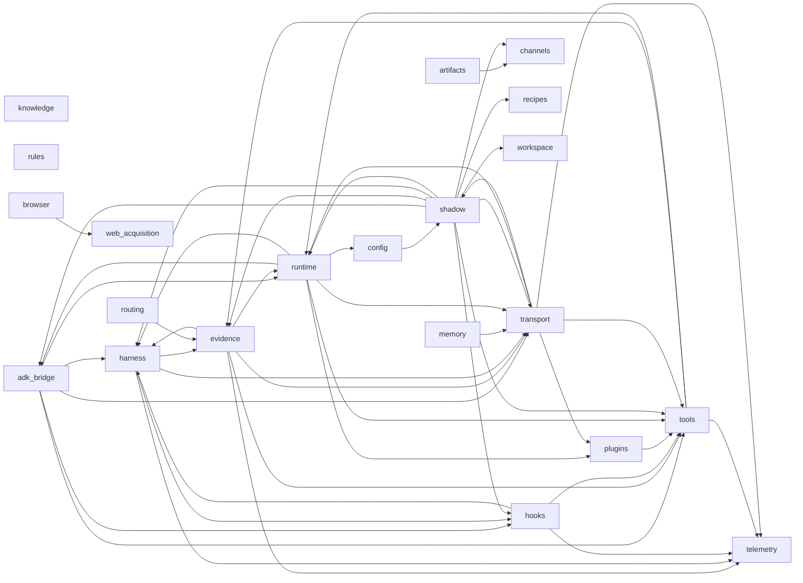

# Module Purpose Map (auto-generated)

## Dependency Graph

## Packages

### (root)

| Module | Purpose | Depends On | Depended By |
|---|---|---|---|
| __init__.py | — | — | — |
| __main__.py | — | main | — |
| app.py | — | chat, debug_trace, health, openmagi_runtime, plugins, shadow_generations, shadow_invocations, tools | (root)/main.py |
| facades.py | High-level entry-point facades that compose existing modules. | bus, context, dispatcher, manifest, resolved, result | — |
| main.py | — | app, chat, env, openmagi_runtime | (root)/__main__.py |

### adk_bridge/

| Module | Purpose | Depends On | Depended By |
|---|---|---|---|
| __init__.py | — | — | — |
| callback_adapter.py | — | bus, context, manifest, resolved | — |
| event_adapter.py | — | transcript, transport | runtime/runner_session_boundary.py, shadow/fixture_runner.py, shadow/gate4c1_runner_shadow_invoker.py |
| local_runner.py | — | local_toolhost, session_service | shadow/fixture_runner.py |
| local_toolhost.py | — | — | adk_bridge/local_runner.py |
| policy_boundary.py | — | control | — |
| primitives.py | — | — | runtime/openmagi_runtime.py |
| runner_adapter.py | — | — | runtime/runner_session_boundary.py, shadow/fixture_runner.py |
| session_service.py | — | — | adk_bridge/local_runner.py |
| tool_adapter.py | — | concurrency, concurrent_dispatcher, context, dispatcher, manifest, registry | — |

### artifacts/

| Module | Purpose | Depends On | Depended By |
|---|---|---|---|
| __init__.py | — | delivery_boundary, output_registry_boundary | — |
| delivery_boundary.py | — | contract | artifacts/__init__.py |
| output_registry_boundary.py | — | — | artifacts/__init__.py |

### browser/

| Module | Purpose | Depends On | Depended By |
|---|---|---|---|
| __init__.py | Default-off browser provider boundaries for the ADK migration. | provider_boundary | — |
| provider_boundary.py | — | policy | browser/__init__.py |

### channels/

| Module | Purpose | Depends On | Depended By |
|---|---|---|---|
| __init__.py | Traffic-free OpenMagi channel contract metadata. | contract | — |
| contract.py | — | — | artifacts/delivery_boundary.py, channels/__init__.py, channels/runtime_boundary.py, shadow/artifact_channel_delivery_contract.py |
| runtime_boundary.py | — | contract | — |
| telegram_boundary.py | — | — | — |

### config/

| Module | Purpose | Depends On | Depended By |
|---|---|---|---|
| __init__.py | — | env, models | — |
| env.py | — | gate3a_replay, models | (root)/main.py, config/__init__.py |
| models.py | — | — | config/__init__.py, config/env.py, runtime/openmagi_runtime.py |

### evidence/

| Module | Purpose | Depends On | Depended By |
|---|---|---|---|
| __init__.py | — | builtin, contracts, extractors, ledger, types | — |
| builtin.py | — | types | evidence/__init__.py, evidence/ledger.py |
| child_runtime_envelope.py | — | subagent, tool_preview, types | — |
| citation_audit.py | — | reports, source_ledger, types | — |
| coding_verification.py | — | contracts, reports, types, verifier_bus | — |
| contracts.py | — | trace_context, types | evidence/__init__.py, evidence/coding_verification.py, evidence/enforcement_boundary.py, evidence/subagent.py, shadow/coding_verification_evidence_contract.py, shadow/research_source_evidence_contract.py |
| enforcement_boundary.py | — | contracts, reports, types | — |
| extraction.py | — | result, transcript, types | — |
| extractors.py | — | types | evidence/__init__.py |
| ledger.py | — | builtin, types | evidence/__init__.py, harness/verifier_bus.py, shadow/audit_reporter.py |
| reports.py | — | tool_preview, types | evidence/citation_audit.py, evidence/coding_verification.py, evidence/enforcement_boundary.py, evidence/source_ledger.py, evidence/subagent.py, shadow/audit_reporter.py, shadow/coding_verification_evidence_contract.py, shadow/research_source_evidence_contract.py |
| rollout.py | — | types | harness/resolved.py |
| source_ledger.py | — | reports, types | evidence/citation_audit.py |
| subagent.py | — | contracts, reports, types | evidence/child_runtime_envelope.py, shadow/delegated_workflow_evidence_contract.py |
| tool_boundary.py | — | tool_preview | — |
| types.py | — | — | evidence/__init__.py, evidence/builtin.py, evidence/child_runtime_envelope.py, evidence/citation_audit.py, evidence/coding_verification.py, evidence/contracts.py, evidence/enforcement_boundary.py, evidence/extraction.py, evidence/extractors.py, evidence/ledger.py, evidence/reports.py, evidence/rollout.py, evidence/source_ledger.py, evidence/subagent.py, harness/resolved.py, harness/verifier_bus.py, routing/deterministic.py, shadow/audit_reporter.py, shadow/coding_verification_evidence_contract.py, shadow/delegated_workflow_evidence_contract.py, shadow/research_source_evidence_contract.py, tools/manifest.py |

### harness/

| Module | Purpose | Depends On | Depended By |
|---|---|---|---|
| __init__.py | — | discipline_boundary, profiles | — |
| audit.py | — | presets | — |
| discipline_boundary.py | — | — | harness/__init__.py |
| engine.py | — | evidence_scope, manifest, resolved, trace_context | — |
| evidence_scope.py | — | — | harness/engine.py, harness/resolved.py |
| goal_loop.py | — | — | shadow/mission_lifecycle_contract.py |
| inference_scaling.py | — | — | — |
| mission_runtime_boundary.py | — | — | — |
| parallel_execution.py | — | — | — |
| plan_gate.py | — | tool_preview | — |
| policy_state.py | — | presets, profiles | — |
| presets.py | — | — | harness/audit.py, harness/policy_state.py, harness/profiles.py |
| process_reward.py | — | tool_preview | — |
| profiles.py | — | presets | harness/__init__.py, harness/policy_state.py, runtime/openmagi_runtime.py |
| resolved.py | — | evidence_scope, manifest, rollout, scope, types | (root)/facades.py, adk_bridge/callback_adapter.py, harness/engine.py, hooks/bus.py, runtime/turn_controller.py |
| self_debug.py | — | tool_preview | — |
| slop_cleaner.py | — | tool_preview | — |
| verifier_bus.py | — | ledger, types | evidence/coding_verification.py |

### hooks/

| Module | Purpose | Depends On | Depended By |
|---|---|---|---|
| __init__.py | — | manifest, registry, result, scope | — |
| bus.py | — | context, manifest, resolved, result, trace_context | (root)/facades.py, adk_bridge/callback_adapter.py |
| context.py | — | — | (root)/facades.py, adk_bridge/callback_adapter.py, hooks/bus.py |
| manifest.py | — | manifest, scope | (root)/facades.py, adk_bridge/callback_adapter.py, harness/engine.py, harness/resolved.py, hooks/__init__.py, hooks/bus.py, hooks/registry.py |
| registry.py | — | manifest | hooks/__init__.py |
| result.py | — | — | hooks/__init__.py, hooks/bus.py |
| scope.py | — | — | harness/resolved.py, hooks/__init__.py, hooks/manifest.py, shadow/patch_file_policy_contract.py, shadow/path_shell_policy_contract.py |

### knowledge/

| Module | Purpose | Depends On | Depended By |
|---|---|---|---|
| __init__.py | — | provider_boundary | — |
| provider_boundary.py | — | — | knowledge/__init__.py |

### memory/

| Module | Purpose | Depends On | Depended By |
|---|---|---|---|
| __init__.py | — | contracts, policy | — |
| adk_bridge.py | — | contracts, policy | — |
| conformance.py | — | — | — |
| contracts.py | — | tool_preview | memory/__init__.py, memory/adapters/hipocampus_readonly.py, memory/adk_bridge.py, memory/policy.py, memory/projection.py |
| policy.py | — | contracts | memory/__init__.py, memory/adapters/hipocampus_readonly.py, memory/adk_bridge.py, memory/projection.py |
| projection.py | — | contracts, policy, tool_preview | — |
| write_boundary.py | — | — | — |

### memory/adapters/

| Module | Purpose | Depends On | Depended By |
|---|---|---|---|
| __init__.py | — | hipocampus_readonly | — |
| hipocampus_readonly.py | — | contracts, policy | memory/adapters/__init__.py |

### plugins/

| Module | Purpose | Depends On | Depended By |
|---|---|---|---|
| __init__.py | — | manifest | — |
| audit.py | — | manager, manifest | transport/plugins.py |
| extension_boundary.py | — | — | — |
| manager.py | — | manifest | plugins/audit.py, plugins/tool_projection.py, runtime/openmagi_runtime.py, transport/plugins.py |
| manifest.py | — | — | plugins/__init__.py, plugins/audit.py, plugins/manager.py, plugins/native_catalog.py, plugins/tool_projection.py |
| native_catalog.py | — | manifest | runtime/openmagi_runtime.py |
| tool_projection.py | — | manager, manifest | — |

### recipes/

| Module | Purpose | Depends On | Depended By |
|---|---|---|---|
| __init__.py | — | compiler | — |
| compiler.py | — | — | recipes/__init__.py, shadow/mission_lifecycle_contract.py |

### routing/

| Module | Purpose | Depends On | Depended By |
|---|---|---|---|
| __init__.py | — | — | — |
| deterministic.py | — | types | — |

### rules/

| Module | Purpose | Depends On | Depended By |
|---|---|---|---|
| __init__.py | — | intent_classifier | — |
| intent_classifier.py | — | — | rules/__init__.py |

### runtime/

| Module | Purpose | Depends On | Depended By |
|---|---|---|---|
| __init__.py | — | openmagi_runtime | — |
| child_runner_boundary.py | — | — | — |
| commit_boundary.py | — | turn_utilities | — |
| control.py | — | tool_preview | adk_bridge/policy_boundary.py, shadow/memory_source_authority_contract.py, shadow/office_automation_contract.py, shadow/patch_file_policy_contract.py, shadow/path_shell_policy_contract.py, shadow/toolhost_contract.py, shadow/ts_parity_replay.py, tools/permission.py |
| error_taxonomy.py | — | — | runtime/runner_session_boundary.py |
| events.py | — | — | — |
| llm_stream_reader.py | — | — | — |
| loop_detectors.py | — | — | — |
| message_builder.py | — | — | — |
| model_routing.py | — | — | — |
| openmagi_runtime.py | — | catalog, manager, models, native_catalog, primitives, profiles, registry | (root)/app.py, (root)/main.py, runtime/__init__.py, transport/chat.py, transport/health.py, transport/plugins.py, transport/shadow_invocations.py, transport/tools.py |
| projection_write_boundary.py | — | — | runtime/runner_session_boundary.py |
| readiness.py | — | — | — |
| runner_session_boundary.py | — | error_taxonomy, event_adapter, projection_write_boundary, runner_adapter, turn_controller | — |
| session_continuity.py | — | transcript | — |
| session_identity.py | — | — | tools/context.py |
| slash_control_boundary.py | — | — | — |
| structured_output_boundary.py | — | — | — |
| transcript.py | — | — | adk_bridge/event_adapter.py, evidence/extraction.py, runtime/session_continuity.py, shadow/fixture_runner.py, shadow/ts_parity_replay.py |
| turn_controller.py | — | resolved | runtime/runner_session_boundary.py |
| turn_maintenance.py | — | — | — |
| turn_policy.py | — | — | — |
| turn_utilities.py | — | — | runtime/commit_boundary.py |

### shadow/

| Module | Purpose | Depends On | Depended By |
|---|---|---|---|
| __init__.py | Local-only diagnostic shadow helpers. | shadow | — |
| adk_eval_fixture_contract.py | — | — | — |
| agent_methodology_contract.py | — | — | — |
| artifact_channel_delivery_contract.py | — | contract, tool_preview | — |
| audit_reporter.py | — | ledger, reports, types | — |
| coding_child_conflict_resolution_contract.py | — | tool_preview | — |
| coding_verification_evidence_contract.py | — | contracts, reports, tool_preview, types | — |
| control_projection_contract.py | — | — | — |
| delegated_workflow_evidence_contract.py | — | subagent, tool_preview, types | — |
| fact_grounding_verifier_contract.py | — | — | — |
| fixture_runner.py | — | event_adapter, local_runner, runner_adapter, sse, transcript | shadow/gate3a_bundle.py, shadow/gate3a_report.py, shadow/redacted_ts_bundle.py |
| gate3a_bundle.py | — | fixture_runner | shadow/gate3a_replay.py |
| gate3a_replay.py | — | gate3a_bundle, gate3a_report | config/env.py |
| gate3a_report.py | — | fixture_runner | shadow/gate3a_replay.py |
| gate3b_bundle.py | — | — | shadow/gate3b_ingest.py, shadow/gate3b_local_consumer.py |
| gate3b_ingest.py | — | gate3b_bundle | shadow/gate3b_local_consumer.py |
| gate3b_local_consumer.py | — | gate3b_bundle, gate3b_ingest | shadow/gate3b_local_report.py, shadow/gate3b_metrics.py, shadow/gate4_bridge.py, shadow/gate4_consumer.py, shadow/gate4c1_runner_shadow_invoker.py, shadow/gate4c2_shadow_comparison_report.py, shadow/gate4d_local_shadow_diagnostics.py, shadow/gate5a_no_memory_shadow_canary.py |
| gate3b_local_report.py | — | gate3b_local_consumer | shadow/gate3b_metrics.py, shadow/gate4_bridge.py, shadow/gate4_consumer.py |
| gate3b_metrics.py | — | gate3b_local_consumer, gate3b_local_report | shadow/gate4_bridge.py, shadow/gate4_consumer.py |
| gate4_bridge.py | — | gate3b_local_consumer, gate3b_local_report, gate3b_metrics | — |
| gate4_consumer.py | — | gate3b_local_consumer, gate3b_local_report, gate3b_metrics | shadow/gate4c2_shadow_comparison_report.py, shadow/gate5a_no_memory_shadow_canary.py |
| gate4c0_shadow_config.py | — | — | shadow/gate4c1_dry_run_boundary.py, shadow/gate4c1_runner_shadow_invoker.py, shadow/gate5a_no_memory_shadow_canary.py, shadow/gate5b_user_visible_routing_canary.py |
| gate4c1_dry_run_boundary.py | — | gate4c0_shadow_config | — |
| gate4c1_runner_shadow_invoker.py | — | event_adapter, gate3b_local_consumer, gate4c0_shadow_config, tool_preview | shadow/gate4c2_shadow_comparison_report.py, shadow/gate4d_local_shadow_diagnostics.py, shadow/gate5a_no_memory_shadow_canary.py |
| gate4c2_shadow_comparison_report.py | — | gate3b_local_consumer, gate4_consumer, gate4c1_runner_shadow_invoker | shadow/gate4d_local_shadow_diagnostics.py, shadow/gate5a_no_memory_shadow_canary.py |
| gate4d_local_shadow_diagnostics.py | — | gate3b_local_consumer, gate4c1_runner_shadow_invoker, gate4c2_shadow_comparison_report | shadow/gate5a_no_memory_shadow_canary.py |
| gate5a_no_memory_shadow_canary.py | — | gate3b_local_consumer, gate4_consumer, gate4c0_shadow_config, gate4c1_runner_shadow_invoker, gate4c2_shadow_comparison_report, gate4d_local_shadow_diagnostics | — |
| gate5b4_internal_endpoint_contract.py | — | — | — |
| gate5b4c2_shadow_invocation_contract.py | — | — | transport/shadow_invocations.py |
| gate5b4c3_live_runner_boundary.py | — | gate5b4c3_runner_input_adapter, gate5b4c3_shadow_generation_contract | transport/shadow_generations.py |
| gate5b4c3_mock_runner_boundary.py | — | gate5b4c3_shadow_generation_contract | — |
| gate5b4c3_runner_input_adapter.py | — | gate5b4c3_shadow_generation_contract | shadow/gate5b4c3_live_runner_boundary.py, transport/shadow_generations.py |
| gate5b4c3_shadow_generation_contract.py | — | — | shadow/gate5b4c3_live_runner_boundary.py, shadow/gate5b4c3_mock_runner_boundary.py, shadow/gate5b4c3_runner_input_adapter.py, shadow/gate5b4c3_shadow_generation_report.py, transport/shadow_generations.py |
| gate5b4c3_shadow_generation_report.py | — | gate5b4c3_shadow_generation_contract | transport/shadow_generations.py |
| gate5b4d_stream_fixture_audit.py | — | sse | — |
| gate5b_user_visible_routing_canary.py | — | gate4c0_shadow_config | — |
| legal_academic_citation_detector_contract.py | — | — | — |
| memory_source_authority_contract.py | — | control, tool_preview | — |
| mission_lifecycle_contract.py | — | compiler, goal_loop, tool_preview | — |
| mission_operator_goaljudge_contract.py | — | — | — |
| office_automation_contract.py | — | control, manifest, tool_preview | — |
| office_recipe_tool_alias_contract.py | — | — | — |
| patch_file_policy_contract.py | — | control, manifest, path_shell_policy_contract, result, scope, tool_preview | — |
| path_shell_policy_contract.py | — | control, manifest, result, scope, tool_preview, toolhost_contract | shadow/patch_file_policy_contract.py |
| permission_arbiter_contract.py | — | — | — |
| redacted_ts_bundle.py | — | fixture_runner | — |
| research_source_evidence_contract.py | — | contracts, reports, tool_preview, types | — |
| tool_policy.py | — | context, dispatcher, manifest, result | — |
| toolhost_contract.py | — | control, manifest, result, tool_preview | shadow/path_shell_policy_contract.py |
| ts_parity_replay.py | — | control, sse, transcript | — |
| web_acquisition_browser_provider_contract.py | — | tool_preview | — |
| workspace_adoption_preflight_contract.py | — | isolation, tool_preview | — |

### telemetry/

| Module | Purpose | Depends On | Depended By |
|---|---|---|---|
| __init__.py | — | execution_trace, logging, trace_context | — |
| execution_trace.py | Execution trace recorder for per-turn observability. | — | telemetry/__init__.py, telemetry/trace_context.py |
| logging.py | — | — | telemetry/__init__.py |
| trace_context.py | Async-safe per-turn trace context using contextvars. | execution_trace | evidence/contracts.py, harness/engine.py, hooks/bus.py, telemetry/__init__.py, tools/concurrent_dispatcher.py, tools/dispatcher.py, transport/debug_trace.py |

### tools/

| Module | Purpose | Depends On | Depended By |
|---|---|---|---|
| __init__.py | — | base, catalog, dispatcher, manifest, permission, registry, result | — |
| base.py | — | context, manifest, result | tools/__init__.py, tools/registry.py |
| catalog.py | — | manifest, registry | runtime/openmagi_runtime.py, tools/__init__.py |
| concurrency.py | Tool batch partitioning for concurrent execution. | registry | adk_bridge/tool_adapter.py, tools/concurrent_dispatcher.py |
| concurrent_dispatcher.py | Concurrent tool dispatcher wrapping the base ToolDispatcher. | concurrency, context, manifest, result, trace_context | adk_bridge/tool_adapter.py |
| context.py | — | session_identity | (root)/facades.py, adk_bridge/tool_adapter.py, shadow/tool_policy.py, tools/base.py, tools/concurrent_dispatcher.py, tools/dispatcher.py, tools/permission.py, tools/safety.py |
| dispatcher.py | — | context, manifest, permission, registry, result, trace_context | (root)/facades.py, adk_bridge/tool_adapter.py, shadow/tool_policy.py, tools/__init__.py |
| manifest.py | — | types | (root)/facades.py, adk_bridge/tool_adapter.py, hooks/manifest.py, plugins/tool_projection.py, shadow/office_automation_contract.py, shadow/patch_file_policy_contract.py, shadow/path_shell_policy_contract.py, shadow/tool_policy.py, shadow/toolhost_contract.py, tools/__init__.py, tools/base.py, tools/catalog.py, tools/concurrent_dispatcher.py, tools/dispatcher.py, tools/permission.py, tools/registry.py, tools/safety.py, transport/tools.py |
| permission.py | — | context, control, manifest, safety | tools/__init__.py, tools/dispatcher.py |
| registry.py | — | base, manifest | adk_bridge/tool_adapter.py, runtime/openmagi_runtime.py, tools/__init__.py, tools/catalog.py, tools/concurrency.py, tools/dispatcher.py |
| result.py | — | — | (root)/facades.py, evidence/extraction.py, shadow/patch_file_policy_contract.py, shadow/path_shell_policy_contract.py, shadow/tool_policy.py, shadow/toolhost_contract.py, tools/__init__.py, tools/base.py, tools/concurrent_dispatcher.py, tools/dispatcher.py |
| safety.py | — | context, manifest | tools/permission.py |

### transport/

| Module | Purpose | Depends On | Depended By |
|---|---|---|---|
| __init__.py | — | health | adk_bridge/event_adapter.py, transport/sse.py |
| chat.py | — | openmagi_runtime | (root)/app.py, (root)/main.py, transport/health.py |
| debug_trace.py | Debug endpoint exposing the current turn's execution trace. | trace_context | (root)/app.py |
| health.py | — | chat, openmagi_runtime | (root)/app.py, transport/__init__.py |
| plugins.py | — | audit, manager, openmagi_runtime | (root)/app.py |
| shadow_generations.py | — | gate5b4c3_live_runner_boundary, gate5b4c3_runner_input_adapter, gate5b4c3_shadow_generation_contract, gate5b4c3_shadow_generation_report | (root)/app.py |
| shadow_invocations.py | — | gate5b4c2_shadow_invocation_contract, openmagi_runtime | (root)/app.py |
| sse.py | — | transport | shadow/fixture_runner.py, shadow/gate5b4d_stream_fixture_audit.py, shadow/ts_parity_replay.py |
| tool_preview.py | — | — | evidence/child_runtime_envelope.py, evidence/reports.py, evidence/tool_boundary.py, harness/plan_gate.py, harness/process_reward.py, harness/self_debug.py, harness/slop_cleaner.py, memory/contracts.py, memory/projection.py, runtime/control.py, shadow/artifact_channel_delivery_contract.py, shadow/coding_child_conflict_resolution_contract.py, shadow/coding_verification_evidence_contract.py, shadow/delegated_workflow_evidence_contract.py, shadow/gate4c1_runner_shadow_invoker.py, shadow/memory_source_authority_contract.py, shadow/mission_lifecycle_contract.py, shadow/office_automation_contract.py, shadow/patch_file_policy_contract.py, shadow/path_shell_policy_contract.py, shadow/research_source_evidence_contract.py, shadow/toolhost_contract.py, shadow/web_acquisition_browser_provider_contract.py, shadow/workspace_adoption_preflight_contract.py |
| tools.py | — | manifest, openmagi_runtime | (root)/app.py |

### web_acquisition/

| Module | Purpose | Depends On | Depended By |
|---|---|---|---|
| __init__.py | Default-off web acquisition provider boundaries for the ADK migration. | provider_boundary | — |
| policy.py | — | — | browser/provider_boundary.py, web_acquisition/provider_boundary.py |
| provider_boundary.py | — | policy | web_acquisition/__init__.py |

### workspace/

| Module | Purpose | Depends On | Depended By |
|---|---|---|---|
| __init__.py | — | — | — |
| adoption_boundary.py | — | — | — |
| isolation.py | — | — | shadow/workspace_adoption_preflight_contract.py |
